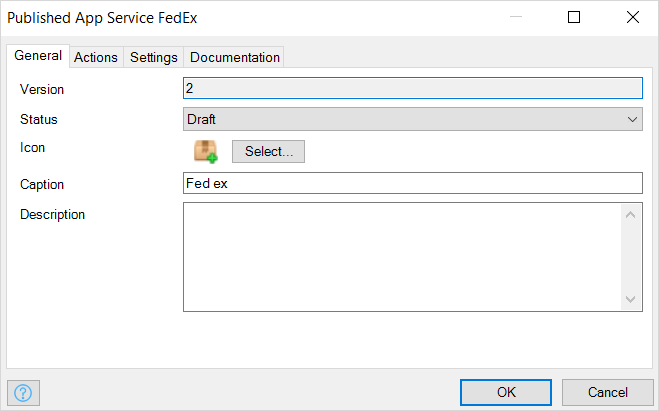
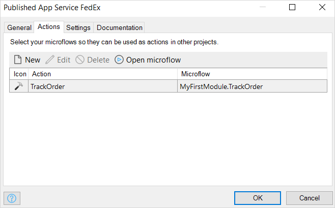
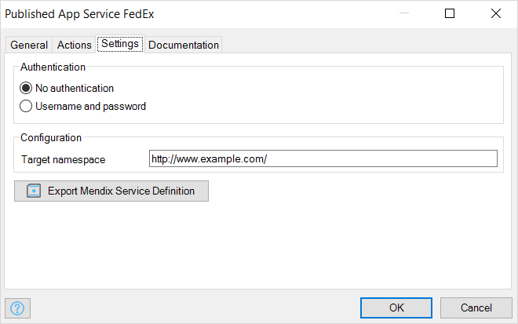

{}
App services are deprecated and were removed in [Studio Pro 9](/releasenotes/studio-pro/9.0). Use a [published web service](published-web-services) or a [published REST service](published-rest-services) instead.
{}

## 1 General Tab

### 1.1 Version

The version of the app service. Every time an app service instance is created, the version number is incremented automatically.

App services are explicitly versioned, because once the app service is consumable, the public interface (parameters and return type) cannot be changed anymore. The public interface can only be changed by creating a new version of the app service. However, it is still possible to change the underlying microflow as long as it adheres to the interface.

### 1.2 Status

A newly created version will have the status set to 'Draft' by default. With 'Draft' status, changes and additions can be made to the app service. When the version is ready to be published, the status must be set to 'Consumable'.

Once the status is set to 'Consumable', you cannot edit the app service anymore. App service versions are only editable when the version is in 'Draft'. Only one version of app service is allowed to be in 'Draft' status.

{}
Always remember to set at least one app service version to Consumable before going to production. Only Consumable app service versions will be available in production.
{}

### 1.3 Icon

This is the icon that belongs to the app service. An icon can be selected from any images document in the project. A new icon can be added to an images document if it is not available yet.

### 1.4 Caption

This is the name of the app service the consumer will see in their toolbox.

### 1.5 Description

Can be used to describe what the app service is used for.

## 2 Actions

Provide the actual actions of which the app service is composed. Each of these actions is coupled to a microflow. See [Actions](actions).

## 3 Settings

### 3.1 Authentication

The following authentication methods are available:

*   No authentication.
*   Username and password: the provided action is only executed if the username/password combination matched a registered web service user.

### 3.2 Target Namespace

The 'Target namespace' is a technical term, that provides an XML namespace.

### 3.3 Export Mendix Service Definition

The button 'Export Mendix Service Definition' creates an MSD-file with the definition of the App service. It can be imported by a consumer of your service. You can test your app service on the local machine by importing this MSD file in another app, and running the provider and consumer apps simultaneously.

{}

This MSD file contains a default location: the Application Root URL of the default configuration in the project settings. For example: [http://localhost:8080/](http://localhost:8080/). This endpoint address is overwritten if you deploy your app in the cloud, and will be set to the cloud location where your app is running.

{}

## 4 Documentation

Documentation for the published app service. A consumer of the app service will see this as well.
