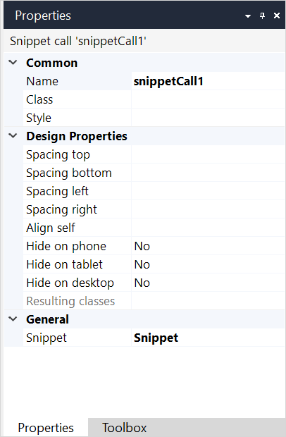

{}
 For the Simplified Chinese translation, click [中文译文](https://cdn.mendix.tencent-cloud.com/documentation/).
{}

## 1 Introduction

The **Snippet call** widget allows you to use a [snippet](snippet) on a [page](page), a [layout](layout), or another snippet:

## 2 Properties

An example of snippet call properties is represented in the image below:

{}
{}

Snippet call properties consist of the following sections:

* [Common](#common)
* [Design Properties](#design-properties)
* [General](#general)

### 2.1 Common Section {#common}

{}

### 2.2 Design Properties Section {#design-properties}

{} 

### 2.3 General Section {#general}

This section contains the **Snippet** property, it shows the name of an actual snippet that will be displayed here.

## 3 Performing Specific Actions

To perform actions on a snippet call, select it on a page and right-click it. The list of possible actions opens. While some actions from this list, such as **Select snippet**, are a quick way to set the properties, the following actions are specific actions that you can perform:

* **Show snippet** – opens a snippet selected for a snippet call
* **Inline snippet** – turns the snippet call into widgets that the selected snippet consists of

## 4 Read More

* [Page](page)
* [Common Widgets](common-widgets)
* [Properties Common in the Page Editor](common-widget-properties)