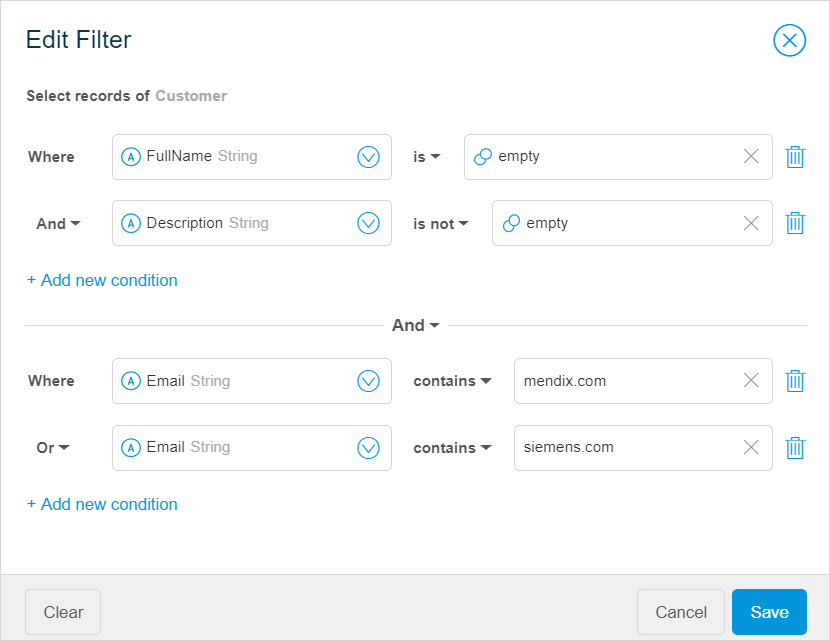
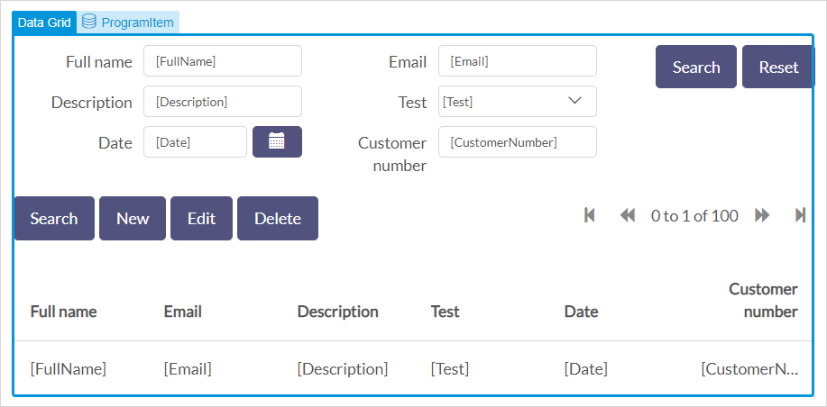

These are Mendix Studio release notes for app projects built with Studio Pro version 7.23 and above. The release notes include all minor versions, patches, and known issues.

For more information on Studio version and Mendix Studio Pro version correlation, see [Studio Version & Mendix Version Correlation](/studio/general-versions).

{}

Previously Mendix Studio was called the Web Modeler and Mendix Studio Pro was called the Desktop Modeler.

For Studio release notes correlated with Studio Pro versions 7.15–7.22, see [7.15–7.22](7.15-7.22). 

For Studio release notes correlated with Studio Pro versions 7.11–7.14, see [7.11–7.14](7.11-7.14). 
{}

{}
For updates on the operational status of Studio as well as deployment features and other Mendix services, see [Mendix Status](https://status.mendix.com/).
{}

## 2019

### May 24th, 2019

#### Improvements

*  To assist you in fixing consistency error, the link to [documentation](/studio/consistency-errors) was added to the **Checks** panel. Also, warnings and info messages are not displayed in the **Checks** panel anymore. For more information, see [Checks](/studio/checks) in the *Studio Guide*. 

*  To prevent you from creating data filters with consistency errors, we added validation in filters. That means that a filter with errors cannot be saved and you will immediately see what the error is. For more information, see [Data Filters](/studio/filters) in the *Studio Guide*. 
	
	

#### Fixes

* We fixed an issue where model versions 7.23.4 and below could no longer correctly load the project's custom widgets, hiding them from the toolbox completely.

### May 17th, 2019

#### New Features

* Mendix Studio now configures the security of any app that you create. That means your data is protected from public access and visible only for users whom you grant access. Moreover, you can configure different roles for different users so that you can optimize the user experience, making sure each user sees exactly what you want them to see.
  How does this work? When you publish your app to the Mendix cloud for the first time, Mendix Studio will auto-configure security so that your data stays secure right from the start. The result is that any user that wants to access your app must use login credentials or will be logged in automatically in case your platform administrator has configured a [single sign-on experience](/developerportal/deploy/integrate-with-mendix-sso) for Mendix apps.   
  Auto-configuring security will be done for all apps with Mendix version 7.23.3 and higher that are accessed in Mendix Studio. For more information, see the following documents:
  
  * For citizen developers: read how to use security and app roles in [Security, Roles & Permissions](/studio/settings-security) in the *Studio Guide*
  * For professional developers: read the details of model changes that are applied when Mendix Studio auto-configures security settings in [Model Changes When Security Is Enabled in Studio](/refguide/studio-security-enabled) in the *Studio Pro Guide*

### May 10th, 2019

#### New Features

* You are now able to preview your app without publishing it. The **Preview** feature allows you to to verify your own changes and to see how your app will look like for different end-users, without changing the published app in the cloud. As it has a different environment from the published app, you can use the **Preview** to experiment with changes and test them. While building your app, simply click **Preview** to see the effects of your changes. Studio will show you the working app instantly, so that you can see your changes straight away. Studio will also assist you in checking for any consistency errors. Then, when you are ready to share your changes with users of your app, click **Publish** to push the latest version of your app to the cloud. For more information, see [Previewing & Publishing Your App](/studio/publishing-app) in the *Mendix Studio Guide*.

    

*  We have made it very easy to configure filters when showing and retrieving data in your app. In microflows, you can add a filter to the **Retrieve** activity, and in the page editor, it is possible to filter data in a list view and in a data grid.  For more information, see [Data Filters](/studio/filters) in the *Mendix Studio Guide*.

    

#### Improvements

* To avoid confusion, we changed naming of variables and objects in the microflow editor. Previously, the term "variable" could be used in different ways: as a name for a list of objects or as an object itself. This has now been cleared. 
* To improve the user experience of the microflow editor, we added more tooltips for activity properties, so that users are better informed on the available options and related behavior. 

#### Fixes

* We fixed an issue where app publishing was not working in Studio for newly created apps.

### May 2nd, 2019

#### New Features

* We added support for [Studio Pro 8.0.0 Beta 1](../studio-pro/8.0). 

### April 12th, 2019

#### Improvements

* To improve collaboration between Studio users, users that are in the read-only mode can see the changes made by the other Studio user in real-time without the need to refresh the browser page.

### March 29th, 2019

#### New Features

*  We replaced the sync process between Studio and Studio Pro with a new, simplified, process of sharing model changes. You can enable it for apps with Mendix version 7.23.3 and above to experience true  collaborative development within your team. All changes made in Studio are auto-saved, and Studio Pro users get these changes when they click **Update** or **Commit**. For more information, see [Collaborative Development](/refguide7/collaborative-development) in *Version Control* and [Collaborative Development in Studio](/studio/general-collaborative-development) in the *Studio Guide*. For information on how to migrate to the new process, see [Migration From the Sync Process to Collaborative Development](/refguide7/collaborative-development-migration). 

    {}Existing projects with Mendix version 7.23.2 or below can continue using **Sync with Studio** until September 2019.
    {}

*  You can now use a [data grid](/studio/page-editor-data-grid) on your pages. A data grid is a data container that shows a list of objects in a table. For example, a data grid can show all the program items for an event, users can search, add, delete items and perform other functions depending on the settings. For more information, see [Data Grid](/studio/page-editor-data-grid). 

      

* In the page editor, you can now use the **Association** data source for a list view and a data grid. The list view or data grid is filled with the objects linked to the data view object by an association. For example, you can show all orderlines for a customer. This data source is available when the list view/data grid is placed inside another data container, for example, a data view.  

* We added support for [Studio Pro 7.23.3](../studio-pro/7.23). 

#### Fixes

* We fixed an issue where a custom widget was not correctly shown in the **Toolbox** of the page editor, if this widget no longer existed in a newer package on the App Store.

### March 15th, 2019

#### Improvements

* To speed up the process of creating pages, **Pre-fill page contents based on the `<name>` entity** is now checked by default when creating a new page with an entity.

    {}
    {}

### March 8th, 2019

#### New Features

* We added support for [Studio Pro 7.23.2](../studio-pro/7.23).

### February 22nd, 2019

#### New Features

* We added support for [Studio Pro 7.23.0](../studio-pro/7.23) and [Studio Pro 7.23.1](../studio-pro/7.23).
