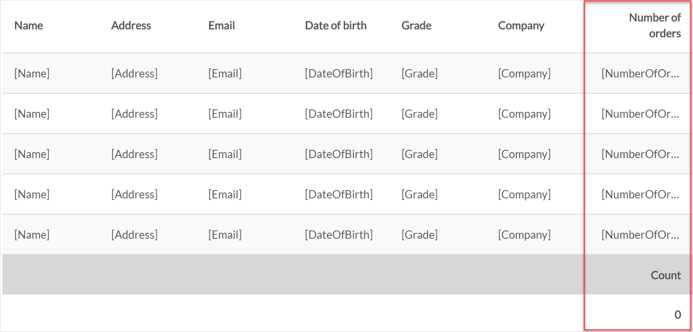
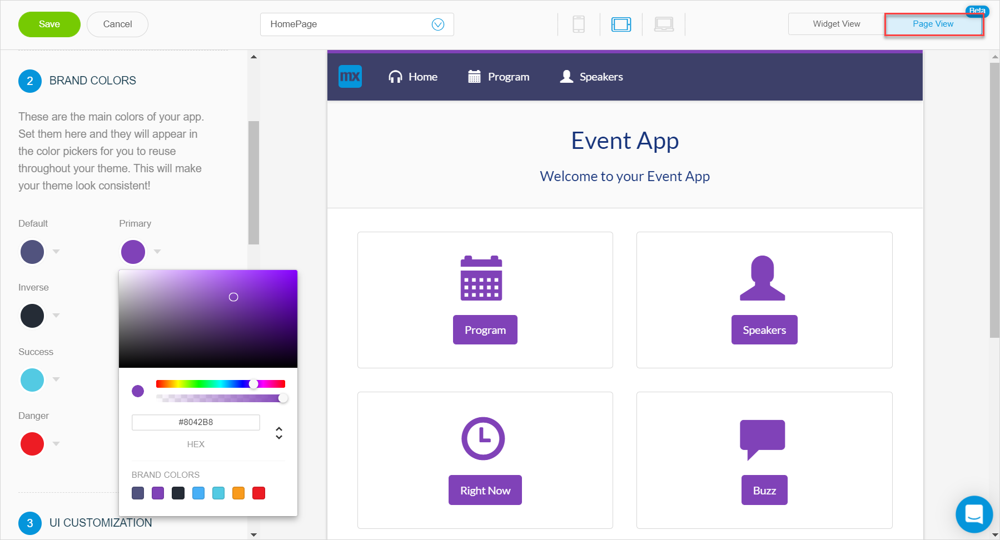
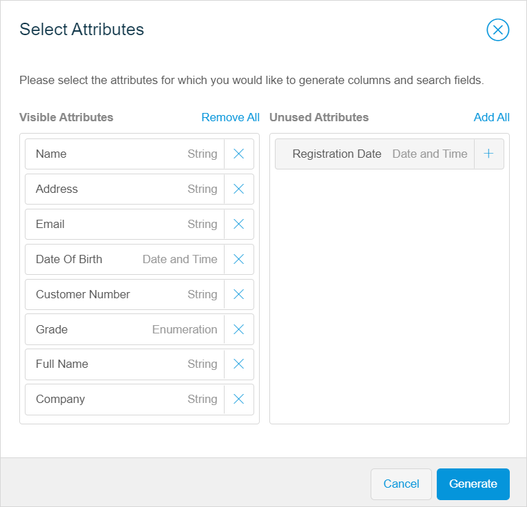
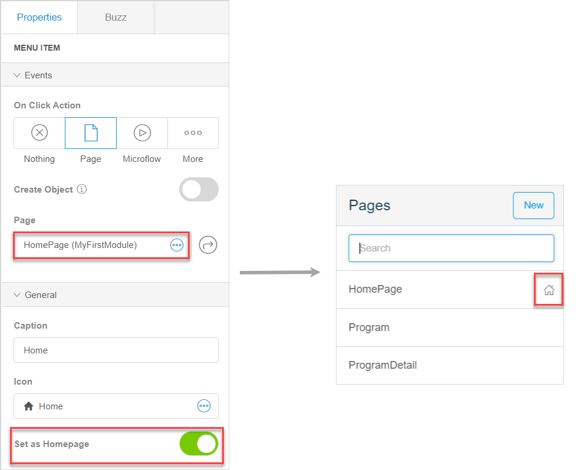
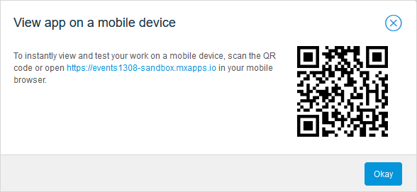

These are the Mendix Studio release notes for app projects built with Desktop Modeler/Studio Pro version 7.23 and above. The release notes include all minor versions, patches, and known issues.

{}
For Studio release notes correlated with the Studio Pro version 7.23, see [7.23](7.23).
{}

For more information on the correlation between Mendix Studio and Desktop Modeler/Mendix Studio Pro versions, see [Studio Ranges & Mendix Versions](/studio/general-versions).

For updates on the operational status of Studio as well as deployment features and other Mendix services, see [Mendix Status](https://status.mendix.com/).

## Upgrading from Mendix Version 7 to 8

Mendix version 8 brings many improvements to the platform, however, this release contains changes that cannot be upgraded automatically using the regular Studio upgrade mechanism. This means that if you want to upgrade your existing app to Mendix version 8 can only do so in Studio Pro or by involving developers familiar with Studio Pro. For more information on upgrading to Mendix version 8, see the [Upgrading to Mendix version 8](/studio/general-versions#upgrade-to-8) section in *Studio Ranges & Mendix Versions* and [Moving from Desktop Modeler Version 7 to Studio Pro 8](/refguide/moving-from-7-to-8).

## 2019

### December 20th, 2019

#### New Features

* We added support for [Studio Pro 8.5](../studio-pro/8.5). 

* In the page editor, we enhanced capabilities of the [layout grid](/studio/page-editor-widgets-structure#layout-grid), [rows](/studio/page-editor-widgets-structure#row), and [columns](/studio/page-editor-widgets-structure#column) by adding new settings to them. Changes can be outlined as following:

  * Column width is easily influenced now, which gives you more flexibility to adjust the layout to your content or to a device type
  * You can align all columns in a row or align an individual column
  * You can change the column width or add new columns right on-canvas

  For more information on the layout grid, rows and columns properties, see [Structure](/studio/page-editor-widgets-structure).

### Fixes

* We fixed an issue in the domain model where copy-pasting a file or image entity resulted in a consistency error.
* We fixed an issue in the **App from a spreadsheet** where the import failed if the association name was too long. 

### December 13th, 2019

#### Fixes:

* We fixed an issue in [Widget Overview](/studio/settings-widget-overview) where the list of widgets in a package got cut off.
* We fixed an issue where it was no longer possible to add building blocks to apps that have Mendix version from 8.0.0 to 8.2.2.
* We fixed an issue where the upgrade dialog linked to the old version of the documentation.

### December 6th, 2019

#### Fixes

* We fixed an issue in the **App from a spreadsheet** where due to Studio not initially setting the correct types for values, importing the data from a spreadsheet failed.
* We fixed an issue where creating a feedback item from the **Buzz** tab in Studio failed.

### November 29th, 2019

#### New Features

* We added support for [Studio Pro 8.4](../studio-pro/8.4). 
*  When you enable [Security](/studio/settings-security) in Studio, it will install the MendixSSO module instead of the AppCloudServices module, because the AppCloudServices module has been deprecated, and enabling sign sign-on is now managed by the MendixSSO module. If you previously enabled security for your app, no action is required, your app will keep running. For more technical information on the model changes that happen when you enable security, see [Model Changes When Security Is Enabled in Studio](/refguide/studio-security-enabled). 

#### Improvements

* For better search results in the page editor, the **Toolbox** supports additional search terms now. For example, if you type in *table* in the **Toolbox** search bar, the search result will give you **Data grid** and **Structure** widgets, because they have the form of a table.  
* In the breadcrumb of the page editor, we renamed **Navigation Layout** to **Layout** to be consistent in terms throughout Studio and to avoid confusion. 

#### Fixes

* We fixed an issue in the **App from a spreadsheet** where the preview failed after deleting/editing an entity with an association 
* We fixed an issue in the **App from a spreadsheet** where the guidance tour crashed.  

### November 22nd, 2019

#### Fixes

* We fixed an issue in the **[Navigation Document](/studio/navigation)** where it was not possible to create a new entity if the **Create Object** setting was enabled.  

### November 15th, 2019

#### Improvements

* Now you can create an association just by drawing a line between two entities: in the domain model editor, simply drag a dot from one entity to another, and an arrow (association) between two entities will be created automatically. This will make the process of creating associations faster. If you click a dot on an entity and hold it for a couple of seconds, a plus icon appears. By clicking this icon you can create a new entity with an association from the first entity. 
  

* You can now show a calculated value for individual data grid columns, using the **Aggregate Function** property  With this property, you can calculate a sum, count, average, minimum, or maximum value that will be calculated and shown at the bottom of the data grid column. For example, you can display the total number of orders of a customer:   
    

    **Aggregate Function** is only available for columns with attributes of type Decimal, Integer, and Long.

#### Fixes

* We fixed an issue where a full-screen error was shown when the loading or reloading of Studio took too much time.

### November 8th, 2019

#### New Features

* We added the **Page View** feature to the **Theme Customizer**. With **Page View**, you can select any page from your app and preview your new style on it. This feature will help you customize apps faster and will visualize your changes right away:
  
    
    
     For more information, see [Theme Customizer](/studio/theme-customizer). 
    {} The **Page View** feature is in beta. This means there might be changes to this feature. For more information on beta features, see [Mendix Beta Features](/releasenotes/beta-features/).
    {}

#### Fixes

* We fixed an issue in the page editor where the pop-up window for selecting an icon (for example, when you select an icon for a button) did not show icon previews. 
* We fixed an issue where associations were not auto-renamed correctly in case the entity name was changed. 

### November 1st, 2019

#### New Features

* We added support for [Studio Pro 8.3](../studio-pro/8.3). 

#### Fixes

* We fixed an issue where inline editing of an entity name did not change the name.  

### October 25th, 2019

#### New Features

* We added support for [Studio Pro 8.2.2](../studio-pro/8.2). 

#### Improvements

* For a better user experience, we improved column generation for a data grid. Now when creating a data grid from an entity with more than eight attributes, a dialog window appears to let you choose whether columns should be generated for all attributes or only several ones:

	

#### Limitations

* The old process of syncing Studio and Studio Pro called **Sync with Studio** is no longer available and has been entirely replaced by new collaborative development capabilities that allow you to easily synchronize changes. [Collaborative development](/studio/general-collaborative-development) is available if your project has Mendix version 7.23.3 or above. This means that you cannot sync your changes between Studio and Studio Pro if your project has Mendix version 7.23.2 or below. You will still be able to open your project in Studio. However, to sync changes between Studio and Studio Pro, the app must be upgraded to version 7.23.3 or above in Studio Pro.

### October 15th, 2019

#### Improvements

* Associations are now renamed automatically when you rename entities in the domain model. This makes the process of implementing changes to the domain model much easier and faster.  

* To improve the user experience, we made columns in the **Checks** panel sortable. Now you can sort the errors per error code, element, etc. 

* For better navigability, a homepage icon is displayed in a list of pages or microflows against a page/microflow that is set as a homepage in the **Navigation Document**:

    

### October 4th, 2019

#### New Features

* We added support for [Studio Pro 8.2.0](../studio-pro/8.2). 

#### Improvements

* For better user experience you are now upgraded automatically from Mendix 8 beta versions to the latest Mendix 8 version instead of being upgraded to Mendix 8.0.0 General Availability version.

* You can now use **Name** and **Size** attributes of an **Image** entity and a **File** entity in the microflow expressions and page editor data filters. This improvement allows you to build more powerful apps. For more information on **Image** and **File** entities, see the **[Types of Entities](/studio/domain-models#entity-types)** section in *Domain Models*. 

* To help you fix consistency errors faster, we implemented the following:

  * Added descriptions on how to fix errors CE0548 and CE0552 to documentation and added links to this documentation 
  * Rewrote texts for errors CE1573 and CE1574 to make them clearer

#### Fixes

* We fixed an issue where an empty enumeration value crashed Studio. Now empty enumeration values are no longer allowed.

### September 23rd, 2019

#### New Features

* We introduced new types of entities in the domain model: an **Image Entity** and a **File Entity**:

    

    They will allow you to build more powerful apps with Studio. An image entity stores an image, and a file entity stores a file. For example, on pages, with the help of these entities end-users will be able to upload and/or download different files. For more information on entities and their types, see the **[Types of Entities](/studio/domain-models#entity-types)** section in *Domain Models*. 

* In the page editor toolbox, we added new widgets that use an image entity or a file entity: an **Image Uploader** and a **File Manager**. These widgets use an image entity (**Image Uploader**) or a file entity (**File Manager**) as their data source and allow end-users to upload and download images and files. For example, users can upload a picture for their profile or download a document stored in the app. For more information on properties of these widgets, see [Image and File Widgets](/studio/page-editor-widgets-images-and-files).  

### September 6th, 2019

#### New Features

* We added support for [Studio Pro 8.1.0](../studio-pro/8.1). 

#### Fix

* We fixed an issue where the link to the release notes in the upgrade top-bar pointed to Studio Pro version 7 release notes instead of [version 8](../studio-pro/8). 

### August 30th, 2019

#### Improvements

* To prevent consistency errors and help you build your app even faster, it is now impossible to create two or more entities with the same name, or two or more associations with the same name. Also, an entity cannot have attributes with identical names.  If you try to use the same name, it will get an underscore and a numeric postfix after its name. For example, if you already have an entity named *Customer* and try to create another entity with this name, it will get a name *Customer_1*. The next duplicate will be named *Customer_2*, etc.  

*  To improve user experience for your end-users, the **Date Picker** widget has formatting options in its properties now. You can select between **Date**, **Time**, **Date & Time**, and **Custom** formats and see  examples of how they will be displayed in the **Format Example**. 

	{}The custom format can only be configured in Studio Pro.
	{} 
	
* For better search results, the **Toolbox** supports additional search terms now. For example, if you type in *Reference selector* in the **Toolbox** search bar, the search result will give you the **Drop Down** widget, because previously **Drop Down** was called **Reference Selector**.  

### August 9th, 2019

#### Improvements

*  To make the page editor more user-friendly, we unified column and layout widgets under new **Structure** category in **Toolbox** > **Widgets**. Now all widgets that provide structure to your page are located in one category:

    {}
    {}

* You can now open Mendix Studio in the Chrome browser on Chromebooks. 

*  You no longer need to download an app for view your app on a mobile device. You can scan a QR-code with your mobile device or open a link on your mobile browser. 

    

### August 2nd, 2019

#### New Features

* We added support for [Studio Pro 8.0.0 General Availability](../studio-pro/8.0). Now newly created apps in Studio will have Mendix version 8. 

#### Improvements

*  To improve user experience, we added error codes to consistency errors in the **Checks** panel and improved Studio specific messages for a number of errors. You can navigate to the corresponding documentation (if available) by clicking the error code. Error codes will help you identify an error easily when asking about it in the [Mendix Forum](https://forum.mendixcloud.com/) or when turning to Mendix Support.

    

* To make the microflow editor more user-friendly, **Exclusive split** is now called **Decision**. The new name better illustrates what this element does: it makes a decision which flow a microflow should take depending on a condition. 
