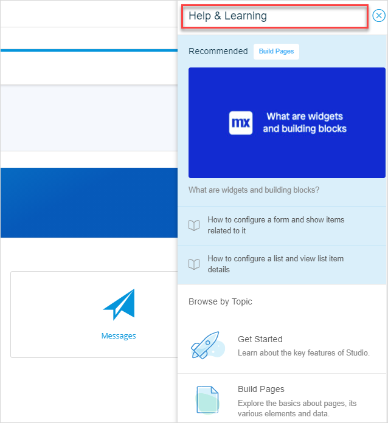
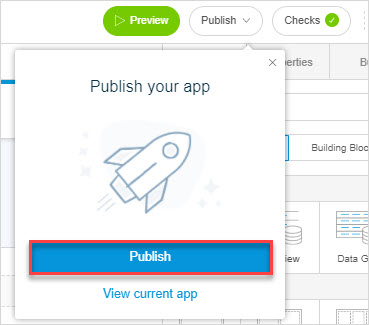
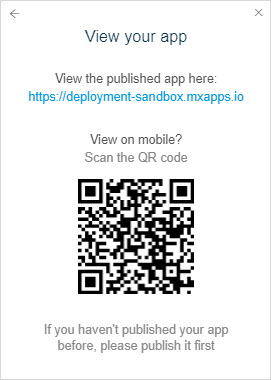
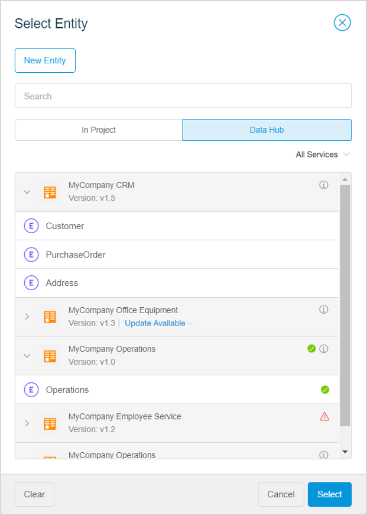
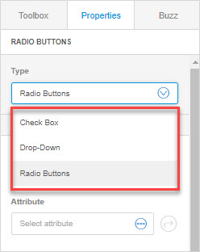
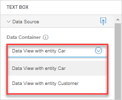
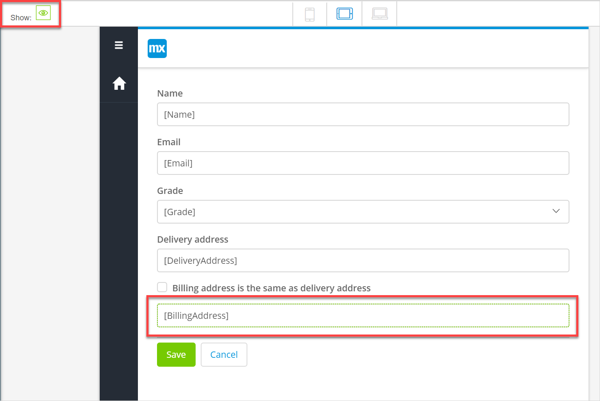
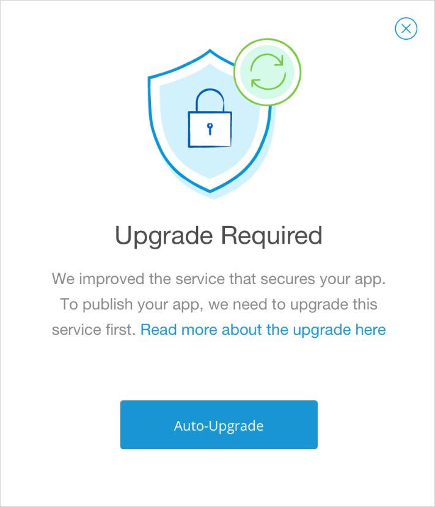
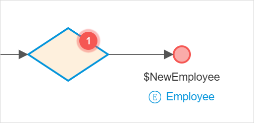
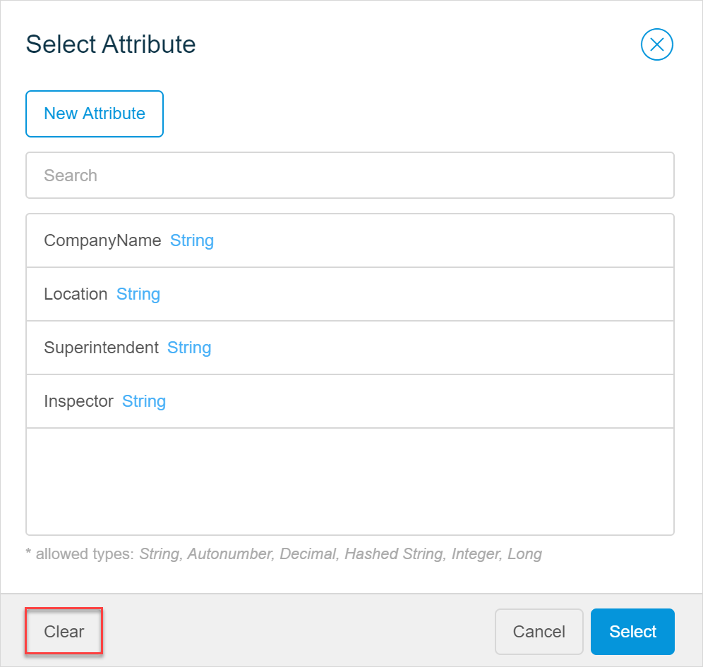

These are the Mendix Studio release notes for app projects built with Studio Pro version 8.7 and above. The release notes include all minor versions, patches, and known issues.

{}
For Studio release notes correlated with the Studio Pro version 8.0–8.6, see [8.0–8.6](8.0-8.6).
{}

For more information on the correlation between Mendix Studio and Desktop Modeler/Mendix Studio Pro versions, see [Studio Ranges & Mendix Versions](/studio8/general-versions).

For updates on the operational status of Studio as well as deployment features and other Mendix services, see [Mendix Status](https://status.mendix.com/).

## 2020

### January 28th, 2021

#### New Features

* We added support for [Studio Pro 8.18](../studio-pro/8.18). 

### December 17th, 2020

#### New Features

* We added support for [Studio Pro 8.17](../studio-pro/8.17). 

### December 8th, 2020

#### Fixes

* We fixed an issue where dialog boxes were closed when consistency checks were completed for your app.

### December 1st, 2020

#### New Features

* We added support for [Studio Pro 8.16](../studio-pro/8.16). 

#### Improvements

* We added a step introducing the **Help & Learning** feature to the guided tour. For more information on the feature, see [General Info](/studio8/general).

#### Fixes

* We fixed a bug where an invalid theme (styling option) caused Studio to claim that you are offline.

### November 24th, 2020

#### Fixes

* We fixed an issue where a consistency error occurred if you copy pasted an entity/attribute more than once.

### November 18th, 2020

#### New Features

* To make it easier for you to learn building apps and assist you when needed, we added contextualized **Help & Leaning** for you. Click the help icon in the top-right corner to view the **Help & Learning** pane with videos and how-to's relevant to your topic. For example, if you are building pages you can view videos on what widgets are and how to configure a data container. You can also browse through other topic that cover all main functionality in Studio:

    {}
    {}

* Now you can publish apps in Studio to the cloud of your choice, e.g. Mendix Cloud, SAP Cloud Platform. The app settings determine which cloud type is the target cloud when users click **Publish**. The Mendix Cloud is the default option. For more information how to configure this, see [Deployment](/developerportal/deploy). For more information on how to publish your app, see [Previewing & Publishing Your App](/studio8/publishing-app). 

#### Fixes

* We fixed an issue where copy pasting elements did not work in the Safari browser. 
* We fixed an issue where you could not preview or publish your app: **Preview** and **Publish** buttons were disabled and the **Initializing consistency checks** message was shown.

### November 10th, 2020

#### Improvements

* To give you more information on the external service from Data Hub, we now link to the technical owner of the service when viewing the service information. By default the technical owner is the owner who registered the service, but this can be changed in the Data Hub Catalog.

### November 3rd, 2020

#### Fixes

* We fixed an issue where selecting an entity as a data source (for example, for a data view or list view) gave an error.

### October 27th, 2020

#### New Features

* We added support for [Studio Pro 8.15](../studio-pro/8.15). 

### October 20th, 2020

#### Fixes

* We fixed an issue with logging out of the Mendix platform. Previously, when you logged out of the platform, you were not logged out of Studio properly. 

### October 13th, 2020

#### New Features

* We improved the process of publishing your app and made it more smooth and reliable. To share your live app with others, simply click the **Publish** button in the new **Publish your app** dialog box:

    
    
    This will publish your changes to the cloud. When your app is being published, a new version of your app is created. Afterwards you can view and share your app. You can view it in the browser clicking the link or view it on mobile by simply scanning the QR code:
    
    
    
    For more information on how to publish your app and how publishing your app differs from previewing it, see [Previewing & Publishing Your App](/studio8/publishing-app).
    
    Under the hood, the new Studio publish process is now identical to the Mendix Studio Pro deployment process (the **Run** button). This means that every time you publish your app from Studio, a specific version (commit) is created in the Team Server, providing the development team full insight in which changes have been published to the live app and by whom.
#### Fixes

* We fixed an issue where an unknown error occurred when publishing your app. 
  

### October 6th, 2020

#### New Features

* We added support for [Studio Pro 8.14](../studio-pro/8.14). 

### September 29th, 2020

#### New Features

* Now [Data Hub](/data-hub/index) functionality is available in Mendix Studio. Every organization has apps containing valuable data that can be used in other applications too. Data Hub allows you to use data from other apps in your app without having to deal with complex solutions. All you need to do is just search for the data, select it, and use it. If your organization has the Data Hub license, you can search for external data from other apps in the **Data Hub** tab in Studio. For more information, see [Data Hub in Studio](/studio8/data-hub-in-studio).

    {}{}

#### Fixes

* We fixed an issue where navigating to another URL was not possible after opening Studio in Mozilla Firefox, you had to open a new tab for that. 
* We fixed an issue where pages with some custom widgets were not displayed.

### September 22nd, 2020

#### New Features

* To speed up the process of app creation and to assist you more in this process, Mendix Studio checks your app for consistency in real-time now. This means you no longer have to first try to preview or publish your app to see if any check fails. You can see failed checks right away now, for example, if any necessary properties of a widget is missing. For more information, see [Checks](/studio8/checks). 
* We added support for [Studio Pro 8.13.1](../studio-pro/8.13). 

### September 15th, 2020

#### New Features

* You can now choose the position of labels of input elements placed inside a data view. We added a new property to the data view that is called **Form Orientation** – it allows you to choose whether labels of input elements inside a data view will have horizontal or vertical orientation, which gives you more flexibility when designing your app:

    

    For more information, see the [General Section](/studio8/page-editor-data-view-list-view#general-section-data-view) in *Data View & List View*.

### September 1st, 2020

#### New Features

* We added support for [Studio Pro 8.13](../studio-pro/8.13). 

#### Improvements

* To improve your user experience and speed up the process of creating an app, we made it possible to convert the type of similar input widgets in one click (you can change a **Text Box** to a **Text Area** and vice versa, and change **Radio Buttons** to a **Check Box** or a **Drop-Down** and vice versa):

    

### August 18th, 2020

#### New Features

* We added support for [Studio Pro 8.12](../studio-pro/8.12). 

#### Improvements

* When configuring an attribute widget (such as, a drop-down, text box, radio buttons), you can now select any surrounding data view as its data source. For example, if you have one data view nested inside another and you place a text box inside these data views, you can choose which data view entity to use as the data source for the text box:

     

#### Fixes

* We fixed an issue where Java compilation errors were not shown in the **Checks** panel.  

### July 14th, 2020

#### New Features

* We added support for [Studio Pro 8.11](../studio-pro/8.11). 

### July 2nd, 2020

#### Improvements 

* To improve your user experience when creating pages, we added opportunity to use snippets. Snippets define reusable page elements and are created in Studio Pro. Using snippets can speed up the process of app creation, as the Studio Pro user needs to make changes in one place only. For more information, see the [Snippet Overview](/studio8/page-editor-widgets-structure#snippet) section in *Structure*.

### June 3rd, 2020

#### New Features

* We added support for [Studio Pro 8.10](../studio-pro/8.10). 

### May 18th, 2020

#### Fixes:

* We fixed an issue where users could not see and select associations in the **Select Entity** dialog box.

### May 6th, 2020

#### New Features

* We added support for [Studio Pro 8.9](../studio-pro/8.9). 

#### Improvements

* We now keep highlighting widgets which have consistency errors (the red border) or conditional visibility property set (the green border) when you edit an element inline.

#### Fixes:

* We fixed a bug in microflows where if you were in read-only mode, and your team member had edited something in microflows, your app crashed after you took over. 

### April 14th, 2020

#### New Features

* To give you more flexibility when creating pages, we added [Conditional Visibility](/studio8/page-editor-widgets-visibility-section) to widget properties. It allows you to show a widget only when certain conditions are met. For example, you have a web shop and you do not want to bother users with filling in the same address twice when the delivery address matches the billing address. In this case, you can make billing address fields visible to users only when they check the option that delivery and billing addresses do not match. 

	You can also highlight which widgets have conditional visibility set by clicking the eye icon of the **Show** option in the top-left corner of pages:

	

* You have more flexibility when configuring input elements and file and image widgets on pages now! You can set **Conditional Editability** that allows you to make a widget editable only if specified conditions are met based on an attribute value. For example, you would like to make the **City** field editable only when users fill the **Country** field in, because you can deliver your products to a limited number of countries. For more information, see the [Editability](/studio8/page-editor-widgets-input-elements#editability) section in *Input Elements* and the [Editability](/studio8/page-editor-widgets-images-and-files#editability) section in *Images & Files*.

#### Fixes

* We fixed an issue where enabling security in Studio, resulted in not being able to log in to the app for Studio Pro users if they previewed the app locally. 

### March 31st, 2020

#### Improvements

* We improved the service that makes it possible to manage your app users. As of April 1st, 2020 we are replacing the current service with an improved one. You might be notified that an auto-upgrade of the security settings of your app is required before you can publish your app:

	{}{}
	
	If you do not auto-upgrade this service, your app will still be secured and running, but you will not be able to publish a newer version of your app. For more information, see the [Auto-Upgrade to the New Service](/studio8/settings-security#upgrade) section in *Security, Roles & Permissions*.
	
* You can resolve [consistency checks](/studio8/consistency-errors) faster and easier! All elements, such as widgets or microflow elements, that require your attention are now marked with a clear indicator:

	{}{}

### March 16th, 2020

#### Improvements

* To speed up the process of creating pages, we added an opportunity to clear the selected attribute. Simply click the **Clear** button:

    {}{}

#### Fixes

* We fixed an issue, where errors were not shown when you configured an enumeration, but you could not proceed because of these errors. 

### March 9th, 2020

#### Fixes

* We fixed a bug when a spinner was not displayed while securing an app before publishing it.
* We fixed an issue where you could not manage users if your app had the AppCloudServices module instead of the [Mendix SSO](/appstore/modules/mendix-sso) module.

### March 2nd, 2020

#### New Features

* It is now possible to copy and paste [enumerations](/studio8/domain-models-enumeration) between Studio apps, which will allow you to build apps faster. You can also duplicate enumerations:

    

* We added support for [Studio Pro 8.7](../studio-pro/8.7). 

#### Fixes

* We fixed an issue in [Studio Buzz](/studio8/collaboration-buzz) where the **Create Feedback Item** button was not working.
* We fixed an issue where it was not possible to add a new page or microflow in app templates.

