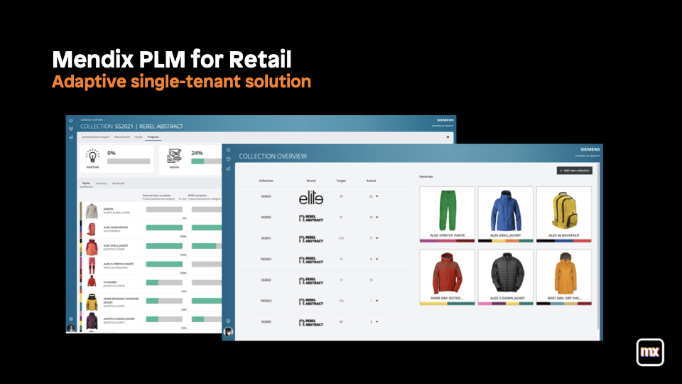
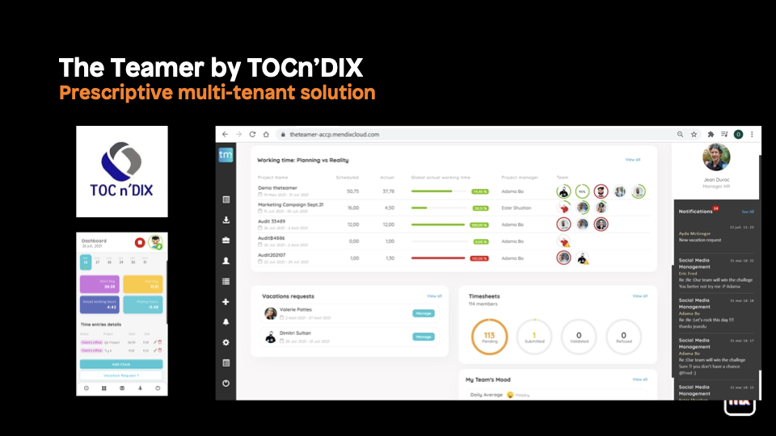
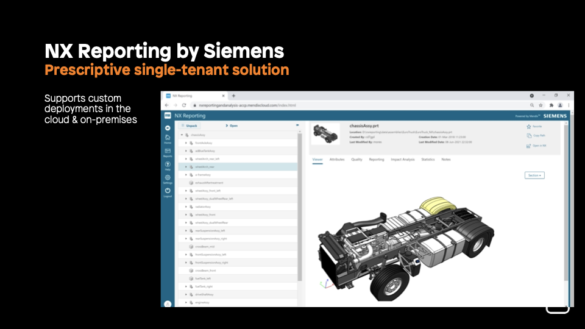

{}
The Mendix Solutions Guide is under active development and will be regularly extended with new sections. Make sure to check in regularly to stay up to date with the latest content!
{}

## 1 Introduction

The Mendix Solutions Platform caters to the needs of different solution business models. Different business models require different architectures. For example, an Adaptive Solution is customized for each customer and requires an implementation team to go & work with the customer on a specific instance of the app model & customize it up to 20% to fit the customer’s needs & to integrate with their existing IT landscape. Another example is a Prescriptive Solution which is fit-for-purpose and has some configuration options, but which does not get adapted at the level of the app model. It can be rolled out to the customer immediately, and can be configured without a dedicated development phase. Each of these scenarios requires a different solution architecture.

## 2 Adaptive & Prescriptive Solutions

The Mendix Solutions Platform supports both Adaptive and Prescriptive Solutions. While Prescriptive Solutions are fully supported, the Mendix Solutions Platform is especially well-suited towards building Adaptive Solutions: Solutions that are made to fit the customer’s needs very well.

### 2.1 Adaptive Solutions

An Adaptive Solution is a solution where each customer gets an instance based on a common core, adapted to the customer’s specific needs & context and integrated with the customer’s existing IT landscape. Up to 20% of the end solution can be adapted - through customizations, extensions, integrations or completely new & customer-specific modules. Instead of being tied to a Prescriptive Solution that only allows for configuration at run-time, Adaptive Solutions allow for design-time adaptation through model-level changes.

The Mendix Marketplace contains plenty of examples of Adaptive Solutions. For example:

- [Mendix PLM for Fashion and Retail](https://marketplace.mendix.com/link/component/118343)
- [Mendix FSM](https://marketplace.mendix.com/link/component/117710)
- [Omnichannel Integration Layer](https://marketplace.mendix.com/link/component/118344)

These solutions are useable as-is, but can be adapted to be even better suitable for the customer.

## 3.2 Prescriptive Solutions

Some solution business models are better suited with a Prescriptive Solution. The solution app model is the same for every customer. They have some configuration options to provide limited flexibility to cater to the needs of groups of customer.

Some examples of Prescriptive Solutions in the Mendix Marketplace are [The Teamer](https://marketplace.mendix.com/link/component/118347) and [NX Reporting & Analytics](https://marketplace.mendix.com/link/component/118155).

The Teamer is a multi-tenant solution where all customers access the solution through the same URL and are isolated in a tenant built into the solution.

NX Reporting & Analytics is a Prescriptive Solution where every customer gets a dedicated instance. The advantage of this solution architecture is that every customer’s solution instance can be deployed where it is most beneficial for the customer - in the cloud or on premises.

## 4 Architecting a Solution for adaptation

Architecting a solution for adaptation requires an understanding of your customer’s needs: you need to know which functional requirements are common across your customers and which are specific. This enables you to split the application model into a shared & immutable core, common extension modules which can be adapted to customer’s needs, and customer-specific modules. Identifying these functional areas enables you to define API boundaries between the shared, immutable core, the common extension modules and the customer-specific modules.

### 4.1 Progressive, emergent architecture

This is a level of knowledge that you will only reach once you are serving a large enough amount of customers. So when starting work on a solution for a launching customer or a handful of customers, you might not have this thorough understanding yet. Instead, as you deliver the solution to additional customers, you will learn about their needs and will better understand which functionalities will be common vs specific. This requires an iterative approach, where your understanding of the requirements on architecture becomes clearer and clearer over time. It also requires a certain level of pragmatism in technical design choices, because it requires you to accept that you do not know everything up front and you will have to redo certain design choices as your understanding increases.

### 4.2 Designing the interfaces

* Split your adaptive solution architecture in three parts:
  * Shared, immutable core
  * Common extensions
  * Customer-specific modules
* Think about which parts of the shared core are reusable in other parts.
  * Define which shared logic should be reusable. Define entry points to the shared logic as APIs.
  * Define which entities (data/state) are required in which parts of the functionality.
* Design APIs between common core & extension module. Consider making only the parts public that are explicitly required in other parts of your current architecture. Design for today.
* Design APIs for custom-specific modules. Focus on current customer requests and their value, and focus on an MVP. Keep it small & simple.
* Iterate with customers to evolve the adaptability of the solution by evolving the architecture. Progressively, the architecture will emerge and become more complex as your solution becomes more succesful. Re-architect when necessary.

### 4.3 Applying IP Protection to make the common core immutable

IP Protection can be used to make parts of the application model immutable by consumers. Review the [IP Protection](ip-protection) section of the Solutions Guide for practical guidance on how to apply IP Protection.
