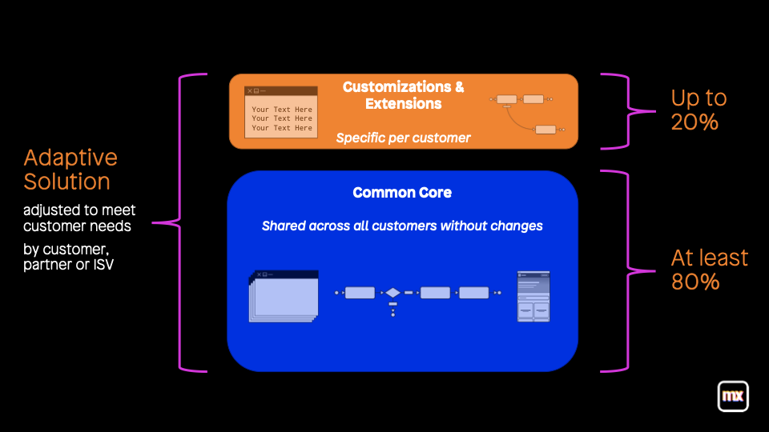

{}
The Mendix Solutions Guide is under active development and will be regularly extended with new sections. Make sure to check in regularly to stay up to date with the latest content!
{}

## 1 Welcome

Welcome to the Mendix Solutions Guide! This section of the Mendix documentation provides information & guidance on how to develop solutions you can sell, on and off the Mendix Marketplace.

Mendix [introduced the Mendix Solutions Vendor program](https://www.mendix.com/blog/introducing-the-mendix-isv-partner-program/) to support companies looking to develop solutions, supporting the full range of organizations - from startups to large enterprises. Under beneficial terms, Mendix provides ISVs & Startups with a Mendix license for development & operations of Mendix apps to implement solutions for their customers.

Read more about the [Mendix Solutions Vendor & Startup programs](general).

## 2 What is a solution?

So, what is a solution? Essentially, a solution is any Mendix app that is suitable to be sold to multiple different customers as a service. This means the app is built to match the needs & expectations of a wider range of customers. Sometimes this means the app is configurable at runtime to better cater to the needs of groups of customers. This means that general Mendix development principles & best practices apply - see below for useful links. And this also means: you can get started right away, from any template available on the Mendix Platform.

Customers often require more from a solution then it supports out-of-the-box. Whether it is an integration with an existing system in the customer's IT landscape, or change to better match the processes of the customer, or simply an adjusted UI to better match the jargon of the customer, these adaptations require more than just a prescriptive SaaS solution: an adaptive solution is required, to make the solution fit to the specific needs of the customer as possible.

Read more on [solution types](solution-types) in the Development section.

## 3 Useful resources

### 3.1 Important sections in the Solutions Guide

Make sure to read through the entire Solutions Guide. A good starting point is the [Development](development) section. The most important topics addressed in the guide are:

- [Architecting for adaptation](adaptive-solution-architecture)
- Applying [IP protection](ip-protection) in your solution
<!-- TODO: Custom usage metering to implement different pricing models -->
- [Version Control](version-control) processes suited to solution development
<!-- TODO: Deployment of solutions -->

### 3.2 Other helpful resources

- General Mendix development with Studio Pro: [Reference Guide](/refguide) and [Howtos](/howto)
- General Mendix [best practices](/howto/general/dev-best-practices) - these equally apply to solutions development

## 4 Get started

Read up on [general](general) information on solutions development on the Mendix Solutions Platform and review the [Development](development) section in the Solutions Guide. Then [create your app](https://new.mendix.com/) and Go Make It!
