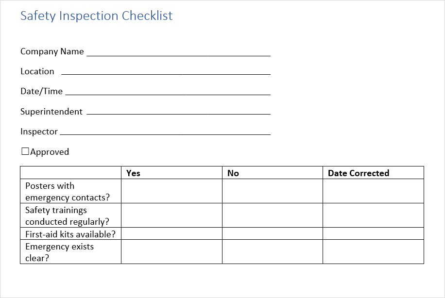
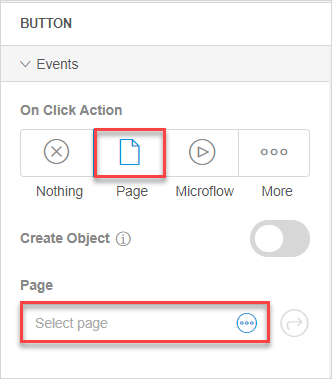
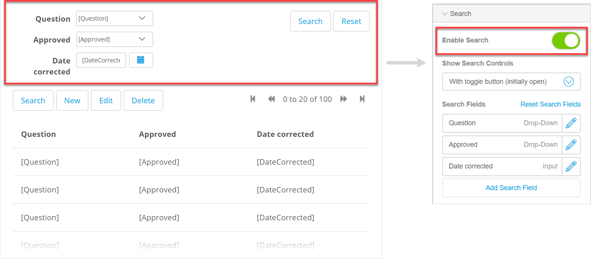

## 1 Introduction 

This how-to explains how you can configure a a page with a form and how to show items related to this form on the same page. 

**This how-to will teach you how to do the following:**

* Configure a form (a data view)
* Show items related to this form in a table 

The how-to describes the following use case: 

The HSE department of your company has the following inspection report:

Your company has an application that is used by inspectors who travel to different companies and inspect whether these companies comply with safety regulations. They fill in their names, a company name, site location, date and time when the inspection was conducted, as well as full name of a superintendent who was present during the inspection. 

Inspectors also have a safety inspection checklist. Based on this checklist the inspector evaluates whether the company passed the inspection. They should check and tick the following checklist items or **questions**:

* If emergency contact posters are displayed
* If safety training are held regularly
* If first-aid kits are available 
* If emergency exists are clear and not blocked

If any of the above requirements are not met, during the next inspection the inspector indicates the date when the safety violation was fixed. 

You have a list of all inspection reports:

You would like the **Details** button in this list to open a pop-up page showing the details of the selected report and its check list items. 

## 2 Prerequisites

Before starting this how-to, make sure you have completed the following prerequisites:

* Familiarize yourself with page terms and how to perform basic functions on pages. For more information, see [Pages](/studio/pages). 

* Familiarize yourself with the domain model terms and learn how to perform basic functions. For more information, see [Domain Model](/studio/domain-models).

* Make sure your domain model is configured the following way:

    

* Make sure you have a page with inspection reports list and the **Details** button:

  

## 3 Adding a Page with a Form

You would like to open a page with inspection report details clicking the **Details** button in the report list. Do the following:

1. Click the **Details** button and go its properties.

2. Set **Page** as an on-click action and click the **Page** property.

	

3.  In the **Select Page** dialog box, click **New Page**, and do the following:

1.  In the **Create new page** dialog box, fill in the page title. 

2.  You can see that the **Pre-fill page contents based on the InspectionReport entity** option is on, so the page template (Forms) is selected automatically for you. Choose **Forms Vertical**:

	

3. Click **Create**.
	
3. The page with a form (a data view) is created. However, the data view's data source was automatically set to **List widget**, you need to change that. Select the data view, go to its properties, and follow the steps below:

1. Change the data source from **List widget** to **Context**.

2. Click the **Entity** property and set the **InspectionReport** entity for it:

       

The form on the page is configured:

 

## 4 Showing Checklist Items

In the initial inspection report, checklist is a table where an inspector has a list of *questions* and ticks the **Yes** or **No** column next to the question: whether the company has posters with emergency contacts, whether it conducts safety trainings regularly, etc. 

To display checklist items in a table, you can add a data grid. It is important that you place it *inside* the data view: this way the data grid will access and display only checklist items associated with the current report rather than display all checklist items ever added to all reports. This means your data grid will get data over an association, in this case called ChecklistItem_InspectionReport.

Follow the steps below:

1. Open **Toolbox** > **Data Containers**.

2. Drag and drop **Data Grid** *inside* the data view (you can see if you placed it correctly on the breadcrumb at the bottom of the page):

    

3. In the data grid properties, click **Entity**.  

4. To show only checklist items associated with the current inspection report, choose the **Checklist** entity over association (*ChecklistItem_InspectionReport/ChecklistItem*) in the **Select Entity** dialog box and click **Select**:

    

5. As the purpose of the page is to display information, you do not need the **Search** section in the data grid. Open data grid properties > **Search** section and disable the **Enable Search** toggle:

    

6. You also do not need **Search**, **New**, **Edit**, and **Delete** buttons in the data grid. Open data grid properties > **Control Bar** section and disable the **Show Buttons** toggle:

  

Now checklist items are displayed in a table below the inspection report details.

Congratulations! You have a page that displays details of the selected report and checklist items of this report:

You can now preview your app and test your page. For more information on how to preview your page, see [Previewing & Publishing Your App](/studio/publishing-app).

You can also work on the page details, for example, add a dynamic image to the list to display a unique company logo next to its name. For more information on dynamic images, see [Images & Files](/studio/page-editor-widgets-images-and-files).