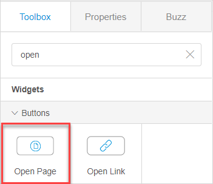
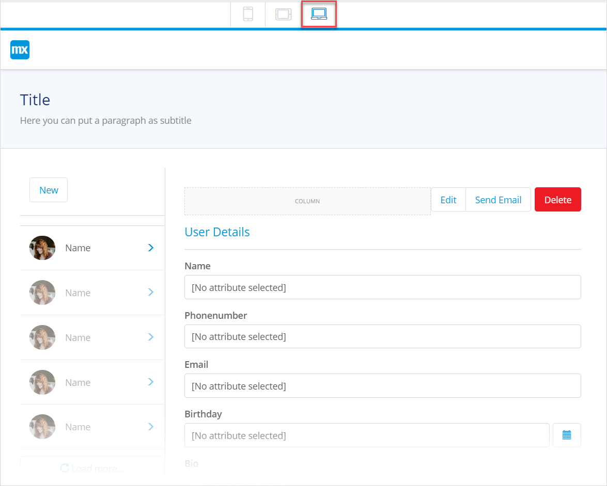
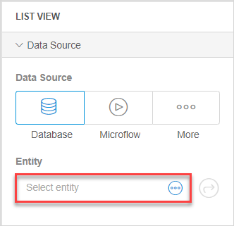
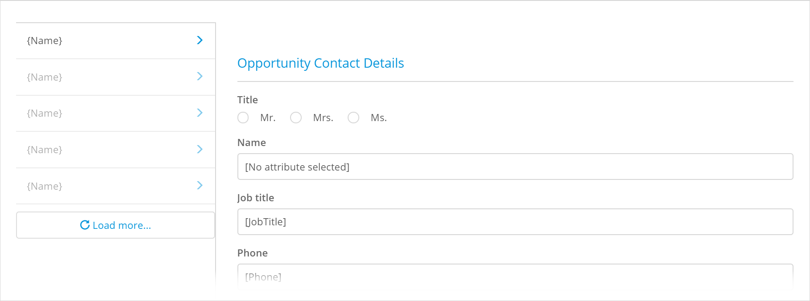

## 1 Introduction 

This how-to explains how you can configure a list of items in Mendix Studio. 

**This how-to will teach you how to do the following:**

* Create a new page
* Configure a list view
* Configure a data view that listens to the list view
* Configure a data grid

The how-to describes the following use case: 

The HSE department of your company has the following inspection report:

Your company has an application that is used by inspectors who travel to different companies and inspect whether these companies comply with safety regulations. They fill in their names, a company name, site location, data and time when the inspection was conducted, as well as full name of a superintendent who was present during the inspection. 

Inspectors also have a safety inspection checklist based on this checklist the inspector evaluates whether the company passed the inspection. They check the following:

* If emergency contact posters are displayed
* If safety training are held regularly
* If first-aid kits are available 
* If emergency exists are clear and not blocked

If any of the above requirements are not met, during the next inspection the inspector indicates the date when the safety violation was fixed. 

You would like to display details of an inspection report and a checklist for it on one page.

## 2 Prerequisites

Before starting this how-to, make sure you have completed the following prerequisites:

* Familiarize yourself with the domain model terms and learn how to perform basic functions. For more information, see [Domain Model](/studio/domain-models).

* Make sure your domain model is configured the following way:

    

* Familiarize yourself with page terms and how to perform basic functions on pages. For more information, see [Pages](/studio/pages). 

## 3 Adding the Master Detail Page

You would like to open a page with inspection report details from your home page. Do the following:

1. Open your home page and navigate to **Toolbox** > **Widgets**.

2. Search for **Open Page** button and drag and drop it to the page.

	

3. Open the button properties and follow the steps below:

    1. Set **Page** as an on-click action and click the **Page** property.

    	

    2.  In the **Select Page** dialog box, click **New Page**.

    3.  In the **Create new page** dialog box, fill in the page title. 

    4. Select the page template by clicking **Master Detail** in the side bar and choose **Master Detail**:

    	

    5. Click **Create**.

The page is created. In the responsive (Desktop) view, a list is displayed on the left and list item details are displayed on the right:

 

## 4 Configuring the Report List

The page is created, now you need to configure it. You need to connect data to the list first. Do the following:

1. Select the list view and click the **Entity** option in its properties:

	

2. In the **Select Entity** dialog box, select *InspectionReport* and confirm your choice by clicking **Select**. Now the list is connected to the *InspectionReport* entity. 

3. To display the name of each report dynamically, do the following:

    1. Select the **Name** text in the list view and click the properties icon to quickly configure widget's properties:

		

    2. In the dialog box, delete *Name* from the **Content** property and click **Add attribute**:

		

    3. In the **Select Attribute** dialog box, choose *CompanyName* and click **Select**. 

4. As the goal of the new page is to merely display data, delete the **New** button above the list view together with the container it is placed in.

Now the list view will display a list of reports by company name:

 

## 5 Configuring Report Details

Now you need to configure report details displayed next to the list. The idea is when you select the company name from the list, the details of the latest inspection report for this company will be displayed. 

The Master Details page template which your page is based on has a preconfigured data view that listens to the list view. That means that the data view has access to the list view data. 

Now you need to configure widgets inside the data view to show attributes of the *InspectionReport* entity, or in other words to show all the details that a report has: a company name, site location, inspection date and time, inspector's name, etc. 

All the details that a report has need to be displayed. Do the following:

1. Delete an empty column and **Edit**, **Send Email**, and **Delete** buttons on the right as you will only  display data on this data, not change it.

2. Double-click the *User Details* text widget (which is displayed as a heading) and rename it to *Inspection Report Details*. 

3. Select the *Name* text box and click **Data Source** > **Attribute** in its properties. 

4. In the **Select Attribute** dialog box, choose *CompanyName* and click **Select**:

	

5. Repeat steps 3 and 4 to replace *Phonenumber* with *Location*, *Email* with *Superintendent*, *Birthday* with *DateAndTime*, and *Bio* with *Inspector* attributes.  

13. To add information on whether the company *passed* the check, you need to add radio buttons with *Yes* and *No* options. Open **Toolbox** and search for radio buttons.

14. Drag and drop radio buttons inside the data view.

15. In the dialog box that appears next to it, click the **Attribute** property:

	

16. In the **Select Attribute** dialog box, choose *Passed* and click **Select**. 

Now the data view and widgets inside it show the details of the inspection report that is selected in the list:

 

## 6 Showing Checklist Items

In the initial inspection report, checklist is a table where an inspector ticks **Yes** or **No** column: whether the company has posters with emergency contacts, whether it conducts safety trainings regularly, etc. 

To display checklist items in a table, you can add a data grid. It is important that you place it *inside* the data view: this way the data grid will access and display only checklist items associated with the current report rather then display all checklist items ever added to all reports. This means your data grid will get data over ChecklistItem_InspectionReport association.

Follow the steps below:

1. Open **Toolbox** > **Data Containers**.

2.  Drag and drop **Data Grid** *inside* the data view.

3. In the dialog box that appears next to the data grid, click **Entity**:

	

4. To show only checklist items associated with the current inspection report, choose the **Checklist** entity over association (*ChecklistItem_InspectionReport/ChecklistItem*) in the **Select Entity** dialog box and click **Select**:

    
    
5. As the purpose of the page is to display information, you do not need the **Search** section in the data grid. Open data grid properties > **Search** section and disable the **Enable Search** toggle:

    

6. You also do not need **Search**, **New**, **Edit**, and **Delete** buttons in the data grid. Open data grid properties > **Control Bar** section and disable the **Show Buttons** toggle:

	

Now checklist items are displayed in a table below the inspection report details.

Congratulations! You have a page that displays a list of inspection reports, details of the selected report, and checklist items of this report:

You can now preview your app and test your page. For more information on how to preview your page, see [Previewing & Publishing Your App](/studio/publishing-app).

You can also work on the page details, for example, delete an image from the list or replace it with a dynamic image to display a unique company logo next to its name. For more information on dynamic images, see [Images & Files](/studio/page-editor-widgets-images-and-files).