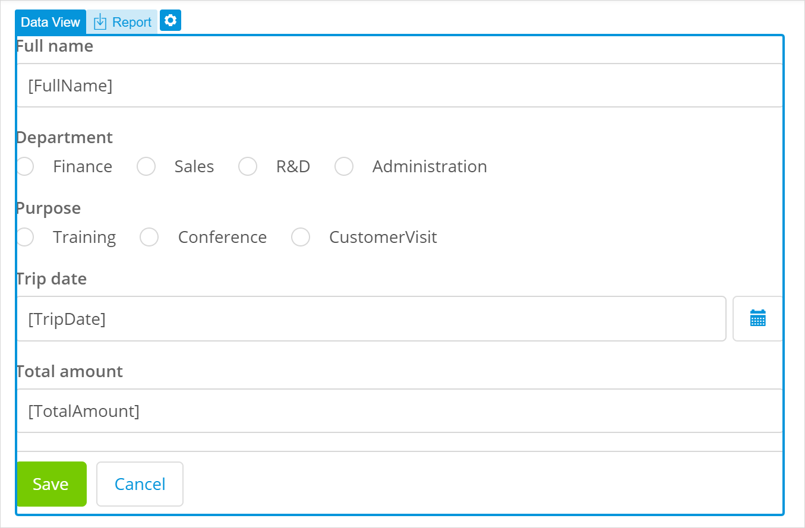

## 1 Introduction 

This how-to explains how you can filter and sort items in a list view or a data grid in Mendix Studio. 

**This how-to will teach you how to do the following:**

* Create image and file entities
* Add an image uploader to a form
* Add a file uploader to a form

The how-to describes the following use case: 

You have a form (a data view) where new employees add their information and upload their profile picture:

Your domain model looks the following way:

## 2 Prerequisites

Before starting this how-to, make sure you have completed the following prerequisites:

* Familiarize yourself with page terms and how to perform basic functions on pages. For more information, see [Pages](/studio/pages). 
* Familiarize yourself with the domain model terms and learn how to perform basic functions. For more information, see [Domain Model](/studio/domain-models).

## 3 Adding Image Entity

First of all, to be able to upload or/and download pictures and files you need to add a special type of entity to your domain model: an image entity. Do the following:

1. Open your domain model and select the **Employee** entity.

2. Click **New attribute**:

    

3. In the **Create New Attribute** dialog box, click **Add image or file** in the bottom right corner:

    

4. Select **Image Entity** in the **Image and Files** dialog box.

5. Name the entity *ProfilePicture* and click **Create**. 

The image entity is automatically created together with a one-to-one association (meaning that one employee can have only one profile picture) to the **Employee** entity:

 

## 4 Adding an Image Uploader to a Form

An **Image Uploader** is a widget that allows your end-users upload images. However, it can only function inside a data container (a list view or data view) and can only have an image entity as its data source. If you just drag and drop image uploader to your current form, it will not work, because your current data view has the  **Employee** entity as its data source, which is not an image type of entity. 

To solve this issue, you first need to drag and drop another data view *inside* your current one, this way you will be able to access the **ProfilePicture** entity over **Employee_ProfilePicture** association. Then you can place an image uploader inside the second data view and it will work properly with your image entity. 

Follow the steps below:

1.  Open the page with employee's form. 

2. Find a data view in the **Toolbox** and drag and drop it *inside* the current data view. 

    

3. In the properties dialog box that appears, click **Entity**. 

4. In the **Select Entity** dialog box, select **Employee_ProfilePicture/ProfilePicture**. This means that the data view will access the **ProfilePicture** entity over **Employee_ProfilePicture** association. 

    

5. Find the **Image Uploader** in the **Toolbox** and drag and drop it inside your newly configured data view.

If you open the **Image Uploader** properties, you can see that the **ProfilePicture** was automatically set as its **Context Entity**:

Good job! Now you have the employee form where employees can enter their details and can upload their profile picture. 

