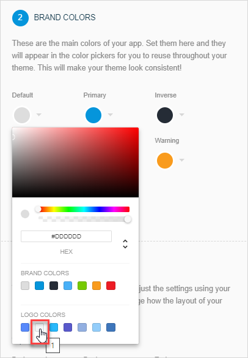
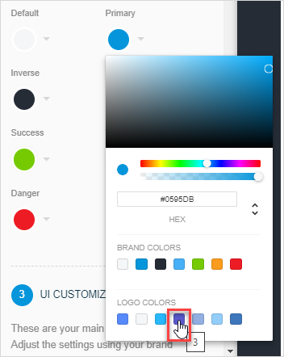
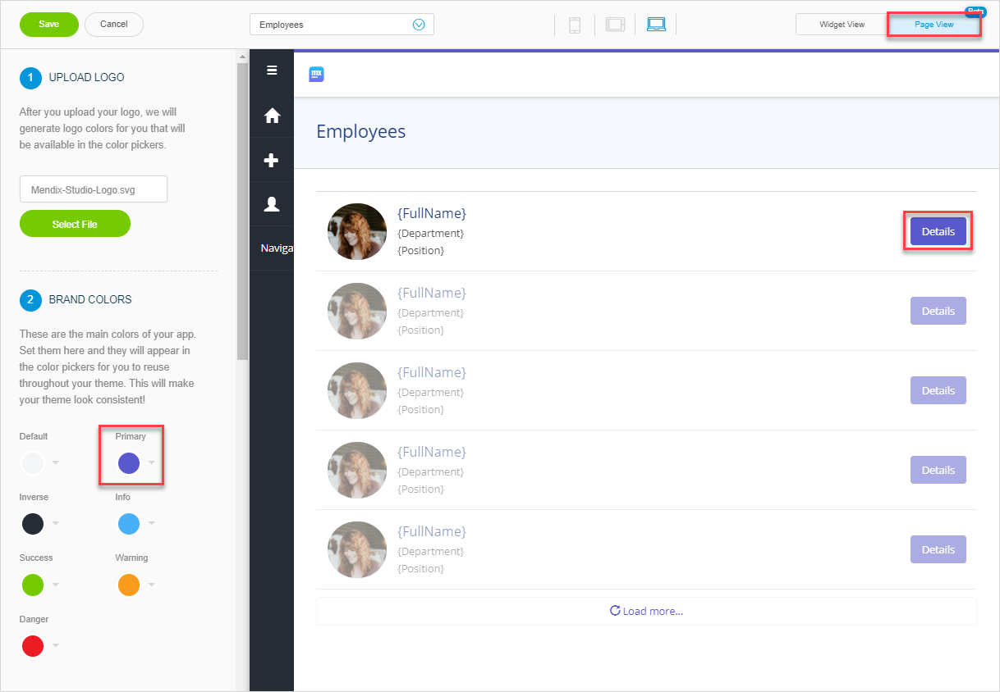
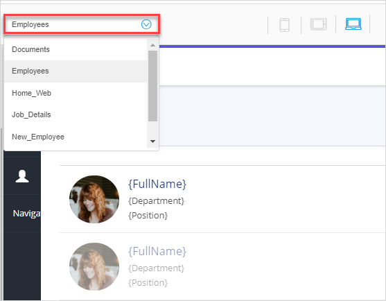
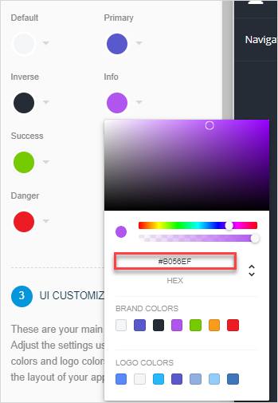

## 1 Introduction

This how-to explains how to configure a menu bar for your app such as creating menu items and sub-items. 

**This how-to will teach you how to do the following:**

* Upload your company logo
* Customize colors of your app interface
* Change fonts

This how-to describes the following use case: 

You would like to customize your app design.

## 2 Prerequisites

Before starting this how-to, make sure you have completed the following prerequisites:

* Familiarize yourself with Theme Customizer terms. For more information, see [Theme Customizer](/studio/theme-customizer). 
* Familiarize yourself with page terms. For more information, see [Pages](/studio/page-editor). 

## 3 Uploading Your Company Logo

To upload a logo, do the following:

1. Open the **Theme Customizer**.

2. In the **Upload Logo** section, click **Select File**.

   

3. In the dialog box, select the image with your company logo.

4. Check out the selected image uploaded and shown in the preview:

   

5. Click **Save** in the top-left corner to save changes.

The logo of your app has changed.

## Changing Your App Colors

You can customize your app colors in the **Brand Colors** section. Once you uploaded the logo, a color palette is generated based on the logo colors. You can then select **Logo Colors** in color-pickers of different settings.

To customize your app colors, do the following:

1. In the **Brand Colors** section, click the **Default** option and select a color marked as *1* in **Logo Colors**:

    

2. Click the **Primary** option and select a color marked as *3* in **Logo Colors**:

    

3. In the top-right corner, select **Page View** to see how your changes are applied to pages. The colors that you have changed are applied to widgets that have the **Style** property, for example, buttons and texts. 

    

4. Select different pages in the top bar to make sure you like how new colors are implemented on all pages of your app:

    

5. In the **Brand Colors** section, click the **Info** option and fill in the HEX color code `#B056EF`:

    

6. Repeat step 4 to make sure the color fits all pages in your app.
7. Click **Save** in the top-right corner to implement your changes.

Good job! You changed the colors in your app. 

## Customizing Topbar, Sidebar,and Backgrounds

