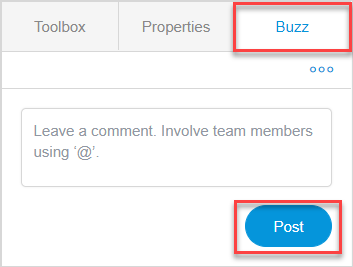
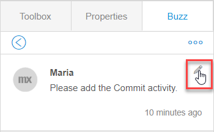
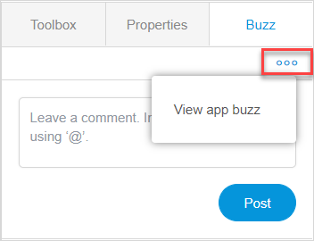
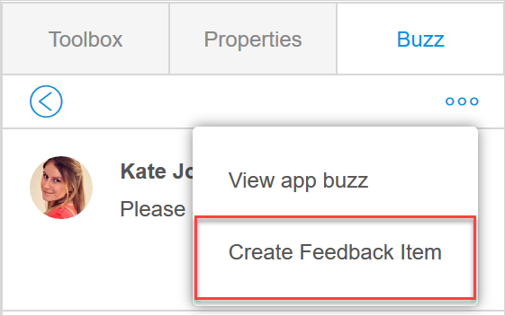
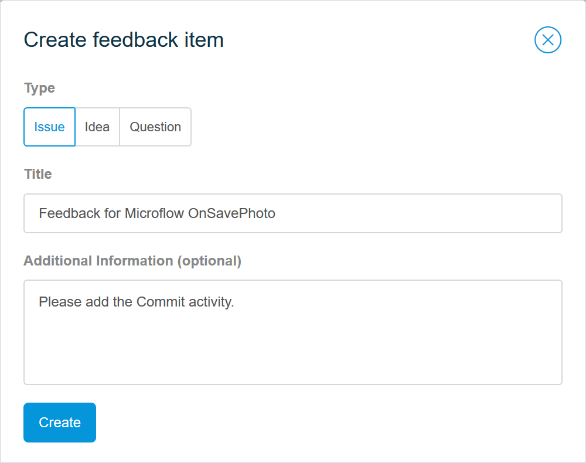

## 1 Introduction 

Via the **Buzz** tab, you can collaborate on your app with team members – leave comments  or create feedback items on pages, microflows, the domain model, or a navigation document. With such in-context commenting it is easy to communicate clearly and plan your future work. 

Comments from Studio Buzz are automatically posted in [App Buzz](/developerportal/collaborate/buzz#app-buzz) in the Developer Portal giving your team members an opportunity to respond to comments both in Studio and the Developer Portal. 

## 2 Leaving and Editing Comments {#comment}

To *leave a comment*, navigate to the **Buzz** tab, write your comment, and click **Post**:

To *tag a person* by their name, use *@*. 

To *edit* a comment, do the following:

1. Open a page, microflow, the domain model, or the navigation document the comment refers to.

2. Open the **Buzz** tab and click the comment.

3.  Click the edit icon and change the comment.

    

4. Click **Save**. 

{}

You cannot delete comments in Studio, this is only possible in the [App Buzz](/developerportal/collaborate/buzz#app-buzz) in the Developer Portal.  

{}

## 2 Viewing App Buzz

Your comments are posted and shown in the **App Buzz** in the Developer Portal. To view the **App Buzz**, click the ellipsis icon > **View app buzz**:

You will be automatically taken to the Developer Portal. For more information on the App Buzz, see the [App Buzz](/developerportal/collaborate/buzz#app-buzz) section in *Buzz*.  

## 3 Creating a Feedback Item

You can create a feedback item via the **Buzz** tab. Feedback items allow you to submit ideas, questions, or issues on the app, and let your team work on them in the Developer Portal. 

In a thread in Studio Buzz, you and your team may conclude that the subject discussed needs more thorough refinement or needs to be postponed to be picked up in future sprints. In that case, a feedback item is a useful way to bring the item under attention of the product owner in the team. From there it can evolve into a story and be planned for a sprint. For more information on feedback items, see [Feedback Management](/developerportal/collaborate/feedback), especially the [Adding a Feedback Item to Your Backlog](/developerportal/collaborate/feedback#adding) section.  

To create a feedback item, do the following:

1. Click the posted comment. For more information on how to leave a comment, see the [Leaving and Editing Comments](#comment) section.

2.  Click the ellipsis icon and select **Create Feedback Item**:

	{}
	{}
	
3.  In the **Create feedback item** dialog box, fill in the type of feedback, its title, and additional information if necessary.

    {}
    {}

4. Click **Create**.

The feedback item is submitted and a corresponding comment is posted in the **Buzz** tab with a link to the Developer Portal:

{}
{}

## 4 Read More

* [Buzz](/developerportal/collaborate/buzz)
* [Feedback Management](/developerportal/collaborate/feedback)
