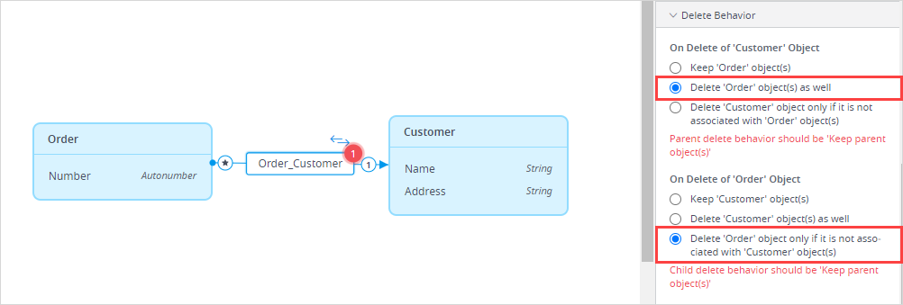
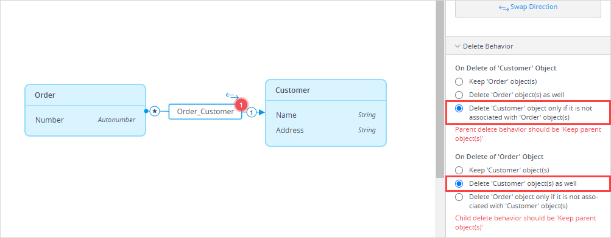
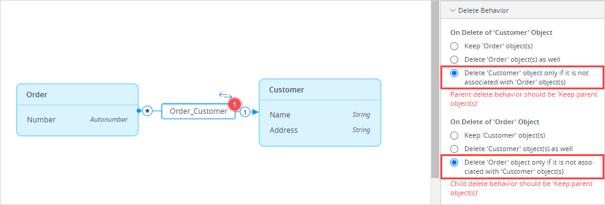

## 1 Introduction 

In this document, we will explain how to solve the most common consistency errors that can occur when configuring the domain model in Mendix Studio. For more information on domain models, see [Domain Model](domain-models).

An example of a consistency error is having the same name for two entities.

## 2 Domain Model Consistency Errors

The most common errors you can come across when configuring a domain model are described in the table below:

| Error Code | Message in the Checks Panel                                  | Cause of the Error                                           | Way to Fix                                                   |
| ---------- | ------------------------------------------------------------ | ------------------------------------------------------------ | ------------------------------------------------------------ |
| CE0001     | An association between a persistable entity and a non-persistable entity must start in the non-persistable entity and have owner 'Default'. | You created an association between a persistable and non-persistable entity, and the association is drawn from the persistable entity to non-persistable one (thus, the owner of association is the persistable entity). Persistable entities are stored in the database, and non-persistable entities are stored in memory. You can point from the memory to the database but not other way around. For more technical information, see [Persistability](/refguide/persistability) in the *Mendix Studio Pro Guide*. | Open association properties and swap the direction of the association thus changing the owner of association; or change the persistability of one of the entities in entity properties. |
| CE0017     | Invalid [delete behavior](domain-models-association-properties#delete-behavior). | This error occurs when delete behavior of entities in the association contradict each other. For more information on the cases when this error occurs, see the [Delete Behavior Consistency Errors and Ways to Fix](#delete-behavior) section. | For information on how to fix this error, see the [Delete Behavior Consistency Errors and Ways to Fix](#delete-behavior) section. |
| CE0021     | Attributes of type {attribute type} are only supported in persistable entities. | A non-persistable entity has an attribute of type Autonumber or Binary. These types of attributes need to be stored in the database. | Make the entity persistable by enabling the corresponding option in properties; or change the attribute type. |
| CE0065     | Duplicate name {name of the entity} in module {name of the module}. Entities, associations and enumerations cannot share names. | You have several entities with one and the same name in your domain model. | Rename one of the entities; all entity names should be unique. |
|            | The selected attribute {name of attribute} is ambiguous. It is not allowed to have more than one entity {name of attribute}. | You have several entities with one and the same name in your domain model, so the attributes of these duplicated entities are giving you an error. | Rename one of the entities; all entity names should be unique. |
|            | The selected association {name of the association} is ambiguous. It is not allowed to have more than one association {name of the association} | You several have associations with one and the same name in your domain model. | Rename one of the associations; all association names should be unique. |

### 2.1 Delete Behavior Consistency Errors and Ways to Fix Them{#delete-behavior}

 Consistency errors connected with delete behavior can occur in the following cases:

*  Delete behavior of an entity the association starts from is set to *Delete {name of entity} object(s) as well* and the delete behavior of an entity the association points to is set to *Delete {name of entity} object only if it is not associated with {name of other entity} object(s)*

    

*  Delete behavior of the entity the association starts from is set to *Delete {name of entity} object only if it is not associated with {name of other entity} object(s)* and the delete behavior of the entity the association points to is set to *Delete {name of entity} object(s) as well*

    

*  Delete behavior of both entities in association is set to *Delete {name of entity} object only if it is not associated with {name of other entity} object(s)*

    

You can fix the delete behavior errors in one of following ways:

* If  you set delete behavior of one entity to *Delete {name of entity} object only if it is not associated with {name of other entity} object(s)*, set delete behavior of another entity to *Keep {name of entity} object(s)*. 
* Set delete behavior of both entities to *Keep {name of entity} object(s)* 
* Set delete behavior of both entities to *Delete {name of entity} object(s) as well*.

For more information on delete behavior, see section the [Delete Behavior](domain-models-association-properties#delete-behavior) section in *Associations*.

## 3 Read More

* [Page Consistency Errors](consistency-errors-pages)
* [Navigation Consistency Errors](consistency-errors-navigation)
* [Microflow Consistency Errors](consistency-errors-microflows)
* [Checks](checks)