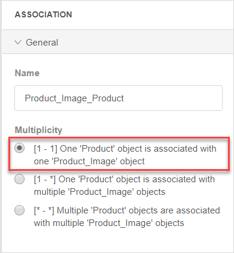
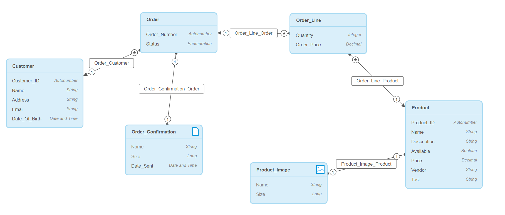

## 1 Introduction

This how-to explains how you can configure the domain model in Mendix Studio. 

**This how-to will teach you how to do the following:**

* Define what data to include to your domain model
* Create different type of entities
* Create attributes
* Create associations

This how-to describes the following use case: 

You are configuring the domain model for an online shop. 

## 2 Prerequisites

Before starting this how-to, make sure you have completed the following prerequisites:

* Familiarize yourself with the domain model terms and performing basic functions. For more information, see [Domain Model](domain-models).

## 3 Defining What Data to Include  

The workflow for new customers of the online shop looks the following way:

1. A customer registers in the online shop and enters the following details:
   1. Full name
   2. Address
   3. Email
   4. Date of birth
2. When registration is complete, a *unique ID* is assigned to the customer. 
3. The customer browses through *products* and the following product details are displayed:
   1. Image 
   2. Name
   3. Description 
   4. Availability
   5. Price 
   6. Vendor
   7.  Unique product ID 
4. The customer adds products to a shopping cart. 
5. In the shopping cart, every item is presented as a separate line showing *quantity* and *price* per line. The customer checks the order, pays it, and gets a *confirmation* with the *order details* and the *date* the order is purchased on. 

Based on the description below, you can divide your data to the following elements: 

* Customer 
* Product 
* Order 

## 4 Defining the Product {#product}

As products is one of the main elements of the online shop, an entity should be created to represent a product in your domain model. The information that defines the product, such as its name and price, should be attributes of the **Product** entity. 

To add the product to your domain model, follow the steps below:  

1. Create the **Product** entity. Do the following:

    1. Open your [domain model](domain-models).

    2. Open **Toolbox**, drag and drop **Entity** in your domain model:

       

    3. In the **Create New Entity**, dialog window, set the name to **Product** and click **Create**.

2. Create attributes for the **Product** entity. Do the following: 
    1. Select the entity and click **New attribute**:
      
		
      
    2. In the **Create New Attribute** dialog window, set the name to *Product_ID*, set the type to *Autonumber*, and click **Create**:
      
        
      
    3. Repeat step 2a to add the *Name* attribute. 
      
    4. In the **Create New Attribute** dialog window, set the name to *Name*, set the type to *String*, and click **Create**.
      
   5. Repeat step 2a to add the *Description* attribute.
   
   6. In the **Create New Attribute** dialog window, set the name to *Description*, set the type to *String*, and click **Create**. 
   
   7. Repeat step 2a to create the attribute to indicate if the product is available. 
   
   8. In the **Create New Attribute** dialog window, set the name to *Available*, set the type to *Boolean*, and click **Create**.
   
   9. Repeat step 2a to create the *Price* attribute.
   
   10. In the **Create New Attribute** dialog window, set the name to *Price*, set the type to *Decimal*, and click **Create**. 
   
   11. Repeat step 2a to create the *Vendor* attribute. 
   
   12. In the **Create New Attribute** dialog window, set the name to *Vendor*, set the type to *String*, and click **Create**. 
   
3. Each product has an *image*, but you did not create it as an attribute. You need to create an image entity for it, a special type of entity that allows you to store images and set its name to *Product_Image*. Follow the steps below:

	1.  Open **Toolbox**, drag and drop the **Image Entity** in your domain model:

		

	2. In the **Create New Image Attribute** dialog window, set the name to *Product_Image* and click **Create**.
		{} *Name* and *Size* attributes are created automatically and are read-only.
		{}

Good job! You created the **Product** entity, its attributes, and the **Product_Image** image entity:

 

## 5 Defining the Order

The order information can be divided into following:

* Order – general information about the order such as its status, order number, name of the customer and their address, etc. 
* Order line – items ordered, their quantity and price
* Order confirmation – confirmation that is sent to the customer that the order is created

So, you need to create three entities: *Order*, *Order_Line*, and *Order_Confirmation*. 

Do the following:

1. Create the **Order** entity. Use the same method as for creating the **Product** entity. For more information, see the [Defining the Product](#product) section. 

2. Create attributes for the **Order** entity: *Order_Number* and *Status*. Do the following: 
    1. Select the entity and click **New attribute**.
      
    2. In the **Create New Attribute** dialog window, set the name to *Order_Number*, set the type to *Autonumber*, and click **Create**. 
      
    3. Repeat step 2a to create the *Status* attribute.
      
    4. Set the attribute **Name** to *Status* and **Type** to *Enumeration*. 
      
    5. Click **Select enumeration** to create a new [enumeration](domain-models-enumeration). 
      
		
      
    6. In the **Select enumeration** dialog window, click **New Enumeration**.
      
    7. In the **Create new enumeration** dialog window, click **Add Item** (*Status* is filled out automatically for the **Name**).
      
		
      
    8. Enter *Ordered* for the **Caption** (**Name** is filled out as *Ordered* automatically).
      
    9. Click **Add Item** and repeat the step above to create the **Paid**, **Shipped**, **Delivered**, and **Cancelled** statuses.
      
		
      
    10. Click **Create** to close the dialog windows and create the attribute.
   
3. Create the **Order_Line** entity. Use the same method as for creating the **Product** entity. For more information, see the [Defining the Product](#product) section. 

4. Create attributes for the **Order_Line** entity. Do the following: 

    1. Repeat step 2a to create the *Quantity* attribute.
    2. In the **Create New Attribute** dialog window, set **Name** to *Quantity*, set **Type** to *Integer*, and click **Create**.
    3. Repeat step 2a to create the *Order_Price* attribute. 
    4. In the **Create New Attribute** dialog window, set **Name** to *Order_Price*, set **Type** to *Decimal*, and click **Create**.

5. Create the **Order_Confirmation** entity. As an order confirmation is a file is sent to customers, you need to create a special type of entity that allows you to store files – the **File** entity. Do the following:

    1. Open **Toolbox**, drag and drop the **File Entity** in your domain model:

		

    2. In the **Create New File Attribute** dialog window, set the name to *Order_Confirmation* and click **Create**.

6. Create attributes for the the **Order_Confirmation** entity. Do the following: 

    1. Repeat step 2a to create the *Date_Sent* attribute.

    2. In the **Create New Attribute** dialog window, set **Name** to *Date_Sent*, set **Type** to *Date and Time*, and click **Create**.

		{} *Name* and *Size* attributes are created automatically and are read-only.
		{}

You configured three entities that define the order in your online shop.

## 6 Defining the Customer

A customer is another crucial part of the online shop that needs a separate entity. The information that defines customers, such as its name and price, should be attributes of this entity.

Follow the steps below:

1. Create the **Customer** entity (for more information on how to create a new entity, see the [Adding New Entities](domain-models#adding-new-entities) section in *Domain Model*).

2. Create attributes for the **Customer** entity (for more information on how to create an attribute, see the [Adding New Attributes](domain-models#adding-new-attributes) section in *Domain Model*). Do the following:

    1. Create the *Customer ID* attribute: set **Name** to *Customer_ID* and **Type** to *Autonumber*. 

    2. Create the *Name* attribute: set **Name** to *Name* and **Type** to *String*.

    3. Create the *Address* attribute: set **Name** to *Address* and **Type** to *String*.

    4. Create the *Email* attribute: set **Name** to *Email* and **Type** to *String*.

    5. Create the *Date_Of_Birth* attribute: set **Name** to *Date_Of_Birth* and **Type** to *Date and Time*.

You created the **Customer** entity and its attributes:

## 7 Creating Associations

You have created all the entities and their attributes:

Now you need to define how these entities are connected to each other and create associations. For more information on associations, see [Associations](domain-models-associations).  

First define how entities are connected between each other:

1. One product image is connected to only one product: this means they have a one-to-one association.
2. One order can contain multiple items (order lines) in it, that means the **Order** and **Order_Line** have a one-to-many association.
3. The **Order_Line** will use information about the product, it needs to access the name of the product, its ID, etc. One product can be associated with several order lines, so **Product** and **Order_Line** need a one-to-many association.
4. One order confirmation is issued per one order. This means one **Order** object is associated with one **Order_Confirmation** object and has a one-to-one association. 
5. Order needs to access information about a customer: name, address, etc. Several orders can be connected to one customer, so Order and Customer have a one-to-many association.

Now that you defined connections between entities, you can start creating these connections. Follow the steps below:

1. Create an association from the **Product_Image** to **Product**. Do the following:

    1. Hover over the Product_Image entity and click the dot icon.
    2. Drag the dot to to the Product entity. 
    3. Open **Properties** and change the multiplicity (one-to-many is created by default) to one-to-one.

		

3. Create an association from **Order_Line** to **Order** following the steps 1a and 1b above. (The correct multiplicity, one-to-many, is created by default).
4.  Create an association from **Order** to **Customer** following the steps 1a and 1b above. (The correct multiplicity, one-to-many, is created by default.)
5. Create an association from **Order** to **Order_Line**. Do the following:
    1. Follow the steps 1a and 1b above.
    2. Open **Properties** and change the multiplicity (one-to-many is created by default) to one-to-one.

Congratulations! You have now configured the domain model for the online shop!

