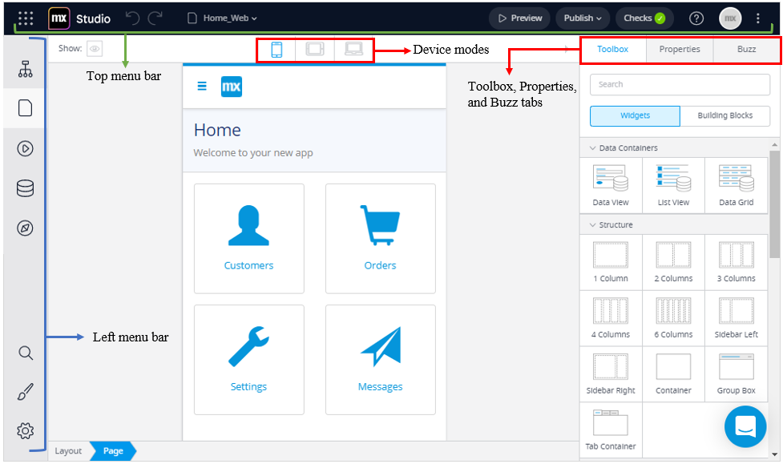
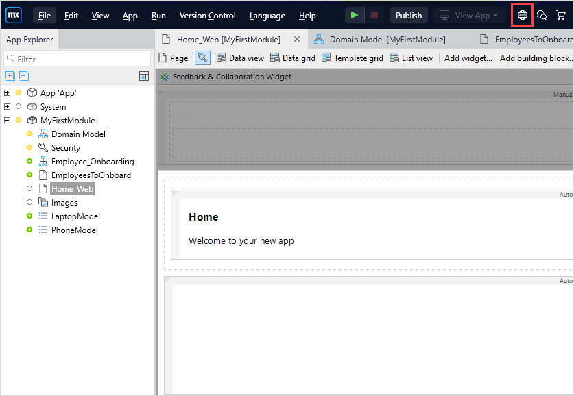
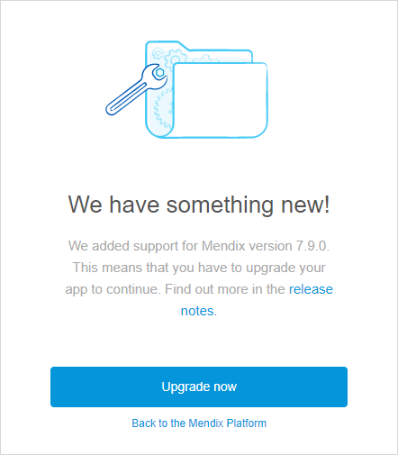
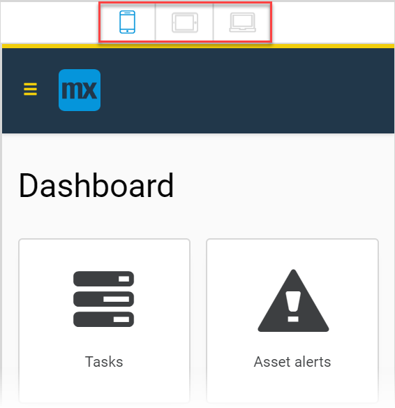
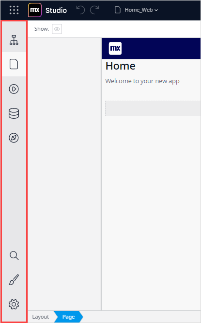

## 1 Introduction {#studio-overview}

Mendix Studio is the place where you can create, view and edit your Mendix applications without going into technical details. For this purpose you can use the [Studio Pro](/refguide/modeling) and [develop apps together with Studio Pro users](general-collaborative-development) anytime. 

With Studio you can create and edit applications in your browser without installing software on your PC.   

The picture below shows the components of Studio's interface:

## 2 Opening Studio

You can open Mendix Studio [via Developer Portal](#opening-studio-via-dev-portal) or [via Studio Pro](#opening-via-studio-pro). 

### 2.1 Opening Studio via Developer Portal {#opening-studio-via-dev-portal}

You can edit an app in Mendix Studio by opening your app in [Developer Portal](https://home.mendix.com) and clicking **Edit in Studio**:

If you do not see **Edit in Studio**, go to [General Settings](/developerportal/settings/general-settings) in the Developer Portal and [enable Studio](/developerportal/settings/general-settings#web).

### 2.2 Opening Studio via Studio Pro {#opening-via-studio-pro}

You can also open your app in Studio via Studio Pro. Do the following:

1. In Studio Pro, open the project in that you want to view in Studio.

2.  Click the globe icon in the top right corner (only available if Studio is enabled).

    

The app opens in Studio.

## 3 Upgrading Studio

After clicking **Edit in Studio** you may need to upgrade your app to the latest version.

{}
{}

You may also see an orange top bar suggesting an upgrade to the next Mendix version. For more information on Studio upgrades and Mendix versions, see [Studio Ranges & Mendix Versions](general-versions).

{}
When you upgrade your app in Studio to the latest  Mendix version, you will need to upgrade your app in the Studio Pro to the same version as well. 

If you are working in a team with others, it is wise to check with your team members if everyone is OK to upgrade the app to the latest Mendix version. The reason for this is that once you update Studio, you need to update Studio Pro as well.

{}

## 4 Switching App Modes

After opening Studio, the home page of the app opens. 

You can change the view of your page to different views by clicking the corresponding icons:

* Mobile
* Tablet
* Responsive (Desktop) 

  {}
  {}

## 5 Left Menu Bar

The left menu bar allows you to go back to the Developer Portal, access pages, the domain model, microflows, and the navigation document in Studio, search for different elements in your app, open settings, and customize the look of your app:

{}
{}

All items of the left menu bar are described in the table below:

| Menu item                            | Shortcut     | Description                                                  |
| ------------------------------------ | ------------ | ------------------------------------------------------------ |
| Mx Logo                              | None         | The Mx logo is the return button to return to the [Developer Portal](https://home.mendix.com) of the app. |
| [Pages](page-editor)                 | 1            | Shows a list of all pages in the app. After you select a page, it opens in Studio. |
| [Domain Models](domain-models)       | 2            | Shows the domain models of the app.                          |
| [Microflows](microflows)             | 3            | Shows a list of all microflows in the app.  After clicking a microflow, it will open in Studio. |
| [Navigation Document](navigation)    | 4            | Shows a configured menu in the form of a navigation tree. You can expand the menu structure of the navigation tree up to two levels with an unlimited amount of pages. |
| Search (magnifying glass) icon       | <kbd>/</kbd> | Helps you search through microflows, entities, and pages. Start typing the name of the item you are looking for and the search feature will return any matches it finds, using exact matches as well as fuzzy matches based on the characters entered.  You can also use "/" shortcut to search through your app. |
| [Settings](settings)                 | None         | **Settings** consists of **Roles and Permissions** and **Widget Overview**.  Via [Roles and Permissions](settings-security) you can manage access to your app for different type of users.   The [Widget Overview](settings-widget-overview) gives you an overview of all widgets and their status. Widgets are user interface elements (alerts, buttons, charts, etc.) that are used to build pages. |
| [Theme Customizer](theme-customizer) | None         | Allows you to style your app with custom branding, colors, and typography. |

## 6 Toolbox, Properties, and Buzz

The top right menu of Studio consists of the **Toolbox**, **Properties** , and **Buzz** tabs: 

The **Toolbox**, **Properties** , and **Buzz** tabs are described in the table below:

| Tab          | Description                                                  |
| ------------ | ------------------------------------------------------------ |
| Toolbox      | Shows tools available for the current editor.                |
| Properties   | Shows the properties of the selected item.                   |
| [Buzz](buzz) | Allows an app development team to make comments to different pages, microflows, domain models, and layouts of Studio, and interact with each other. |

## 7 Top Menu Bar

The top menu bar allows to check whether Studio is connected to the internet, undo or redo actions, view your recent documents, preview or publish your app, and view errors in your app (if any). 

The top menu bar items are described in the table below: 

| Menu item | Description |
|------|------|
| Status icon | Indicates the internet connection status of Studio. If the icon is green, Studio is connected. When grey, Studio is offline. |
| Undo/Redo actions | There buttons undo or redo the last action. You can also use <kbd>Ctrl</kbd>+<kbd>Z</kbd> and <kbd>Ctrl</kbd>+<kbd>Y</kbd> shortcuts correspondingly. |
| Recent documents drop-down menu | A document that you are currently viewing is displayed in this option. When you click the drop-down menu, documents that you have recently viewed are displayed in the list. Click the document to open it. |
| [Preview button](publishing-app) | Shows you what your app will look like after it is published |
| [Publish button](publishing-app) | You can publish your app with this button. Click **Publish** > **Update** to publish the latest changes you made in Studio. For more information, see [Previewing & Publishing Your App](publishing-app) |
| [Checks button](checks) | Displays consistency errors (if any) that prevent your app from being previewed and published. For more information on errors, see [Consistency Errors](consistency-errors). You can also use <kbd>C</kbd> shortcut to view the **Checks** panel. |
| Information icon | Here you can find following information:<ul><li>**About** – shows the information on the [Studio version and Mendix version](general-versions) </li><li>**Keyboard Shortcuts** – opens the list of shortcuts in Studio</li><li>**Take a Product Tour** – starts a  the guided product introduction tour and shows you around Studio</li><li>**Ask the Community** – a link to the [Mendix Forum](https://forum.mendixcloud.com/index4.html) where you can ask questions and explore the knowledge offered by the entire Mendix community<li>**Check the  Documentation** – a link to the [Studio Guide](index)</li><li>**Contact Mendix Support** – a link to the [Mendix Support Portal](https://support.mendix.com/hc/en-us)<li>**Mendix Academy** – a link to the [Mendix Academy](https://gettingstarted.mendixcloud.com)</li><li>**Mendix Assist Is ON** – a setting that enables/disables [Mendix Assist](mx-assist)</li><li>**Edit in Studio Pro** – opens your app in Studio Pro</li></ul> |

## 8 Cut/Copy/Paste Function 

You can copy and paste pages and microflows. You can also cut, copy, and paste separate elements such as widgets or microflow activities. 

### 8.1 Copy/Paste Pages, Microflows, and Enumerations {#copy-paste-documents}

Pages, microflows, and enumerations can be copied to clipboard and then pasted to a different Studio app. You can also copy and paste pages, microflows, and enumerations to the same app, however, there is the **Duplicate** option you can use for this purpose. For more information on how to copy, paste, or duplicate pages, microflows, and enumerations, see [Pages](page-editor), [Microflows](microflows), and [Enumerations](domain-models-enumeration) respectively.  

Mind the following when copying and pasting pages, microflows, and enumerations:

* You can copy/paste pages, microflows, and enumerations only to Studio apps that have the same Mendix version 
* You can copy/paste pages, microflows, and enumerations only between instances of the same browser
* You *cannot* copy/paste from Studio to Studio Pro or vice versa

### 8.2 Cut/Copy/Paste Separate Elements

Cut/copy/paste function is available in all editors of Studio: pages, microflows, domain models, and navigation document. To cut/copy/paste you can use <kbd>Ctrl</kbd> + <kbd>X</kbd> /  <kbd>Ctrl</kbd> + <kbd>C</kbd> / <kbd>Ctrl</kbd> + <kbd>V</kbd> or  <kbd>Cmd</kbd> + <kbd>X</kbd> /  <kbd>Cmd</kbd> + <kbd>C</kbd> / <kbd>Cmd</kbd> + <kbd>V</kbd>. 

Mind the following characteristics when using cut/copy/paste:

* You can cut/copy/paste elements within one editor; that means that you can cut/copy/paste elements within one page or to other pages in Studio, and copy microflow activities within one microflow or to other microflows
* You can cut/copy/paste elements to different apps in Studio if they have the same Mendix version
* You cannot copy/paste pages or microflows, only elements of a page or a microflow 
* You cannot cut/copy/paste from Studio to Studio Pro or vice versa

## 9 Main Documents in This Category

* [Collaborative Development in Studio](general-collaborative-development) – provides you with information on how team members work together on one project in Mendix Studio Pro and Mendix Studio 

* [Studio Ranges & Mendix Versions](general-versions) – explains how Studio version correlates to the Mendix version
