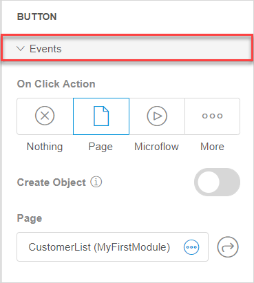
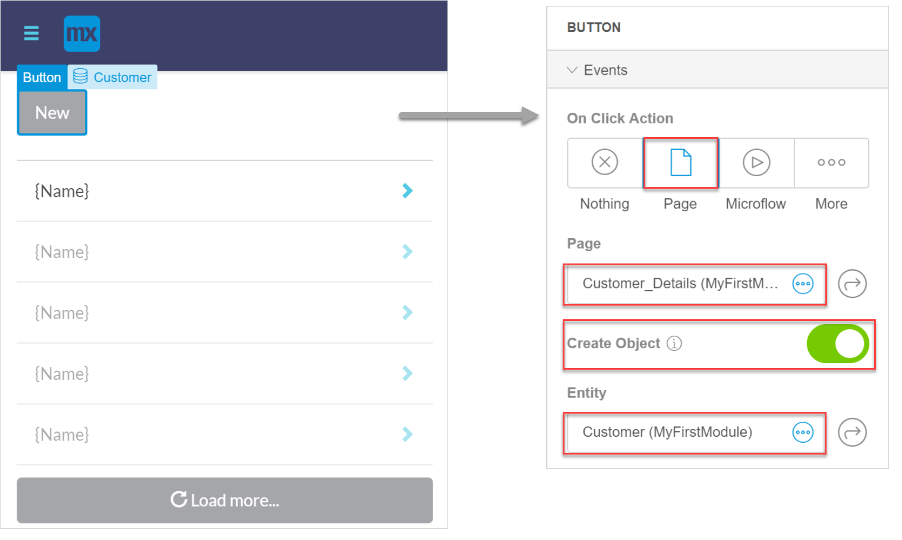
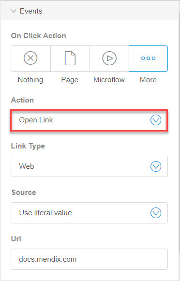
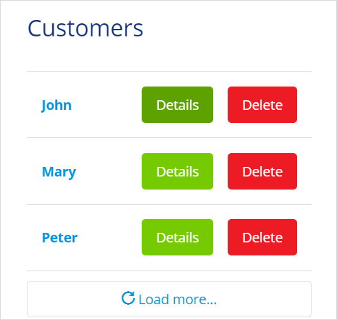
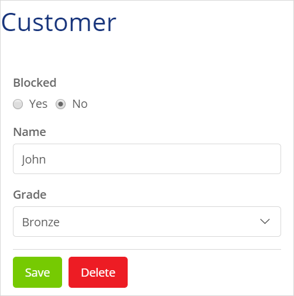

## 1 Introduction 

The **Events** section is a section in the **Properties** tab that is common for different widgets in Mendix Studio, for example, for a static image, buttons, list view, and data view. 

In the **Events** section, you can set the **On Click Action** for widgets and specify what action will be performed when end-users click the widget. For example, you can specify that when a user clicks a profile image, the page with the user's personal account will open. 

{}
{}

## 2 On Click Actions {#on-click-action}  

You can find the description of possible on-click actions below:

* [Nothing](#do-nothing) 
* [Page](#show-page) 
* [Microflow](#microflow) 
* [Call Workflow](#call-workflow) 
* [Open Workflow Page](#open-workflow-page) 
* [Open Task Page](#open-task-page)
* [Complete Task](#complete-task) 
* [Save Changes](#save-changes) 
* [Cancel Changes](#cancel-changes) 
* [Close Page](#close-page) 
* [Sign Out](#sign-out)  
* [Open Link](#open-link-action) 
* [Delete Object](#delete-object-action) 

{}

The list of available on-click actions may differ depending on the widget. For example, **Delete Object** on-click action is unavailable for the list view. 

{}

### 2.1 Nothing {#do-nothing}

No action is taken. This option is useful for setting up a page without defining the underlying functionality yet.

### 2.2 Page {#show-page}

The **Page** action opens the specified page. 

The following properties are specific for this action:

* **Page** – a [page](page-editor) that should open.

* **Create Object** – creates a new object and passed it to the selected page (disabled by default). For more information, see the [Create Object Option](#create-object-option) section below

#### 2.2.1 Create Object Option {#create-object-option}

When you set the **On Click Action** to **Page**, you can enable the **Create Object** option. You need to pass an object if the selected page expects a context. 

For example, you want to create a new customer by clicking the **New** button. This button will open a page where you can fill in a new customer's details and save them. However, the *Customer Details* page needs to get data first, in other words, it expects the object *Customer* to be passed to it. 

{}
{}

Thus, when setting the on-click action of the **New** button to **Page**, you need to enable the **Create Object** option and select the **Customer** entity.

If you enable **Create Object** option, you need to set the following:

* **Page** – Specifies which page with the new created object should be shown. The page should contain a data view that expects this object.
* **Entity** – Specifies the object of which entity will be created and passed to the selected page as a context.    

### 2.3 Microflow {#microflow}

The **Microflow** action executes the selected microflow. The **Microflow** property, which allows you to select a microflow, is specific for this action.

### 2.4 Call Workflow {#call-workflow}

The **Call workflow** action executes the specified workflow. 

The following properties are specific for this action:

* **Workflow** – A [workflow](workflows) that should be executed.
* **Close page** – Specifies whether the current page should be closed.
* **Commit** – Specifies whether the object should be committed when running a workflow. 

### 2.5 Open Workflow Page {#open-workflow-page}

**Open workflow page** opens an overview page set for the **Workflow page** in [workflow properties](workflow-properties). An element with this on-click action should be placed in a data container connected to the **System.WorkflowInstance** entity. {}[The warning in properties gives a simpler explanation, but is confusing, because it appears even when I select a workflow entity]{}

### 2.6 Open Task Page {#open-task-page}

**Open task page** opens an overview page set for the [user task](workflows-user-task) in properties. An element with this on-click action should be placed in a data container connected to the **System.WorkflowUserTask** entity. {}[The warning in properties gives a simpler explanation, but is confusing, because it appears even when I select a workflow entity]{}

### 2.7 Complete Task {#complete-task}

The **Complete task** action marks the specified user task in the workflow as completed.

The following properties are specific for this action:

* **Workflow task** – The [user task](workflows-user-task) that should be marked as completed.

* **Outcome** – Lists the outcomes of the selected [user task](workflows-user-task) and follows the selected outcome. If the user task has only one outcome, the **Default** is set as an outcome and the property cannot be edited. 

* **Close page** – Specifies whether the current page should be closed.

* **Commit** – Specifies whether the object should be committed when marking the task as completed.

### 2.8 Save Changes {#save-changes}

The **Save Changes** action saves (commits) all changes made on the page.

### 2.9 Cancel Changes {#cancel-changes}

The **Cancel changes** action rolls back all changes made on the page. 

### 2.10 Close Page {#close-page}

The **Close page** action closes a pop-up window (for pop-up pages) or navigates to the previously visited page.

### 2.11 Sign Out {#sign-out}

The **Sign out** action signs the currently signed-in end-user out of the app. 

### 2.12 Open Link Action {#open-link-action}

The **Open Link** action triggers an action based on the link type:

{}
{}

The following properties are specific for this action:

* **Link Type** – specifies the action the link performs. Possible values for **Link Type** are the following: 

  * **Web** – Navigates to a website.

  * **Email** – Composes an email.

  * **Phone Call** – Starts a phone call.

  * **Text Message** – Sends a text message.

    {}When you configure **Email**, **Phone Call** or **Message** options, the corresponding default app will be opened on the device when the action is triggered, for example, the default email client will be opened to compose a message.
    
    {}

* **Source** – Depends on the chosen link type and whether you want to use a literal value or to use the value of an attribute. Possible values for **Source** are the following:

  * **Use literal value** – You can fill a value out (Specify **Url** for **Web**, **Recipient** for **Email**, and **Phone Number** for **Phone Cal**l and **Message**).
  * **Use attribute** – If you select **Database**>**Entity** as a data source for the list view,  you can choose the attribute of a string type that belongs to the entity or create a new one (when the **Use attribute** option is configured, you do not need to fill out any information manually, it will be updated dynamically).

### 2.13 Delete Object Action {#delete-object-action}

Behavior of the **Delete Object** action depends on a data container it is placed in: a [list view](page-editor-data-view-list-view#list-view-properties) or a [data view](page-editor-data-view-list-view#data-view-properties). 

#### 2.13.1 Delete Object Action in a List View

If you place the **Delete Object** in a list view, the corresponding list view item will be deleted, when a user clicks a button.

For example, you have a page with a list view showing customer names. A **Delete** button is placed inside the list next to each name. Thus, if you click **Delete** in a line that says "Peter", this customer and all customer's details will be deleted. 

{}
{}

#### 2.13.2 Delete Object Action in a Data View

When placed on a data view, **Delete Object** will delete the connected object. For example, you opened a page with customer's details. The details are placed in a data view. You have **Save** and **Delete** buttons at the bottom of the page. When you press **Delete**, the customer "John" and customer's details will be deleted and the page will be closed. 

{}
{}

## 3 Read More

* [Widgets](page-editor-widgets)
