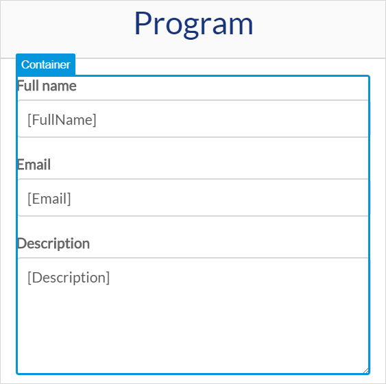
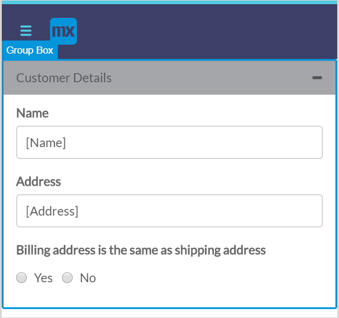
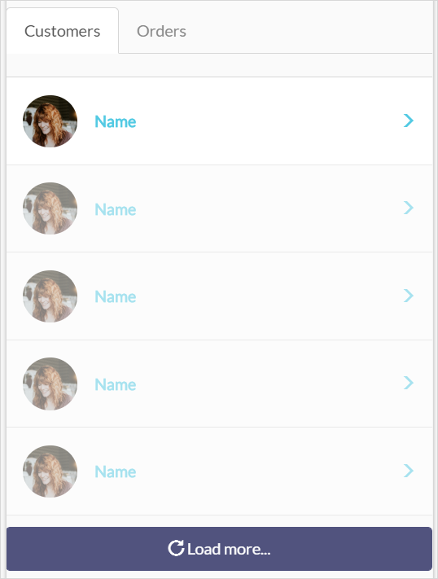
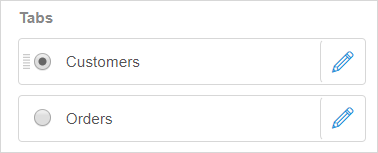
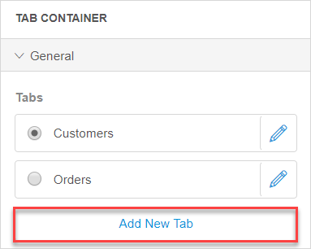
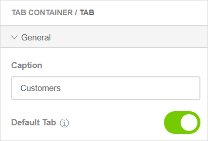

---

title: "Layout Widgets"
parent: "page-editor-widgets"
description: "Describes layout widgets in Mendix Studio."
menu_order: 60
tags: ["studio", "page editor", "layout", "layout widgets", "widgets"]
---

## 1 Introduction 

Layout widgets are widgets that allow you to provide structure to your page and group other widgets inside them. 

Layout widgets are the following ones:

* [Container](#container-overview)
* [Group Box](#group-box-overview)
* [Tab Container](#tab-container)

## 2 Container Overview {#container-overview}

A **Container** is used as a layout element where you can place a widget or a group of widgets and simultaneously style, drag or delete them. For example, you can place a section title and input widgets for filling out program's details in one container, and subsequently reposition the whole container at once to a different location on the page. 

{}
{}

Container properties consist of the **Design** section. For information, see [Design Section in Widgets](page-editor-widgets-design-section).

## 3 Group Box Overview {#group-box-overview}

A group box is used to group widgets together. The group box can be configured to collapse or expand dynamically with all the elements inside it. 

{}
{}

### 3.1 Group Box Properties

Group box properties consist of the **General** section and the **Design** section. For information on the **Design** section and its properties, see [Design Section in Widgets](page-editor-widgets-design-section).

Properties available in the **General** section are described in the table below.

| Property    | Description                                                  |
| ----------- | ------------------------------------------------------------ |
| Show Header | **Show Header** defines whether a header is shown above the group box.  *This property is enabled by default.* |
| Caption     | This property is only displayed when the **Show Header** option is enabled. It defines the caption that is shown in the header. |
| Collapsible | This property is only displayed when the **Show Header** option is enabled. It defines whether the group box and its elements can be collapsed or expanded. Possible values of this property are the following:<ul><li>**Yes (start expanded)** – the elements inside the group box will be initially expanded and can be collapsed when a user clicks a minus icon in the header</li><li>**Yes (start collapsed)** – the elements inside the group box will be initially collapsed and can be expanded when a user clicks a plus icon in the header </li><li>**No** – group box elements cannot be expanded or collapsed</li></ul> |

## 4 Tab Container Overview {#tab-container}

A tab container is a container that is used to show information categorized into tabs. This can be useful if the amount of information that you would like to display is larger than the amount of space on the screen. For example, you can show a list of customers on one tab, and orders on the other one. 

{}
{}

You can place a widget or a group of widgets inside each tab and configure information in them separately. 

### 4.1 Tab Container General Properties

In the **General** section, you can configure the following properties:

*  **Tabs** – use radio buttons to switch from one tab to another; click the tab and drag it to change the order of tabs; click the **Edit** icon to open the tab properties and configure it (for more information, see section [5.3 Tab Properties](#tab-properties))

	{}
	{}

*  **Add New Tab** – adds a new tab to your tab container; tab properties will open automatically (for more information, see section [5.3 Tab Properties](#tab-properties))

	{}
	{}

### 4.2 Tab Container Design Properties

For information on the **Design** section and its properties, see [Design Section in Widgets](page-editor-widgets-design-section).

### 4.3 Tab Properties {#tab-properties}

Each tab has the following properties: 

* **Caption** – defines the name of the tab; you can also edit the caption by double-clicking it in the page 

*  **Default Tab** – defines which tab is active when the page is opened. If no tab is set as the default one, the first tab page will be shown. By default, none of the tabs are set as a default tab.

	{}
	{}

## 5 Read More

* [Pages](page-editor) 
* [Widgets](page-editor-widgets)
