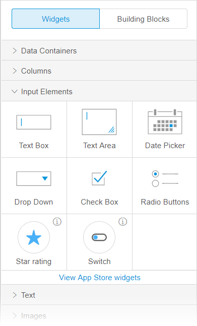
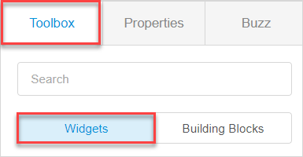
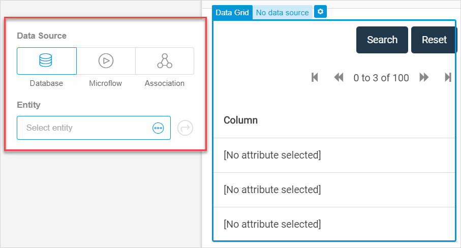
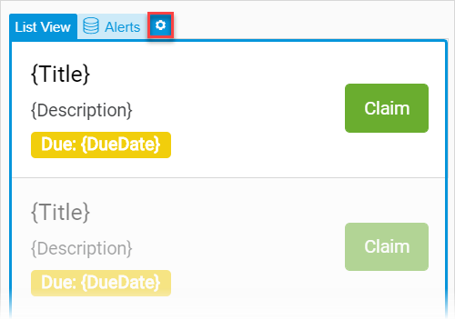
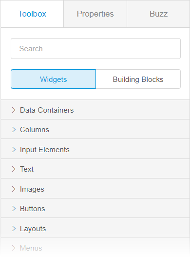
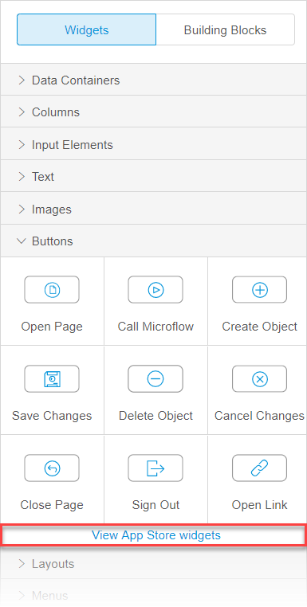
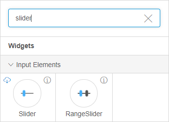
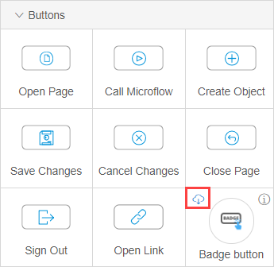

## 1 Introduction

Widgets are single user-interface elements that can be configured. Examples of widgets can be a container, a drop-down menu, or different kinds of buttons.

{}
{}

Widgets in Studio are grouped by category and can be classified by their origin.

## 2 Viewing Widgets

To view widgets in Mendix Studio, do the following:

1. Click the **Pages** icon in the left menu bar.

2. In the displayed list of app pages, select the page you want to open and click it.

3. In the **Toolbox** tab, **Widgets** are opened by default.

   

## 3 Quick Configuration of Widget Properties {#quick-config}

Quick configuration of properties is available for most of non-custom widgets. This means that their properties can be configured in a pop-up window when adding these widgets on a page. 

Once you drag and drop a widget, a small pop-up window appears next to it. You can set the properties that are necessary for the widget to function without resulting in [consistency errors](consistency-errors) as well as other frequently used properties to help you configure the widget quickly. However, you can configure all properties from the **Properties** tab at all times. 

For example, quickly configuring the data source of a data grid helps you avoid consistency errors when previewing or publishing your app, and you can configure the rest of the properties later.

The pop-up window disappears once you start interacting with the page or the menu items, for example, if you start clicking elements on the page or if you open **Toolbox**, **Properties**, **Buzz**. To access the quick configuration pop-up window again, click the gear icon in the top-right corner of the widget:

## 4 Widgets by Category {#widget-categories}

Widgets of Studio are divided into categories that you can see when you open the **Widgets** tab.

{}
{}

Widget categories are described in the table below:

| Widget Category                                        | Description                                                  |
| ------------------------------------------------------ | ------------------------------------------------------------ |
| Data Containers                                        | Contains a [data view](page-editor-data-view-list-view) (the starting point for showing the contents of one object),  [list view](page-editor-data-view-list-view) (the starting point for showing the contents of list of objects), and a [data grid](page-editor-data-grid) (shows a list of objects in a table format). |
| [Structure](page-editor-widgets-structure)             | Contains pre-set layout grids with a specific number of columns and widgets for controlling the placing widgets. |
| [Input Elements](page-editor-widgets-input-elements)   | Contains elements that can be used for inputting data.       |
| [Text](page-editor-widgets-text)                       | Contains text display widgets.                               |
| [Images & Files](page-editor-widgets-images-and-files) | Contains widgets that help you display images, upload or/and download files and images. |
| [Buttons](page-editor-widgets-buttons)                 | Contains buttons with general actions, such as opening or closing a page, calling a microflow, signing users out, opening a link. |
| [Data Buttons](page-editor-widgets-buttons)            | Contains buttons that manipulate data and are used to create or delete an object, save or cancel changes. |
| [Workflow Buttons](page-editor-widgets-buttons)        | Contains buttons that are related to [workflows](workflows) and are used to call  a workflow, complete or show a [user task](workflows-user-task), show a workflow page. |
| [Menus](/refguide/menu-widgets)                        | Contains menu creation widgets. Currently, these widgets can be configured only in Studio Pro. |
| Add-ons                                                | Contains all custom widgets previously installed in the app. If widgets cannot be matched to the Marketplace profile they will be shown in the add-ons. |
| Charts                                                 | Contains different charts. This category consist of the [Marketplace widgets](#app-store-widgets). |
| Display                                                | Contains widgets which display changing elements on a page, for example a map, or a progress bar. This category consists of the [Marketplace widgets](#app-store-widgets). |
| List view Controls                                     | Contains controls for the list view. This category consist of the [Marketplace widgets](#app-store-widgets). |

## 5 Widgets by Origin {#widgets-by-origin}

Widgets in Studio can be divided by origin as shown in the table below:

| Type                                                | Description                                                  | Origin                                                       |
| --------------------------------------------------- | ------------------------------------------------------------ | ------------------------------------------------------------ |
| Default widgets                                     | Widgets that are included into your app by default and do not have the information icon in the top-right corner. | Apps created in the Developer Portal (for more information on the Developer Portal, see [Developer Portal](/developerportal/)) |
| Marketplace widgets | Widgets that you can download to your app directly from Studio. Some Marketplace widgets are already in your app as a part of the app. Such widgets have the information icon in the top-right corner of widgets in the **Toolbox**.  For more information on the Marketplace, see [Marketplace Overview](/appstore/general/app-store-overview). | [Marketplace](/appstore/)                               |
| Local widgets                                       | Either widgets that are a part of an app template, or widgets created by your or your team locally via Studio Pro. For more information on developing widgets, see the [Build pluggable web widgets](/howto/extensibility/pluggable-widgets) how-to's. As a rule local widgets will be listed in the **Add-ons** category. For more information on categories, see the [Widgets by Category](#widget-categories) section. | Apps created in the  Developer Portal/Studio Pro             |

## 6 Adding the Marketplace Widgets

You can add the Marketplace widgets to your app by downloading them directly in the **Widgets** tab in Studio. These widgets are a subset of all widgets available in the Marketplace: you can only download the ones that are approved for use in Studio. You can also update them if an update is available.

To add an Marketplace widget, do the following:

1. Open the **Widgets** tab.

2.  Do one of the following:  

    a. Find a category with the **View Marketplace widgets** option and click it.   

    {}
    {} 

    b.  Start typing the name of the category or of a specific widget in the **Search** field.  

    

3.  Click the cloud icon to download the widget and add it to your app.

    

The widget is now added to your app, you can simply drag and drop it to the page to use it. You can also view settings of this widget in the **App Settings**.  For more information on managing widgets in your app, see [Settings](settings).

{}

Some similar widgets are packaged together: downloading one of these widgets will cause a number of other widgets to be downloaded as well. For example, downloading a line chart will give you all chart widgets.

{}

## 7 Read More 

* [Pages](page-editor)
* [Settings](settings)
* [Marketplace Overview](/appstore/general/app-store-overview)
