## 1 Introduction 

Security is a way of controlling access to your app. For example, you can decide who can access your app. 

[Roles and Permissions](#roles-and-permissions) are an important part of security – an instrument which you can use to restrict or grant access to different parts of your app, such as pages and microflows.

## 2 Enabling Security {#enabling-security}

Whether security is enabled for your app by default, depends on app's type and version. You can come across the following cases:

1. If your app has been created in the Developer Portal with Mendix version 7.23.3 or above, you can enable security in Studio and view and edit [roles and permissions](#roles-and-permissions). For more information on versions, see [Studio Ranges & Mendix Versions](general-versions)

2. If your app has been created in the Developer Portal with Mendix version below 7.23.3, or has been labelled as private content, or has been customized by your team specifically for your company, the security state depends on Studio Pro: 
    a.  If security is off in Studio Pro, then you can enable security in Studio. In this case, when you try to [publish the app](publishing-app), you will be prompted to enable security.  

	{}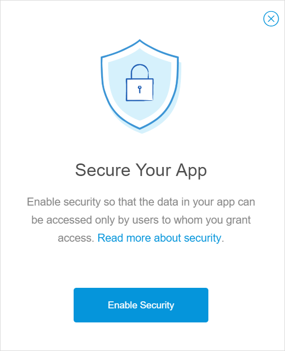
	{} 

    b. If security is set to the **Production** level in Studio Pro and settings are compatible with Studio, you can view and edit **Roles and Permissions** in Studio. (For more information on what security settings are compatible with Studio, see the [Studio Compatibility](/refguide/studio-security-enabled#studio-compatible) section in *Model Changes When Security Is Enabled in Studio*.)

    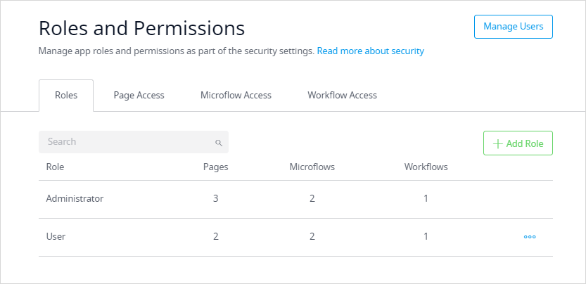

    c. If security is set to the **Prototype/demo** or **Production** level in Studio Pro and settings are not compatible with Studio, you can view (not edit) **Roles and Permissions** in Studio. (For more information on security settings compatible with Studio, see the [Studio Compatibility](/refguide/studio-security-enabled#studio-compatible) section in *Model Changes When Security Is Enabled in Studio*.)

    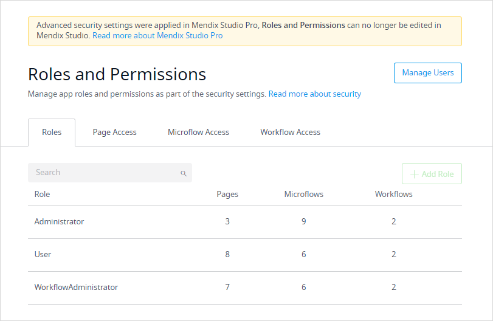

If you need to enable security, do one of the following:

* Click **Enable Security** in the above-mentioned pop-up dialog, and security will be set up automatically for you. After that you can restrict or grant access to your app via [Roles and Permissions](#roles-and-permissions).

*  Open **App Settings** > **Roles and Permissions** and click **Enable Security**. 

	

{}
When you enable security, it is enabled for the whole app, and there are checks and changes applied to the model that are visible in Studio Pro. For more technical information on these checks and changes, see [Model Changes When Security Is Enabled in Studio](/refguide/studio-security-enabled).
{}

## 3 Roles and Permissions {#roles-and-permissions}

{}
In Studio Pro, advanced security settings can be applied. In this case, you will not be able to edit roles and permissions in Studio.
{}

A role is a set of permissions that you can assign to a user. For example, you may want to give the *Administrator* full access to all pages and microflows. While for other users, you may choose to only grant access to certain pages and restrict access for microflows. 

In apps created via the Developer Portal, there are two app roles: 

* Administrator
* User

{}
When security is enabled, these two app roles will have full access to your app. We recommend you to review permissions for the User role. 
{}

For more information on managing app users, see the [Managing App Users](#managing-app-users) section.

The **Roles and Permissions** screen consist of three tabs:

* Roles
* Page Access
* Microflow Access

The **Roles** tab lists all roles and indicates the number of pages and microflows these roles can access. 

The **Page Access** and **Microflow Access** tabs contain a table where all pages/microflows are listed in rows, and all roles are placed in columns. 

You can allow only certain roles to access a page or microflow: select the appropriate box to grant access for a role to a page or microflow. 

To select/deselect all pages or microflows click the ellipsis icon next to the user role.

As a result, you will get a matrix specific for each role. 

### 3.1 Creating a New Role

To create a new app role, do the following:

1. Open **Roles and Permissions** > the **Roles** tab.

2.  Click **Add Role** in the right corner.

    

3.  Specify the name of the new role in the **Create Role** dialog box and click **Create**.

    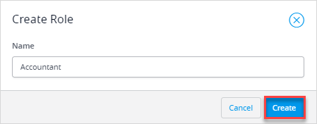

The new role is created.

### 3.2 Editing Existing Roles

To edit an existing role, do the following:

1.  Open **Roles and Permissions** > the **Roles** tab.

2.  Click the **More Options** icon and select **Edit**.

    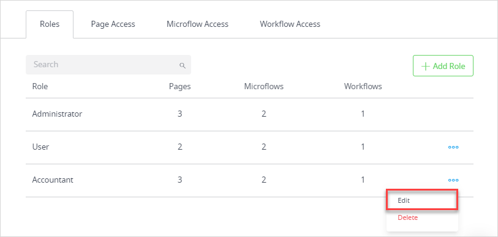

3.  In the **Edit Role** pop-up dialog perform the changes, and click **Save**.

    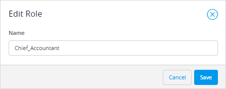    

The role has been edited.

### 3.3 Deleting Roles

To delete an existing role, do the following:

1.  Open **Roles and Permissions** > the **Roles** tab.

2.  Click the **More Options** icon and select **Delete**.

    

3.  Confirm the deletion in the pop-up dialog.

    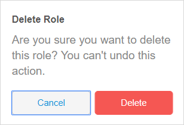

The role has been deleted.

{}

You cannot delete or edit the Administrator role.

{}

### 3.4 Setting Access to Specific Pages/Microflows

There are two ways to set access for specific pages/microflows in your app:

1.  To set access via **Roles and Permissions**, do the following: 
    1.1  Open **Roles and Permissions** > **Page**/**Microflow Access** tab. 
    1.2 Find the user role in the column and tick the box next to a page/microflow to open access for it, or untick – to restrict access. In the example below, we have restricted page access for the User. 

    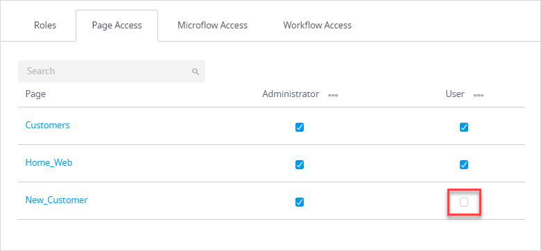

2.  To set access for a page/microflow via properties of this page/microflow , do the following:  
	2.1 Open the page/microflow. 
    2.2. Go to **Properties** > the **Permissions** section and tick/untick **Allowed Roles** to grant/restrict access.  

	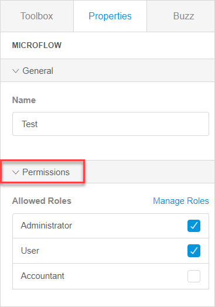

## 4 Demo Users

Demo users are a demonstration of each user role existing in your app. You can use demo users to review how your app looks like for each user role. For more technical information, see [Demo Users](/refguide/demo-users). 

### 4.1 Testing Your Roles {#testing-your-roles}

You can test how your app looks like for different roles the following way:

1. [Preview your app](publishing-app).

2. Click a user icon in the right side of the screen:

    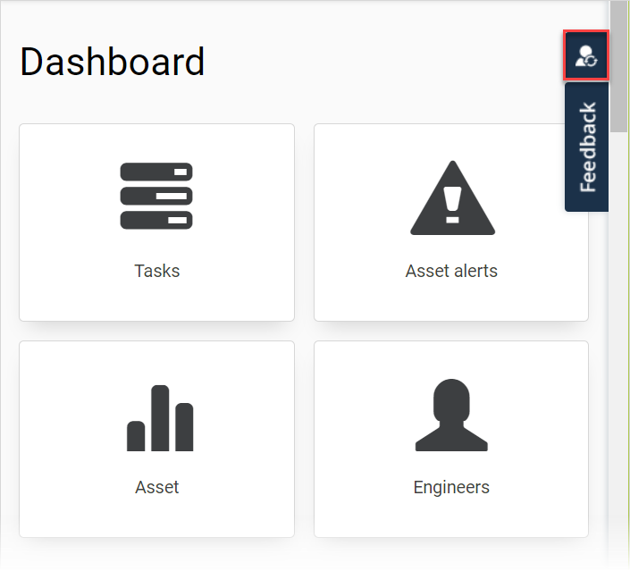

4. In the displayed menu bar, select a demo user and the app will be viewed from the perspective of the corresponding role.

    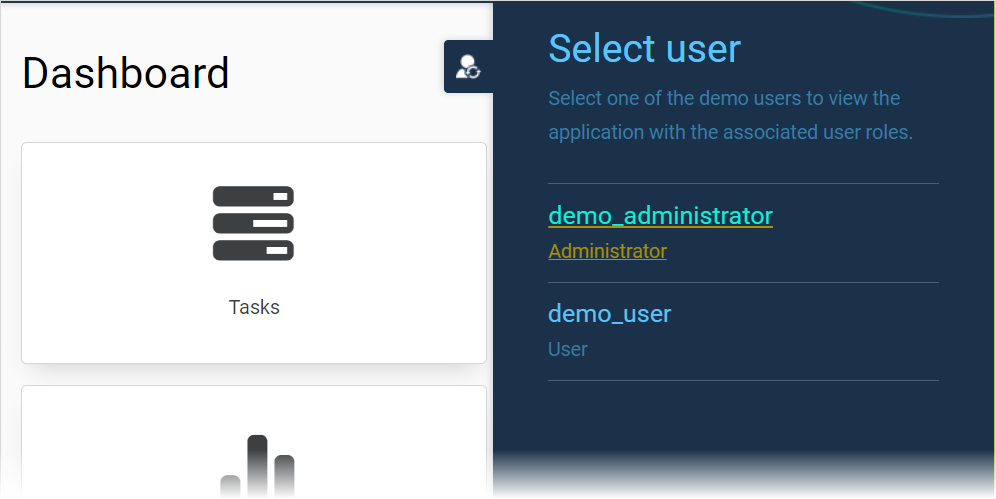

## 5 Managing App Users {#managing-app-users}

You can assign the default or customized user roles for your app to app end-users with Mendix accounts. These are called **App Users** and once authorized, they can access your published app to use it, test it, and provide feedback.

{}
You can manage App Users only after you publish your app.
{}

To manage App Users, open **Roles and Permissions** and click **Manage Users** in the top-right of the screen:

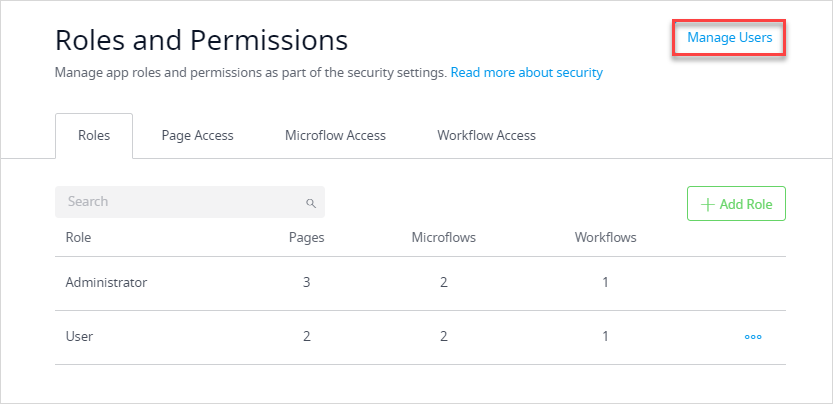

You will be taken to the [App User Management](/developerportal/settings/general-settings#managing-app-users) page in the Developer Portal, where you can invite people to your app and manage their user roles. 

{}
People invited to join your App Team in the Developer Portal are not added as App Users automatically, so you will need to invite your App Team members if necessary.
{}

{}
If you have created a new user role on the **Roles and Permissions** page, you need to publish the app first to be able to see and assign this role in the Developer Portal.
{}

## 6 Auto-Upgrade to the New Service {#upgrade}

When you try to publish your app, you may be notified that upgrade of the service that secures your app is required first:

{}

{}

A special service makes it possible to manage your app users. As of April 1st, 2020 we are replacing the current service with an improved one. This upgrade will be done automatically for you when you click **Auto-Upgrade**. 

No need to worry if you do not auto-upgrade, your app will still be secured and running, however, you will not be able to publish a newer version of your app until you upgrade. 

If the automatic upgrade fails, this means, the service was customized in Studio Pro, and only manual upgrade in Studio Pro is possible in this case. 

If the auto-upgrade detects that the service was customized in Studio Pro by a team member, you will be notified that a manual upgrade in Studio Pro should be performed first. For more technical information on how to upgrade the service in Studio Pro, see [Upgrading to Mendix SSO from AppCloudServices](/developerportal/deploy/upgrading-to-mendix-sso-from-acs).

## 7 Read More

* [Security](/refguide/security)
* [Model Changes When Security Is Enabled in Studio](/refguide/studio-security-enabled)
