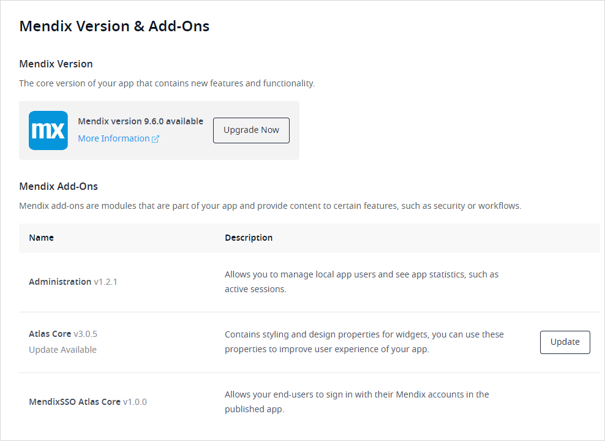
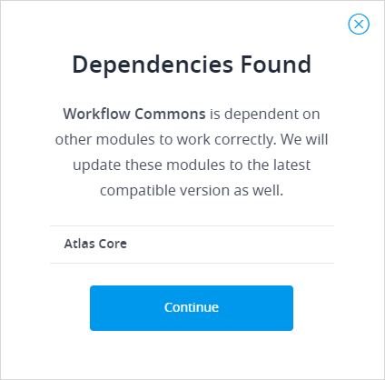

## 1 Introduction

The **Mendix Version & Add-Ons** screen provide information on the Mendix version and add-on modules your app currently has and allows you to upgrade them when a newer version is available. 

Mendix version is the core version of your app that contains main features and functionality. For more information on Mendix and Studio versions, see [Studio Ranges & Mendix Versions](general-versions).

The Mendix app consists of *modules* that divides functionality of your app into separate parts. Some modules are core modules, without which the app will not function, while other modules are *add-ons*. An add-on module provides additional content to certain features, such as security or workflows. For example, the Mendix SSO module allows your end-users to sign into the app with their Mendix credential; this module provides content for security, but your app can as well function without this module. 

Modules can be dependent on each other, for example, one module might need other modules to function properly, or one version of a module might require a specific version of the module it depends on. For example, the workflow-specific module Workflow Commons requires Atlas Core module and it requires Atlas Core to be no lower than version 3.

## 2 Upgrading to the New Mendix Version 

When a new Mendix version comes out, you will see a green dot next to the **Mendix Version & Add-Ons** screen in the menu bar (in addition to the top bar that is displayed in Studio). Click the **Upgrade Now** button to upgrade to the next version.

For more information on the upgrade, see the [Upgrading to the Next Version](general-versions#upgrade) section in *Studio Ranges & Mendix Versions*.

{} 

Once you have upgraded to the newest version, you cannot revert the upgrade. Also, anyone working on the app using Studio Pro must use the new version of Studio Pro from that moment on.

{}    

## 3 Updating Add-Ons

Once there is a new version of an add-on module that is compatible with your app, you will see the **Update** button next to it – click it to update the add-on. 

When modules are dependent on other modules, you can update them only together otherwise your app will not function properly. For example, the latest version of  Workflow Commons might needs the latest version of the Atlas Core module. Studio detects such dependencies automatically and notifies you about them:

## 4 Read More

* [Studio Ranges & Mendix Versions](general-versions)
