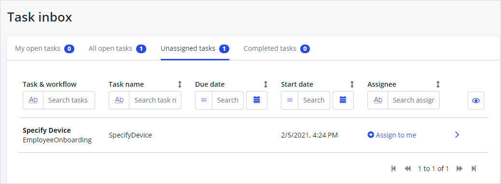
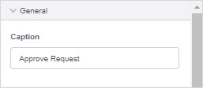
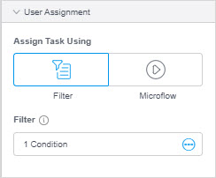
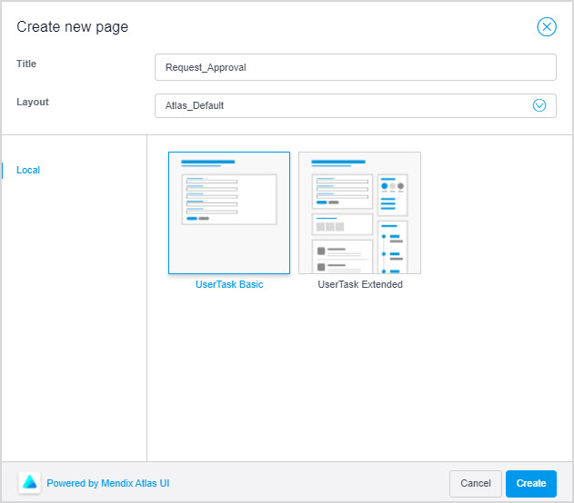

## 1 Introduction

User task allows you to assign a workflow task to a certain user. 

For example, you can add filters and assign a task to a user in the IT department. When the workflow reaches this user task, the task will appear in their inbox:

## 2 Properties

User task properties consist of the following sections:

* [General](#general)
* [User Assignment](user-assignment)
* [Task Page](#task-page)
* [Display Information](#display-info)
* [Due Date](#due-date)
* [Outcomes](#outcomes)

### 2.1 General Section {#general}

**Caption** defines a title of the user task:

### 2.2 User Assignment Section {#user-assignment}

**Assign user task using** allows you to manage what users will the task be assigned to. You can filter users or implement a more complicated logic and add several checks using a microflow. 

Possible options of this property are described in the table below:

| Option    | Description                                                  |
| --------- | ------------------------------------------------------------ |
| Filter    | Allows you to filter users who should be assigned the user task. For example, you can assign a certain task only to users with the Administrator user role. For more information on how to use filters, see [Data Filters](data-filters). |
| Microflow | Allows you to assign the user task to certain users. Using microflow you can check, for example, which users have the right to approve user tasks and are currently not on vacation and assign the task only to users who passed the check. For more information on microflows, see [Microflows](microflows). |

### 2.3 Task Page Section {#task-page}

**Task Page** is an overview page where the allowed roles can track the progress of the user tasks and view its details, such as comments or attachments:

When you create a task page, you can use a user task-specific page templates. 

### 2.4 Display Information Section {#display-info}

The **Display Information** section defines the user task name and its description that are displayed in the running (published) app. 

The **Display Information** section properties are described in the table below:

| Property         | Description                                                  |
| ---------------- | ------------------------------------------------------------ |
| Task Name        | **Task Name** is displayed in the running app. The **Task Name** can contain attributes of the [Workflow entity](workflow-properties#data) or of its associated entities, the value of which will be displayed to the end-users. For example, you can select a **FullName** attribute from the **Employee Onboarding** data to display the name of the new employee. |
| Task Description | **Workflow Description** is a description of the workflow displayed in the running app. The **Workflow name** can contain attributes of the [Workflow entity](#data) {}[or it's generalization, shall I add this info?]{}, the value of which will be displayed to the end-users. For example, you add a **PhoneModel** attribute from the **Employee Onboarding** data to display what phone needs to be shipped for this employee. |

### 2.4 Due Date Section {#due-date}

The **Due Date** section allows you to set a deadline for the user task and keep track of it. However, this is not an automatic reminder but rather a deadline you reference when keeping track of the workflow. 

The **Due Date** section properties are described in the table below:

| Property   | Description                                                  |
| ---------- | ------------------------------------------------------------ |
| None       | No due date is set.                                          |
| Duration   | You can set the deadline for the user task with the **Due In** option, which indicates the number of hours, days, or weeks the task is due in. Possible values of the property are the following ones: <ul><li>Hour(s)</li><li>Day(s)</li><li>Week(s)</li> </ul> |
| Expression | You can set a due date for the user task writing an expression in Studio Pro. |

{}[Will it be possible to write an expression using the new editor?]{}

### 2.6 Outcomes Section {#outcomes}

The outcomes property allows you to create new outcomes for the user task. These outcomes can be referred to by other elements, such as a button. For example, you have a process when you need to approve or reject a request. One button on a [task page](#task-page) can refer to the **Approve** outcome of the user task, while another one can use the **Reject** outcome:

## 3 Read More

* [Workflows](workflows)