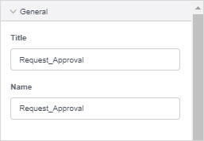
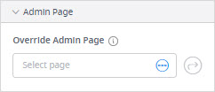
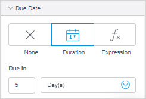

## 1 Introduction

This document describes workflow properties. For details on what workflows are for and what kind of elements you can use there, see [Workflows](workflows).

## 2 Workflow Properties

Workflow properties consist of the following sections:

* [General](#general)
* [Data](#data)
* [Workflow Page](#workflow-page)
* [Display Information](#display-info)
* [Permissions](#permissions)
* [Due Date](#due-date)

### 2.1 General Section {#general}

The **General** section contains information on the title and name of the workflow.

The **General** section properties are described in the table below:

| Property | Description                                                  |
| -------- | ------------------------------------------------------------ |
| Title    | Defines a title of the workflow that you see at the top of the working area. |
| Name     | The internal name of the workflow that must be unique. When referring to the workflow in the app project you will use this name. |

### 2.2 Data Section {#data}

The **Data** section contains information on what data context the workflow is using. 

**Workflow entity** is an entity that is used as a workflow context. This entity should be of a workflow entity type. For more information, see the [Entities and Their Types](domain-models#entity-types) section in the *Domain Model*.

### 2.3 Workflow Page Section {#workflow-page}

**Workflow page** is an overview page where the allowed roles can track the progress of the workflow and its tasks. 

### 2.3 Display Information Section {#display-info}

The **Display Information** section defines the workflow name and its description that are displayed in the running (published) app. 

The **Display Information** section properties are described in the table below:

| Property             | Description                                                  |
| -------------------- | ------------------------------------------------------------ |
| Workflow Name        | **Workflow name** is displayed in the running app. The **Workflow name** can contain attributes of the [Workflow entity](#data), the value of which will be displayed to the end-users. For example, you can select the **FullName** attribute from the **Employee Onboarding** data to display the name of the new employee. |
| Workflow Description | **Workflow Description** is a description of the workflow displayed in the running app. The **Workflow name** can contain attributes of the [Workflow entity](#data), the value of which will be displayed to the end-users. For example, you can add the **FirstDay** attribute from the **Employee Onboarding** data to display the start date of the new employee and assign them to a training group. |

### 2.4 Permissions Section {#permissions}

**Allowed roles** defines the [user role](settings-security#roles-and-permissions) that can execute the workflow.

{}
This section is only displayed when the security is on. For more information, see [Security](settings-security).
{}

### 2.4 Due Date Section {#due-date}

The **Due Date** section allows you to set a deadline for the workflow and keep track of it. However, this is not an automatic reminder but rather a deadline you reference when keeping track of the workflow. 

The **Due Date** section properties are described in the table below:

| Property   | Description                                                  |
| ---------- | ------------------------------------------------------------ |
| None       | No due date is set.                                          |
| Duration   | You can set the deadline for the workflow with the **Due In** option, which indicates the number of hours, days, or weeks the workflow is due in. Possible values of the property are the following ones: <ul><li>Hour(s)</li><li>Day(s)</li><li>Week(s)</li> </ul> |
| Expression | You can set a due date for the workflow writing an expression. For example, to set a due date to tomorrow, you can use `addDays([%CurrentDateTime%], 1)`. |

## 3 Read More

* [Workflows](workflows)