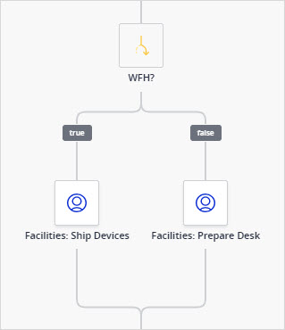
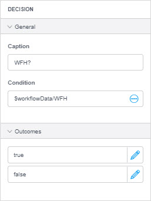
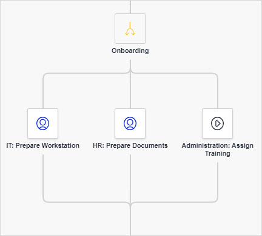
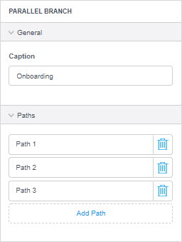

## 1 Introduction

**General** activities allow you to manage paths in your workflow. A **Decision** allows you to add a condition and the workflow will follow one of the paths depending on this condition. With the help of the **Jump** activity you can jump to another activity in the workflow. **Parallel Split** adds several parallel paths (processes) to the workflow, and the **End** activity ends a path. 

{}[Retake the screenshot above with the Jump activity.]{}

## 2 Decision {#decision}

A decision is an element that makes a choice based on a condition and follows one and only one of the outgoing paths. For example, you can use it to follow different processes when a new hire works remotely or when they work from the office:

### 2.1 Decision Properties

An example of decision properties is represented in the image below:

Decision properties consist of the following sections:

* [General](#general)
* [Outcome](#outcome)

#### 2.1.1 General Section {#general}

The **General** section provides the caption for the element and its condition.

The **General** section properties are described in the table below:

| Property  | Description                                                  |
| --------- | ------------------------------------------------------------ |
| Caption   | Describes what happens in this element. It is displayed in the workflow element to make the workflow easier to read and understand. |
| Condition | **Condition** is configured based on an [expression](/refguide/expressions). The expression should result in a Boolean or an enumeration. For the expression resulting in a Boolean, two paths are possible: **true** and **false**. For example, you can use the expression resulting in a Boolean to follow different processes whether a new employee is working from home or from the office (and either send their devices to the home address or set up a workstation in the office).  |

#### 2.1.2 Outcomes Section {#outcome}

**Outcomes** depends on the condition of the decision. For example, for the Boolean, you have **true** and **false** outcomes, and for the enumeration: an outcome per each enumeration value and an empty one when the value is unassigned.  

## 3 Jump Activity {#jump}

The **Jump** activity allows you to jump to other activities in the workflow. This is useful when, for example, you are approving a request and need more details that are provided in one of the previous user tasks:

{}[Add screenshots]{}

{}
You cannot use the **Jump** activity in a Parallel split or in a path where it would end the workflow without any other path continuing it. 
{}

### 3.1 Jump Activity Properties

An example of Jump activity properties is represented in the image below:

{}[Add screenshots]{}

The Jump activity properties consist of the **General** section and are described in the table below:

| Property | Description                                                  |
| -------- | ------------------------------------------------------------ |
| Name     | The internal name of the element. When referring to the element in the app project you will use this name. It must be unique. |
| Caption  | Describes what happens in this element. It is displayed in the workflow element to make the workflow easier to read and understand. |
| Target   | **Target** is the activity the **Jump** goes to. You can select the activity you would like to go to from the drop-down menu. |

## 4 Parallel Split {#parallel-split}

The parallel split is used to have parallel processes in your workflow. For example, when onboarding a new employee, you can have several processes running in parallel: the HR preparing necessary documents, the IT department preparing a workstation, and the Administration department scheduling a training for the employee:

{}

All paths of the parallel split need to be completed before the workflow can continue to the next activity. 

{}

### 4.1 Parallel Split Properties

An example of parallel split properties is represented in the image below:

Parallel split properties consist of the following sections:

* [General](#general)
* [Paths](#paths)

#### 4.1.1 General Section {#general}

The **Caption** describes what happens in this element. It is displayed in the workflow element to make the workflow easier to read and understand.

#### 4.1.2 Paths Section {#paths}

The **Paths** property allows you to add as many paths as there are parallel processes. 

## 5 End Activity {#end}

The **End** activity ends the path of the workflow.

## 6 Read More

* [User Task](workflows-user-task)