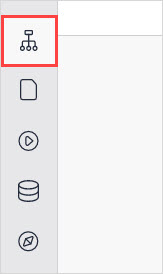
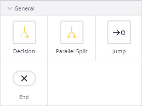
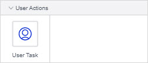

## 1 Introduction

Workflow is a visual language in Mendix Studios that allows you to build extendable processes. It is fully integrated with other visual languages, such as the microflow editor and page editor. 

To view the workflows of your app project in Studio, click the **Workflows** icon in the left menu bar:

Workflows is a visual way of expressing application logic. A workflow looks like a flow chart. On a new workflow a *start event* (a starting point of the workflow) and an *end event* (an endpoint of the workflow represented by a *red* dot) are created by default. You can various activities to a flow of a workflow that is called a *path*.

## 2 Performing Basic Functions

You can perform the following basic functions when working on workflows:

* Open a workflow
* Create a workflow
* Delete a workflow
* Add elements to a workflow
* View element properties 

### 2.1 Opening a Workflow

To open a workflow in Studio, do the following:

1. Click the workflow icon in the left menu bar.
2. In the displayed list of workflows, select the one you want to open and click it.

The selected workflow is opened.

### 2.2 Adding a Workflow

To add a workflow to your app project in Studio, do the following:

1. Click the workflow icon in the left menu bar.

2. Click **New** in the top right corner of the displayed side panel.

3. In the **Create new workflow** dialog box, fill in the name of the workflow and select a workflow entity:  {}[Add a reference to the domain model]{}

   

4. Click **Create**.

The workflow is created.

### 2.3 Deleting a Workflow

To delete a workflow in Studio, do one of the following:

1. Open the workflow you want to delete and follow the steps below:
    1. Open the **Properties** tab.
    2. Click **Delete** at the bottom of the **Properties** tab.
2. Click the workflows icon in the left menu bar and do the following:
    1. In the side panel, click the ellipsis icon and select **Delete** in the drop-down menu:

The selected workflow is deleted. 

### 3.4 Adding Elements to a Workflow 

To add an element to a workflow, do the following:

1. Open the **Toolbox** tab.
2. Select an element you would like to add and drag and drop this element in the workflow path.

The selected element is added.

## 3 Toolbox Elements

The **Toolbox** tab contains elements that you can drag and drop on a path. Below is a categorized overview of all elements. The following categories are used:

* [General](#general)
* [User actions](#user-actions)
* [System actions](#system)

### 3.1 General {#general}

Elements in the general category help you control the workflow path, for example, add parallel paths or end them:

The elements of this category are described in the table below:

| Element                           | Description                                                  |
| --------------------------------- | ------------------------------------------------------------ |
| [Decision](decision-in-workflows) | Makes a choice based on a condition and follows one and only one of the outgoing paths. |
| [Parallel split](parallel-split)  | Adds two parallel paths to your workflow.                    |
| End activity                      | Ends the path of the workflow                                |

### 3.2 User Actions {#user-actions}

[User task](user-task) – a central element in a workflow that allows you to assign a task to a certain user using filters or microflows. 

### 3.3 System Actions {#system}

[Call microflow](call-microflow) activity calls a selected microflow. 

## 4 Read More

* [Workflow Properties](workflow-properties)