## 1 Introduction 

Mendix Studio has a lot of built-in logic that works out of the box (for example, buttons). But if you want to add custom logic, you need to create microflows.

*Microflows* is a visual way of expressing a textual program code.  A microflow can perform actions such as creating and changing objects, showing pages, and making choices. 

You need to use microflows for the following cases:

*  To change/extend the standard behavior of buttons
* To add custom logic to your application
* To integrate with other systems, databases, web services, etc.

Examples of using microflows can be the following:

*  You check the values that an end-user has entered, and you either show the end-user an error message or another page
*  You are creating a to-do list and you want to use custom logic when the status of an item on the list has changed

To view the microflows of your app in Studio, click the **Microflows** icon in the left menu bar:

{}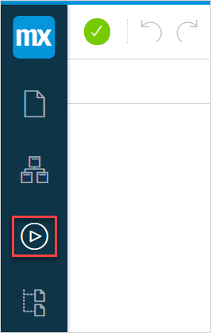
{}

## 2 Concepts and Definitions 

A microflow looks like a flow chart. On a new microflow a *start event* (a starting point of the microflow represented by a *green* dot) and an *end event* (an endpoint of the microflow represented by a *red* dot) are created by default. 

Start and end events are connected by a *sequence flow* (a line with an arrow), where you can add new events and activities. For more information, see the [Creating a New Microflow](#creating-new-microflow) section. If [Mendix Assist](mendix-assist) is on, it will be represented with a blue dot in the middle (for more information on what Mendix Assist is, see [Mendix Assist](mendix-assist)).

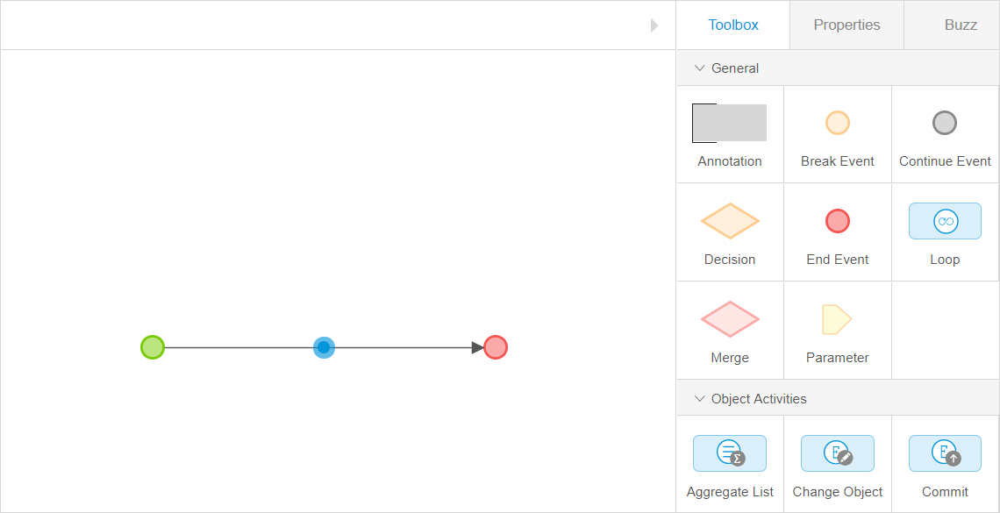

Before you start configuring microflows, familiarize yourself with the concepts and notions that the microflow editor uses:

| Concept    | Description                                                  |
| ---------- | ------------------------------------------------------------ |
| Activities | Activities perform different functions and are displayed as blue boxes. For example, with the help of an activity you can show end-users a home page. For more information on activities, see section the [Toolbox](#microflows-toolbox) section. |
| Flows      | Flows are displayed as arrows that connect microflow events and activities. For more information on flows, see section the [Flows](#flows) section. |
| Events     | Events are all other elements in a flow that are not activities (not blue boxes). [Decision](microflows-decision) is an example of an event. For more information on events, see the [General](#microflow-general-section) section. |
| Variable   | A variable is a temporary storage for data. Variables are used to store information and refer to it when needed. For this purpose variables should have a unique name.  In a microflow you can add a variable, assign a value to it and then use it in microflow activities or events. You can then change this value later if necessary. For example, you can create variable **$Discount** and assign it a value 0.5, and use it to calculate a price for a customer.  You can use the variable only in the microflow where it was created. |
| Parameter  | Parameters contain global variables, which means that you can use one and the same parameter in different microflows. |

## 3 Creating a New Microflow {#creating-new-microflow} 

To create a new microflow and to start building custom logic, do the following:

1. Click the **Microflow** icon in the left menu bar. 
2.  Click **New** on the **Microflows** side panel.

    {}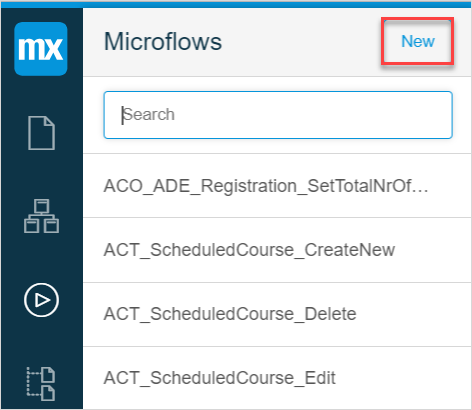
    {}

3.  Fill in the name of the microflow in the pop-up dialog and click **Create**.

    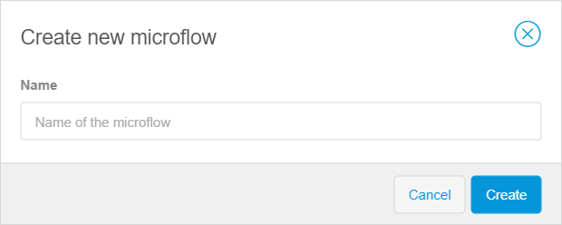    

The new microflow is created, you can now add logic using events and activities. 

## 4 Duplicating a Microflow {#duplicate}

To duplicate a microflow, do the following:

1. Click the **Microflows** icon in the left menu bar.

2.  In the side panel, click the ellipsis icon and select **Duplicate** in the drop-down menu:

    {}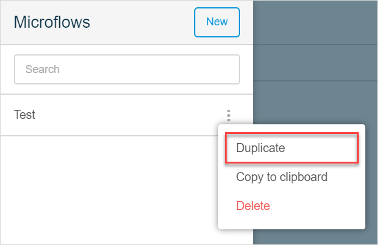{}

The microflow is duplicated.

## 5 Copying and Pasting a Microflow

To copy and paste a microflow, do the following:

1. Click the **Microflows** icon in the left menu bar.

2.  In the side panel, click the ellipsis icon and select **Copy to clipboard** in the drop-down menu:

    {}
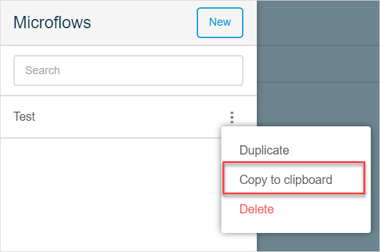
{}

3. Open the Studio app where you want to paste the microflow and press <kbd>Ctrl</kbd> +<kbd>V</kbd> or <kbd>Cmd</kbd> +<kbd>V</kbd>. 

Your microflow is pasted. For more information on copy/paste function in Studio, see the [Copy/Paste Pages, Microflows, and Enumerations](general#copy-paste-documents) section in *General Info*. 

## 6 Deleting a Microflow

To delete a microflow in Studio, do one of the following:

1. Open the microflow you want to delete and follow the steps below:

    1. Open the **Properties** tab.

    2. Click **Delete** at the bottom of the **Properties** tab.

2. Click the **Microflows** icon in the left menu bar and do the following:

    1. In the side panel, click the ellipsis icon and select **Delete** in the drop-down menu:
    
        {}
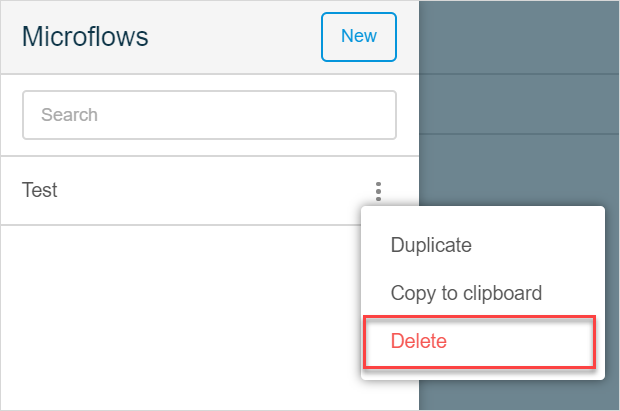
{}

## 7 Adding a New Event or Activity {#adding-activity-to-microflow}

To add a new activity or event to the microflow, do the following:

1. Open the microflow you want to add the event or activity to.
2. Open the **Toolbox** tab.
3. Select the event or activity in the **General**, **Object Activities** or **Client Activities** section.
4. Drag and drop the event or activity in the microflow. 

## 8 Toolbox {#microflows-toolbox}

The **Toolbox** tab contains the following sections:

* [General](#microflow-general-section)
* [Object Activities](#microflow-object-activities)
* [Client Activities](#microflow-client-activities)

### 8.1 General {#microflow-general-section}

The **General** section contains various elements, such as a parameter and an end event: 

{}
{}

Elements available in the **General** section are described in the table below.

| Element                         | Description                                                  |
| ------------------------------- | ------------------------------------------------------------ |
| Annotation                      | An annotation is an element that can be used to put comments in a microflow. |
| Break Event                     | A break event is used in loops only to stop iterating over a list of objects and continue with the rest of the flow in the microflow. For more information on the break event, see [Break Event](/refguide8/break-event) in the *Studio Pro Guide*. |
| Continue Event                  | A continue event is used in loops only to stop the current iteration and start the iteration of the next object. For more information on the continue event, see [Continue Event](/refguide8/continue-event) in the *Studio Pro Guide*. |
| End Event                       | An end event defines the location where the microflow will stop. There can be more than one end event, for example when a [Decision](microflows-decision) is used in the microflow. So, the number of end events depends on the number of possible outcomes of the microflow. For more information on the end event, see [End Event](/refguide8/end-event) in the *Studio Pro Guide*. |
| [Decision](microflows-decision) | A decision splits the flow and should be used if you want to add conditions. For example, if you want to show different order forms for customers with different grades.  This element is based on a condition and will result in several outgoing flows, one for every possible outcome. The microflow checks the condition and follows one of the flows. For more information on a decision and its properties, see [Decision](microflows-decision). |
| [Loop](microflows-loop)         | A loop is used to iterate over a list of objects and perform actions on each item of the list. For example, you can retrieve a list of orders from your database, then loop over this list and mark orders as processed. For more information on a loop and its properties, see [Loop](microflows-loop). |
| Merge                           | A merge can be used to combine flows into one.  If previously you split the microflow flow (for example, when adding a decision) and now one and the same action needs to be executed for these separated flows, you can combine the two (or more) paths using a merge. For more information, see [Merge](/refguide8/merge) in the *Studio Pro Guide*. |
| Parameter                       | A parameter is an input data for the microflow and can be used in any activity in the microflow. For more information on parameters, see [Parameter](/refguide8/parameter) in the *Studio Pro Guide*. |

### 8.2 Object Activities {#microflow-object-activities}

The **Object Activities** section contains activities that interact with an object or objects (for more information on what an object is, see [Domain Model](domain-models)): 

{}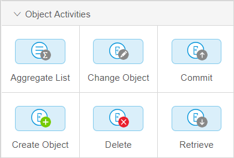
{}

The **Object Activities** are described in the table below.

| Activity       | Description                                                  |
| -------------- | ------------------------------------------------------------ |
| Aggregate List | **Aggregate List** can be used to calculate aggregated values such as the maximum, minimum, sum, average, and total amount of objects over a list of data objects. For more information, see [Aggregate List](/refguide8/aggregate-list) in the *Studio Pro Guide*. |
| Change Object  | **Change Object** can be used to change an existing data object or properties of this object. For more information, see [Change Object](/refguide8/change-object) in the *Studio Pro Guide*. |
| Commit         | **Commit** saves changes you have not saved in the database yet. For more information, see [Commit](/refguide8/committing-objects) in the *Studio Pro Guide*. |
| Create Object  | **Create Object** can be used to create a data object. For more information, see [Create Object](/refguide8/create-object) in the *Studio Pro Guide*. |
| Delete         | **Delete Object** can be used to delete one data object or a list of objects. For more information, see [Delete](/refguide8/deleting-objects) in the *Studio Pro Guide*. |
| Retrieve       | **Retrieve** can be used to get one or more objects, either by getting another object through an [association](domain-models-association-properties), or by retrieving objects from the database. For more information, see [Retrieve](/refguide8/retrieve) in the *Studio Pro Guide*. |

### 8.3 Client Activities Section {#microflow-client-activities}

The **Client Activities** perform activities in the client, for example, open a page or show a message:

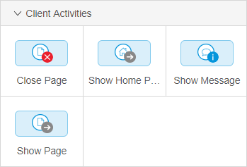

The **Client Activities** are described in the table below.

| Activity       | Description                                                  |
| -------------- | ------------------------------------------------------------ |
| Close Page     | **Close Page** activity closes the currently open page. For more information, see [Close Page](/refguide8/close-page) in the *Studio Pro Guide*. |
| Show Home Page | The **Show Home Page** action navigates to the home page. It goes to the same page as the end-user goes to after signing in and respects role-based home pages. For more information, see [Show Home Page](/refguide8/show-home-page) in the *Studio Pro Guide*.  For details on setting the home page, see [Navigation Document](navigation). |
| Show Message   | With the **Show Message** action you can show a blocking or non-blocking message to an end-user. (Non-blocking message lets users continue their work in the app with the pop-up window open, while the blocking message does not let the user continue work until the pop-up window is closed. ) For more information, see [Show Message](/refguide8/show-message) in the *Studio Pro Guide*. |
| Show Page      | With the **Show Page** action you can show a page to the end-user. For more information, see [Show Page](/refguide8/show-page) in the *Studio Pro Guide*. |

### 8.4 Variable Activities

The **Variable Activities** section contain activities that manipulate variables: 

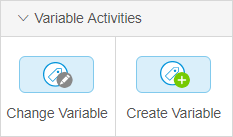

The **Variable Activities** are described in the table below:

| Activity        | Description                                                  |
| --------------- | ------------------------------------------------------------ |
| Change Variable | **Change Variable** changes the value of an existing variable in the current microflow. For more information, see [Change Variable](/refguide8/change-variable) in the *Studio Pro Guide*. |
| Create Variable | With the **Create Variable** activity you can create a variable and assign a value to it. The variable can be used to store, change, and reuse a value in activities of the microflow. For more information, see [Create Variable](/refguide8/create-variable) in the *Studio Pro Guide*. |

For example, you can first create a variable named *Discount* to a microflow, and then change the variable Discount depending on the type of the customer's grade. You can give a discount for customers with Gold and Silver grades. 

{}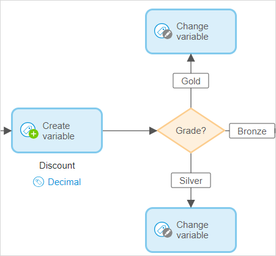
{}

## 9 Flows {#flows} 

Flows are lines connecting the elements. You can find the description of flows in the table below:

| Flow            | Image                                                        | Description                                                  |
| --------------- | ------------------------------------------------------------ | ------------------------------------------------------------ |
| Sequence Flow   |    | A sequence flow is an arrow that links events, activities, decisions, and merges with each other. Thus, it defines the order of execution. Flows always flow in one direction where elements are executed one by one. This means that the microflow cannot follow two flows at the same time. Even if you have a **Decision** that splits a flow into several flows, the microflow will follow only one of the flows. |
| Annotation Flow |  | An annotation flow is a connection that can be used to link an annotation to a flow element(s). |

## 10 Activity Icons 

When configuring the activities of microflows you will notice icons above or underneath activities. You can find the description of icons in the table below:

| Name                  | Image Example                                                | Description                                                  |
| --------------------- | ------------------------------------------------------------ | ------------------------------------------------------------ |
| Entity                |        | Indicates that the data source for the activity is an entity. |
| Value                 |   | Indicates that the data source for the activity is a simple value, such as decimal, Boolean, date and time, etc. |
| Commit                |        | Indicates that the object will be committed. *Committing* means that the changes will be saved in the database. This can be useful, for example, when you want an object *NewCustomer* to be saved and updated in the database. |
| Commit without events |  | Indicates that the object will be committed but without events. This means that the object will be saved in the database, but event handlers will not be triggered. For more information on event handlers, see [Event Handlers](/refguide8/event-handlers) in the *Studio Pro Guide* |
| Refresh in Client     |  | Indicates that the result of the activity will be displayed to an end-user. |

## 11 Main Documents in This Category

* [Mendix Assist](mendix-assist) – describes an artificial intelligence-powered agent that helps you configure microflows
* [Decision](microflows-decision) – explains what a decision is and describes its properties
* [Loop](microflows-loop) – explains what a loop is and describes its properties
* [Microflow Expressions](microflows-expressions) – explains how to use microflow expressions
* [Set & Change a Value for Different Activities in the Microflows](microflows-setting-and-changing-value) – explains how to set or/and change a value for microflow activities
