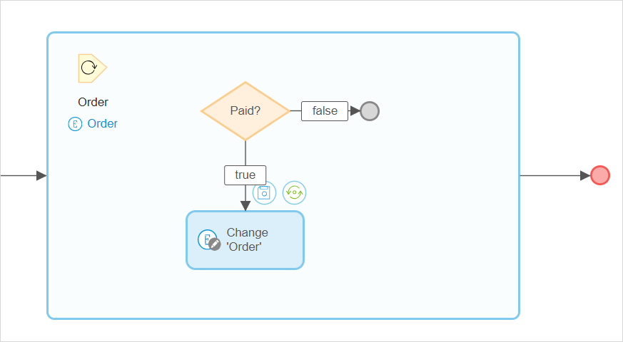
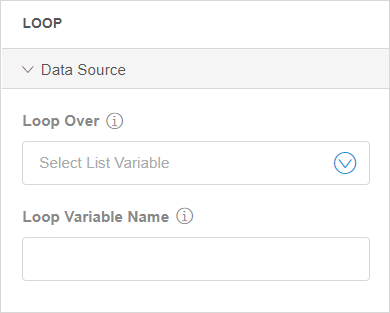
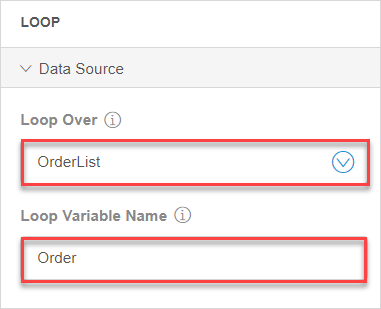
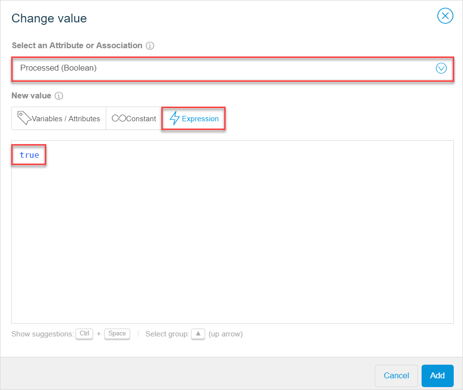

## 1 Introduction 

A loop is used to iterate over a list of object and perform actions on each item of the list when building [microflows](microflows-wm). For example, you can retrieve a list of orders from your database, then loop over this list and mark orders as processed. For more details, see section [3 Loop Example](#loop-example).

The loop is visualized as a frame. The flow inside the loop is executed for each object. That means, if you add more than one activity to the loop, the full flow gets executed on each item. For example, you can add a loop that will prevent orders from processing if a customer is blocked. 

The loop can contain all types of elements used in other parts of microflows, with the exception of start and stop events. Additionally, only a loop can contain [break events](/refguide/break-event) and [continue events](/refguide/continue-event). A break event is used in loops only to stop iterating over a list of objects and continue with the rest of the flow in a microflow. A continue event is used in loops only to stop the current iteration and start the iteration of the next object.

## 2 Loop Properties

Loop properties consists of the **Data Source** section and are described below:

* **Loop Over** – a variable that is a list of items you will loop through
* **Loop Variable Name** – refers to the name of the list item that is currently being worked on

{}
{}

## 3 Loop Example {#loop-example}

Let us study a straightforward use-case, where you retrieve a list of orders from your database, loop over this list, and mark orders as processed as a result. 

Make sure you have the following prerequisites:

1. [Create an entity](domain-models-wm#adding-new-entities) in your domain model and name it *Order*.
2. [Create an attribute](domain-models-wm#adding-new-attributes) of the Boolean type for this entity to indicate the status of an order and name this attribute *Processed*.
3. [Create a microflow](microflows-wm#creating-new-microflow).

To start the use-case, do the following:

1. Open a microflow to add a loop to.

2. First of all, we need to get the list of orders we will loop over. Do the following:  

    a. In the **Toolbox**, select **Retrieve**, drag and drop it to the microflow.  

    b. In **Properties** > the **Data Source** section, select **From Database**, and set *Order* as an entity for this activity.  

    {}
    {}

3. As we have retrieved the list of orders we can work on, we will create a loop and logic for it. Do the following:  

    a. In the **Toolbox**, select **Loop**, drag and drop it to the microflow.  

     

    b. In **Properties**, set **OrderList** as **Loop Over** (**Loop Variable Name** is set automatically). We have selected the entity, and will loop over the list of its objects.  

    {}
     {}

4. Now we can add the activity that will change the status of each order to *Processed*. This means that the activities you add inside the loop will be performed on each object (each order). Do the following: 

    a. In the **Toolbox**, select **Change Object**, drag and drop it inside the loop . 

    b. In **Properties** > the **Data Source** section for the **Change Object** activity, set **Variable** to **Order**. 

    c. When the **Change Members** option appears, click **Add New Value**. 

    

5. In the **Change value** dialogue window,  do the following: 

    a. Set **Select an Attribute or Association** to **Processed (Boolean)**. 

    b. In the **Expressions** tab, set the **New value** of this attribute by typing in *true*.  

    

    c. Click **Add** to save the changes. 

Check out the video with the process of configuring the example above:

<video width="768" height="432" controls src="attachments/microflows-loop-wm/wm-loop-example.mp4">VIDEO</video>

As a result, we have a list of orders retrieved to our microflow, and a loop that iterates over this list. The activity inside the loop sets the status of each order to processed. 

## 4 Read More

* [Microflows in the Web Modeler](microflows-wm)
