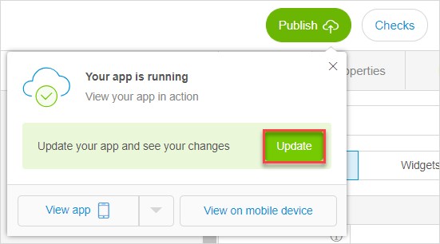
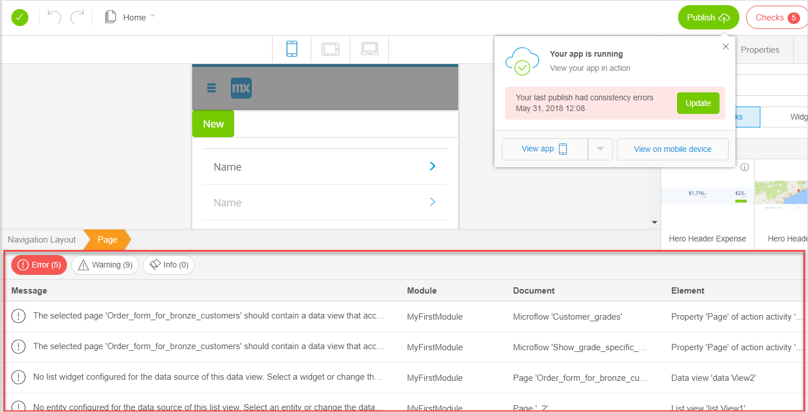

## 1 Introduction 

When [publishing your app](deployment-wm#deploying-your-app), the Web Modeler checks the app you created on [consistency errors](consistency-errors-wm). If there are any, the app cannot be published, and you see the **Checks** button goes red with the number of errors indicated.

## 2 Viewing Checks for Your App and Interacting with the Checks Panel {#viewing-checks}

To display checks for your app and view the faulty elements in it, do the following:

1. Click **Publish** in the top-right of the Web Modeler.

2.  In the pop-up window, click **Update**.

    

3.  If your app has consistency errors, the **Checks** button will have red border, the number of the errors will be indicated on the button, and a warning will be displayed. 

    

4.  Click the **Checks** button, the warning or press <kbd>C</kbd> to view all checks. 
   The panel with the list of checks appears at the bottom of the screen. For more information on the **Checks** panel, see section [3.2 Checks Panel Overview](#checks-panel-overview).

    

5.  Click **Error**, **Warning** and **Info** buttons to manage what is displayed on the **Checks** panel (the types that are displayed are highlighted in red/orange/blue for **Error**/**Warning**/**Info** types correspondingly). For more information, see section [3.1 Types of Checks](#checks-types). 

    

6.  To view the exact place and element that the error/warning/info refers to, click the corresponding row in the **Checks** panel (you can click any place of the row, the whole row is responsive),  and the element that contains faults will be displayed.

    

7. To close the panel, either click the close button in the top-right corner of the panel, or click **Checks** in the top-right corner of the Web Modeler. 

{}

If there are no consistency errors, the app will be published, and the **Checks** panel will be empty. That means that if there are no consistency errors, **Warnings** and **Info** will not be updated and displayed, and you will see an empty **Checks** panel.

{}

## 3 Checks Types and the Checks Panel

The **Checks** panel consist of three buttons indicating the type of a check and a table with details on each check. 

### 3.1 Types of Checks {#checks-types}

There are three types of checks in the Web Modeler. Each button is colored differently at the top of the **Checks** panel and has its own icon.

The description of the types of checks is represented in the table below.

| Type    | Button color | Icon                                           | Function                                                     |
| ------- | ------------ | ---------------------------------------------- | ------------------------------------------------------------ |
| Error   | Red          |    | Consistency errors that prevent your app from functioning in a correct way and being published (for example, if you do not specify an entity for the data view, your app cannot function correctly). For more information on consistency errors, see [Consistency Errors in the Web Modeler](consistency-errors-wm) |
| Warning | Orange       |  | Errors that are not critical, so you can publish your app having warnings. However, it is highly recommended to take action based on the warnings, because your app has logical gaps (for example, clicking a button does nothing). |
| Info    | Blue         |     | This type shows information on features that will be deleted from the user interface soon (deprecated). This does not affect the app now, but may cause problems when upgrading to the next version. |

{}

The button is colored only when the corresponding type of the check is enabled for the panel. If the type is disabled, it is transparent.

{}

### 3.2 Checks Panel Overview {#checks-panel-overview}

The **Checks** panel is represented as a table with buttons on top, and a table underneath them. The buttons control the information that is displayed in the table. For more information, see section [3.1 Types of Checks](#checks-types). 

{}

The **Checks** panel is only refreshed after a user clicks **Update** again, it is not refreshed in real-time.

{}

The information displayed in the table of the **Checks** panel is represented below. 

| Item     | Description                                                  |
| -------- | ------------------------------------------------------------ |
| Message  | Contains an explanation of the error/warning/info. In front of the message you can see an icon indicating the type of the check. For more information, see section [3.1 Types of Checks](#checks-types). |
| Module   | Indicates the module where the error/warning/info is found.  |
| Document | Indicates the place of your app where the error/warning/info is found (for example, a page, a microflow). |
| Element  | Indicated the exact element that is faulty (button, activity, etc. ). |

## 4 Read More

* [Consistency Errors in the Web Modeler](consistency-errors-wm)
* [Deploying Your App From the Web Modeler](deployment-wm)
* [The Web Modeler Overview](overview-wm)
