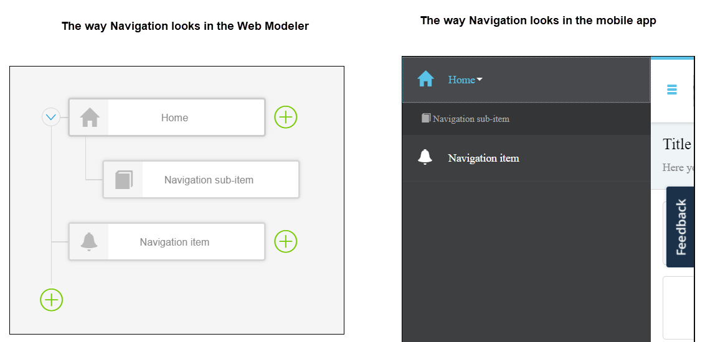
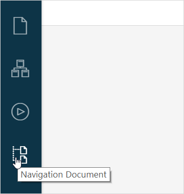
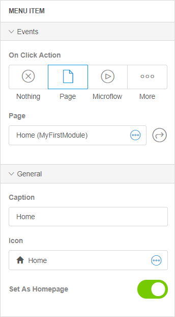
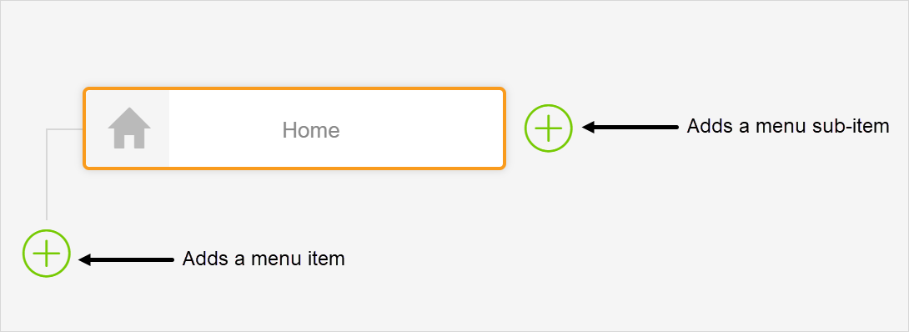

## 1 Introduction 

A navigation document shows a configured menu of your app in a form of a tree. You can create items and sub-items in your navigation. 

Open the **Navigation Document** by clicking the corresponding icon in the left menu bar.

{}
{}

{}

In the Web Modeler, you are viewing and editing a Responsive type of the navigation profile, while there are more types of profiles in the Desktop Modeler. For more information on profiles in the Desktop Modeler, see section [2 Profiles](/refguide/navigation#profiles) in *Navigation in Mendix 7.4 & Above* in the *Desktop Modeler* category. 

{}

## 2 Properties of Menu Items {#properties-of-menu-items}

Properties of the menu items consists of the following sections:

* [Events](#events-section-navigation) 
* [General](#general-section-navigation) 

{}
{}

### 2.1 Events Section {#events-section-navigation}

You can choose the **On Click Action** in the **Events** section. The **On Click Action** defines what action is performed when the user clicks a menu item. The available actions are described in the table below:

| Action         | Description                                                  |
| -------------- | ------------------------------------------------------------ |
| Nothing        | No action is taken.                                          |
| Page           | The specified page is opened.                                |
| Microflow      | The selected microflow is executed.                          |
| Save Changes   | Saves (commits) all changes made in the currently opened page and closes the page. |
| Cancel Changes | Rolls back all changes made in the currently opened page and closes the page. |
| Close Page     | Closes the pop-up window (for pop-up pages) or navigates to the previously visited page. Note that this action will close the page and the changes if any will not be saved. Use **Save Changes** for this purpose. |
| Sign Out       | The current user is signed out of the app.                   |
| Open Link      | Triggers an action based on the link type: <ul><li>**Web** – navigates to a website </li><li>**Email** – composes an email</li><li>**Phone Call** – starts a phone call</li><li>**Text Message** - sends a text message</li></ul>**Note** When you configure **Email**, **Phone Call** or **Message** options, the corresponding default app will be opened on the device when the action is triggered, for example, the default email client will be opened to compose a message. |

{}

If a menu item has a sub-item, the **On Click Action** should be **Nothing**. 

{}

### 2.2 General {#general-section-navigation}

The properties that can be configured in the **General** section, are described in the table below.

| Property        | Description                                                  | Depends on                                                   |
| --------------- | ------------------------------------------------------------ | ------------------------------------------------------------ |
| Caption         | Fill out the name of the menu item here.                     | Nothing                                                      |
| Icon            | Set the icon for the menu item here.                         | Nothing                                                      |
| Set As Homepage | Allows you to set the menu icon as a homepage, i.e. the first page that the user sees when opening your app. | **On Click Action**, available only when a page or a microflow is selected as an **On Click Action**. For more information, see [Events Section](#events-section-navigation). |

## 3 Creating a Menu Item

To create a new navigation item, do the following:

1. Click the **Navigation Document** icon in the left menu bar to open the **Navigation**.

2.  Click a plus at the end of the navigation tree to create a menu item, or click a plus next to the existing navigation item to create its sub-item

    

3. Specify the properties of the created item if needed (For more information, see [Properties of Menu Items](#properties-of-menu-items)). 

## 4 Read More

* [The Web Modeler Overview](overview-wm)
