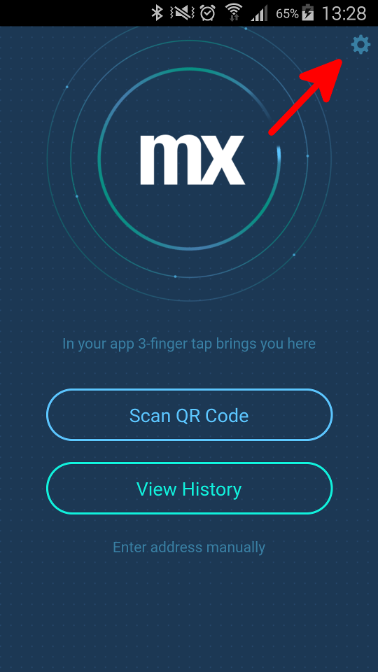

# Debug a Hybrid Mobile Application

This how-to explains the steps involved in debugging a Mendix application that is running in the Mendix Developer App on your mobile phone.

**After completing this how-to you will know:**

*   How to debug a mobile application

## 1. Preparation

Before you can start with this how-to, make sure you have completed the following prerequisites.

*   Install [weinre](https://people.apache.org/~pmuellr/weinre/docs/latest/)
*   Mendix Developer App (v1.1 or later) installed on your mobile device. You can find it in your platform's appstore. 

## 2\. Start weinre

From your console, start weinre with the following parameters:

weinre --boundHost 1.2.3.4 --httpPort 9090

where 1.2.3.4 is your local IP. This will most probably match the address that you see in the History of your Mendix Developer App. You can change 9090 to a different port, as long as it doesn't clash with your application's port, which is usually 8080. 

## 3\. Connect your Mendix Developer App

Click the settings icon (top right, see screenshot) to configure your debugger. On the configure screen, fill in the same settings that you used to start weinre. This should be [http://1.2.3.4:9090](http://1.2.3.4:9090) (where 1.2.3.4 is your local IP)

You can now surf to the **same** address from your local browser to start the debugging session.

## 4\. Related content

*   [Finding the Root Cause of Runtime Errors](/howto50/finding-the-root-cause-of-runtime-errors)
*   [Clearing Warning Messages in Mendix](/howto50/clearing-warning-messages-in-mendix)
*   [Testing web services using SoapUI](/howto50/testing-web-services-using-soapui)
*   [Debugging Microflows](/howto50/debugging-microflows)
*   [Common Mendix SSO Errors](/howto50/common-mendix-sso-errors)
*   [Monitoring Mendix using JMX](/howto50/monitoring-mendix-using-jmx)
*   [Debugging Java Actions](/howto50/debugging-java-actions)
