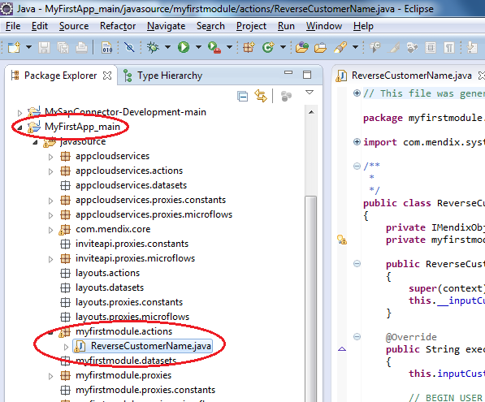
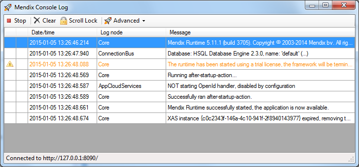

# Debugging Java Actions

The Mendix Modeler has a built-in debugger to solve errors on Microflow level. A Microflow can be extended with custom Java actions, but because these actions are text based they can only be checked on compile errors. If you run into an error in any of the Java actions, you can easily debug them utilizing the debugger of Eclipse.

# Table of contents

## 1\. Preparation

Before you start with this how-to please complete the following prerequisites:

*   Install [Eclipse](https://eclipse.org/)
*   Add a Java action and open the project in Eclipse.
*   Complete the how-to about [extending your application with custom Java](/howto50/extending-your-application-with-custom-java)
*   Deploy the application for Eclipse by selecting 'Deploy for Eclipse' from the project menu in the Mendix Modeler. You should redo this every time you make changes in the Mendix Modeler.
    

## 2\. Setting Breakpoints

1.  Open **Eclipse** and locate the project in the package explorer.
2.  Double click the **ReverseCustomerName.java** in the package explorer of Eclipse.
    
3.  Place the cursor on the line that needs debugging.
4. Hold down **Ctrl+Shift** and press **B** to enable a breakpoint. A blue dot in front of the line will occur. 
    

    You can also use Ctrl+Shift+B to disable a breakpoint.

## 3\. Debugging in Eclipse

1.  Select the project root node in the package explorer.
2.  Click the **debug icon** in the Eclipse toolbar.
    

    The application will now be started with Eclipse attached as debugger.
    
3.  As soon as the deployment process is ready, open the application in your browser and do whatever is needed to trigger the Java action.

    As an end user of the application you will see progress bar on your application. As a developer you will notice that the Eclipse icon will be flashing on the windows task bar.
4.  Open Eclipse. You should now see the 'Debug' perspective of Eclipse.
5. Click **Step into** (F5) or **Step over** (F6) to move on the next step in the Microflow.
    

    The difference between 'Step into' and 'Step over' is only noticeable if you run into a function call. 'Step into' means that the debugger steps into the function and 'Step over' just moves the debugger to the next line in the same java action.
    With 'Step Return' (F7) you can instruct the debugger to leave the function. It's basically the opposite of 'Step Into'.
    Clicking 'Resume' (F8) instructs the debugger to continue until it reaches another breakpoint.

6. Place your cursor on any of the variables in the Java action to see its value in a pop-up.
    

## 4\. Related content

*   [Finding the Root Cause of Runtime Errors](/howto50/finding-the-root-cause-of-runtime-errors)
*   [Clearing Warning Messages in Mendix](/howto50/clearing-warning-messages-in-mendix)
*   [Testing web services using SoapUI](/howto50/testing-web-services-using-soapui)
*   [Debugging Microflows](/howto50/debugging-microflows)
*   [Common Mendix SSO Errors](/howto50/common-mendix-sso-errors)
*   [Monitoring Mendix using JMX](/howto50/monitoring-mendix-using-jmx)
*   [Debugging Java Actions](/howto50/debugging-java-actions)
*   [Java Actions](/refguide5/java-actions)
