## 1 Introduction

Mendix is the app platform for the enterprise, and in enterprise software, it is not likely that you work in a [greenfield project](https://en.wikipedia.org/wiki/Greenfield_project). In almost every situation, you will need to integrate with existing systems. Mendix supports many ways of integrating, and this how-to focuses on how you can consume web services with Mendix.

For this how-to, you will be using an example web service of [W3Schools](http://www.w3schools.com/). Please note that this is a very simple web service that converts temperatures from Celsius to Fahrenheit and vice versa. The converted temperature will be returned as a string value that can be stored in a variable directly. If you want to invoke a web service that returns a complex XML message, you can use the XML-to-domain mappings explained in [How to Import XML Documents](Importing+XML+documents).

**After using this how-to, you will know how to do the following:**  

* Import a WSDL
* Create logic to call the web service

## 2 Importing a WSDL

A WSDL describes the operations of a web service and can be imported in the Modeler. After importing the WSDL, you can invoke the operations of the web service instantly within the microflow editor.

To import a WSDL, follow these steps:

1. Right-click your module in the **Project Explorer** and select **Add** > **Document** from the menu (you can also use shortcut **Ctrl+N**):
    
2. Select **Consumed web service** as the **Document type** in the **New Document** pop-up window, and then select a module or folder as the target **Location**:
    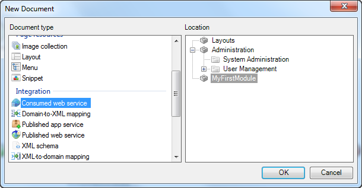
3. Click **OK** and enter a name for the new consumed web service (for example, _TemperatureConverter_).
4. Click **OK** again. You will now see the consumed web service editor:
    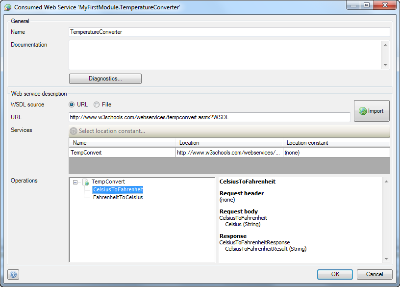
5. Enter `http://www.w3schools.com/webservices/tempconvert.asmx?WSDL` as the URL, and then click **Import**. This will bring up the **Select Ports** pop-up window asking you to select a web service port:
    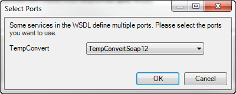
6. Click **OK** to select the default. The Modeler should now import these operations: **CelsiusToFahrenheit** and **FahrenheitToCelsius**.
    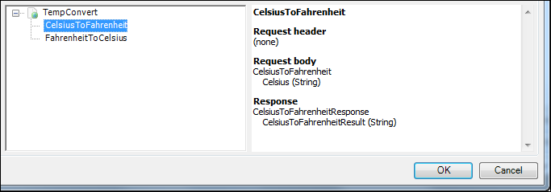
7. Click **OK** to save the consumed web service.

## 3 Creating Logic to Call the Web Service

To create logic to call the web service, follow these steps:

1. Right-click your module in the **Project Explorer** and select **Add** > **Document** from the menu (you can also use shortcut **Ctrl+N**):
    
2. Select **Microflow** as the **Document type** in the **New Document** pop-up window, and then select a module or folder as target **Location**:
    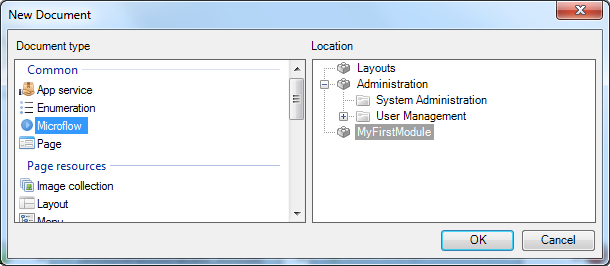
3. Click **OK** and enter a name for the new microflow (for example, _ConvertCelsiusToFahrenheit_).
4. Click **OK** again. You will now see an empty microflow:
    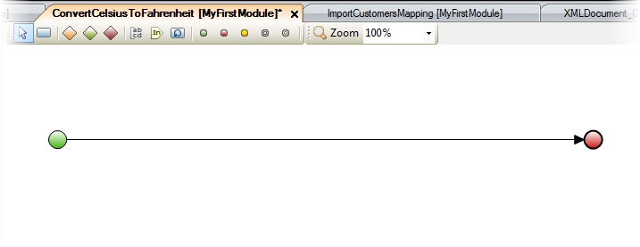
5. Open the **Toolbox** (from the bottom-right corner of the Modeler):
    
    You can also open the **Toolbox** from the view menu:
    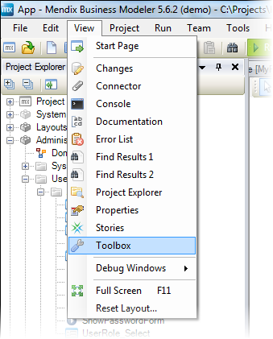
6. Drag a **Create variable** activity from the **Toolbox** to the line between the start and end event. This inserts a new activity.
7. Double-click the new activity to open the **Create Variable** properties editor.
8. Select **Integer/Long** as the **Data Type**, enter *100* as the value, and set *TemperatureInCelsius* as the **Output Variable** name:
    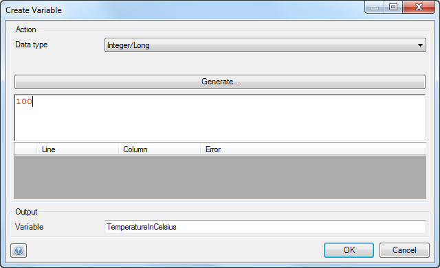
9. Click **OK.** The microflow will look like this:
    
10. Drag a **Call web service** activity from the toolbox to the line between the start and end event. This inserts a new activity.
11. Double-click the new activity to open the **Call Web Service** properties editor:
    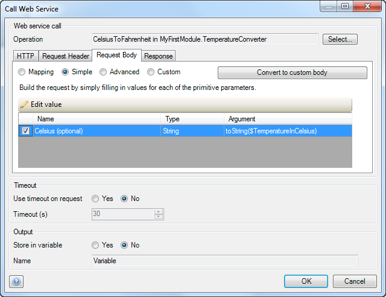
12. In the **Web service call section** of the editor, click **Select...** to open the **Select Web Service Operation** pop-up window:
    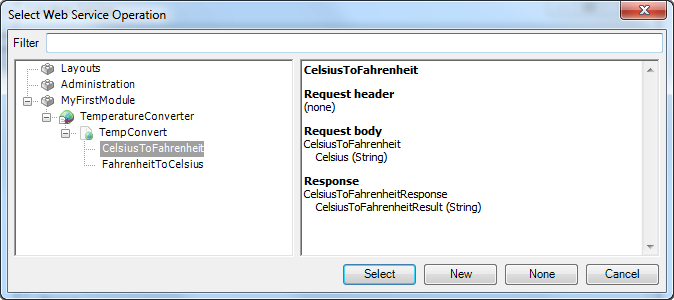
13. Select **CelsiusToFahrenheit** and then click **Select**.
14. Double-click the **Celsius (optional)** input parameter:
    
15. Enter *toString($TemperatureInCelsius)* for the expression. The web service operation expects a string value, which is why you need to use the *toString* function. Then click **OK**.
16. Select **Yes** for the **Store in variable** option, and name the variable *TemperatureInFahrenheit*:
    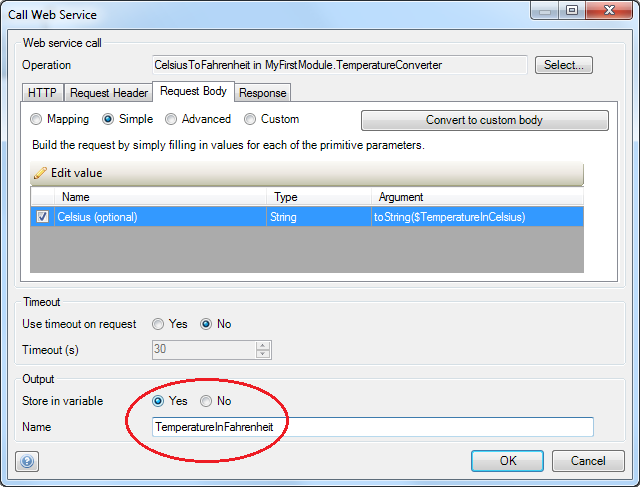
17. Click **OK**. The microflow will look like this:
    
18. Drag a **Show message** activity from the **Toolbox** to the line between the start and end event. This inserts a new activity.
19. Double-click the new activity to open the **Show Message** properties editor.
20. Select **Information** as the **Type**, and enter *The temperature in fahrenheit is: {1}* for the **Template**. The *{1}* functions as a placeholder for the parameters below.
    
21. Create a new parameter and enter *$TemperatureInFahrenheit* for the expression (this is the return value of the web service operation), and click **OK**:
    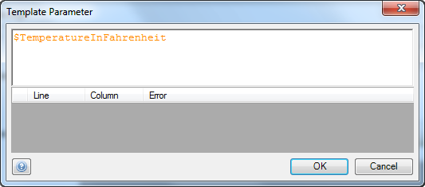
22. Click **OK** again to save the **Show message activity** properties. The microflow will look like this:
  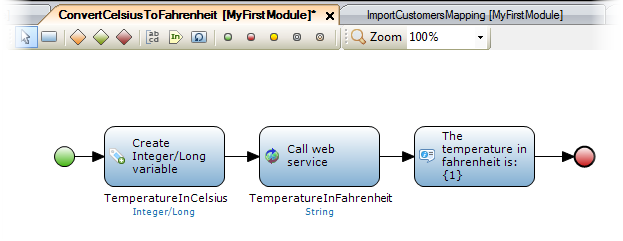
23. Create a menu item that triggers this microflow. For details on how to create a menu item, see [How to Set Up the Navigation Structure](Setting+Up+the+Navigation+Structure).
24. Deploy the application and trigger the microflow to call the web service operation. You should see a message with the converted temperature.

## 4 Related Content

* [Generating a Personal SSH2 Key Pair](Generating+a+personal+SSH2+key+pair)
* [Create a Secure App](Create+a+Secure+App)
* [Security](Security)
* [Consuming a Complex Web Service](Consume+a+Complex+Web+Service)
* [Exporting XML Documents](Export+XML+documents)
* [Importing Excel Documents](Importing+Excel+Documents)
* [Exposing a Web Service](Expose+a+web+service)
* [Selenium Support](Selenium+Support)
