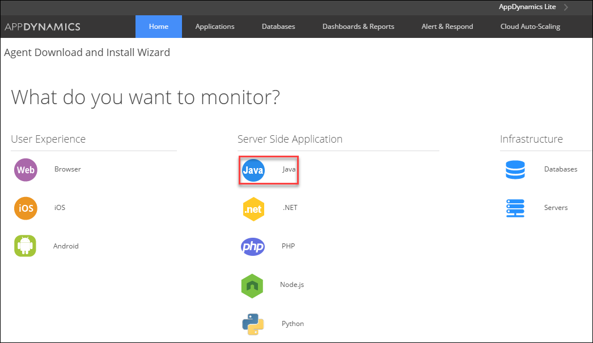
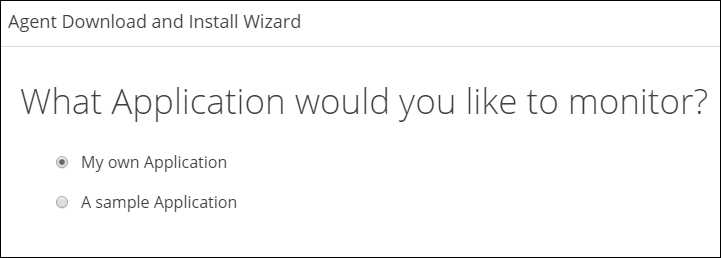
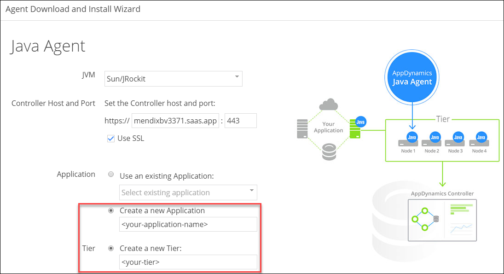

## 1 Introduction

To ensure your applications run smoothly, they need to be actively monitored so that the information is available in order to do the following:

* Avoid performance problems
* Diagnose performance problems when they occur

App Dynamics is a flexible application performance management tool that provides information to help you achieve the above goals.

**After using this how-to, you will know how to do the following:**

* How to set up application performance management for your Mendix application on AppDynamics

## 2 Prerequisites

Before starting with this how-to, make sure you have completed the following prerequisites:

* Create an AppDynamics account by signing up here: [https://portal.appdynamics.com/account/signup/community/](https://portal.appdynamics.com/account/signup/community/)
* If you want to install on-premises AppDynamics, see this article: [https://docs.appdynamics.com/display/PRO14S/Get+Started+with+AppDynamics+On-Premise](https://docs.appdynamics.com/display/PRO14S/Get+Started+with+AppDynamics+On-Premise)

## 3 Setting Up

In this section, we will walk through all the steps to configure AppDynamics so that it can be used for the application performance monitoring of your Mendix application.

## 3.1 Setting Up AppDynamics

To set up AppDynamics, follow these steps:

1. Navigate to your AppDynamics controller, where you should see the following screen:

    
2. Select **Java**.
3. Select **My own Application**, and then click **Next**:

    
4. Enter your application name and your tier, and then click **Next**:

    
5. If you are going to deploy your Mendix app on-premises, download the Java agent:

   
    The downloaded archive contains the *javaagent.jar* file, which you  will need when setting up your Mendix deployment.

## 3.2 Setting Up Your Mendix Deployment

### 3.2.1 Cloud Foundry

Follow the the build-pack instructions to set up AppDynamics for Cloud Foundry deployments that are described here: [https://github.com/mendix/cf-mendix-buildpack#appdynamics](https://github.com/mendix/cf-mendix-buildpack#appdynamics).

### 3.2.2 On-Premises Linux & Windows Service Console

To the `javaopts` list in your *m2ee.yaml* file, add "-javaagent:<path-to-javaagent>javaagent.jar". For example:

```java
 javaopts: [
   "-Dfile.encoding=UTF-8", "-XX:MaxPermSize=128M", "-Xmx512M", "-Xms512M",
   "-Djava.io.tmpdir=/srv/mendix/data/tmp",
   "-javaagent:/opt/AppDynamics/AppAgent/javaagent.jar"
 ]
```

### 3.2.3 Mendix Modeler (Development Mode Only)

1. Open your Mendix application, and then select **Settings** in the **Project Explorer**:

    

2. Open a configuration:

     

3. In the **Extra JVM parameters** field on the **Server** tab, add "-javaagent:<path-to-javaagent>javaagent.jar":

    

## 4 Configuring Business Transactions

Now that your Mendix application has been set up to provide its information using the Java agent, AppDynamics needs to be configured so that it can be displayed in a useful way. This information will be presented as business transactions that will show the requests handled by the request handlers and the Mendix actions that have been triggered. These business transactions will allow you to pinpoint the bottle necks and issues in your Mendix application.

To configure these business transactions, follow these steps:

1.  From the **Home** page, select your application:

    

2.  Open the **Configuration** page (1) and click **Instrumentation** (2):

    

3.  On the **Instrumentation** page, navigate to the **Transaction Detection** tab (1), select your tier (2), check the **POJO Enabled** box (3), and add a new **Custom Match Rule** (4):

    

### 4.1 Mendix Actions

To monitor your actions as business transactions, follow these steps:

1. From the **Custom Match Rules** page, select the **POJO** entry point type from the drop-down menu:

    

2. Fill in the **Transaction Match Criteria** tab with the information presented in this screenshot (the highlighted field should be *com.mendix.core.actionmanagement.CoreAction*):

    

3. Fill in the **Transaction Splitting** tab with the information presented in this screenshot:

    

4. After saving, the Mendix actions will appear under **Business Transactions**:

    

### 4.2 Request Handlers

To set up monitoring on the request handlers, follow these steps:

1. From the **Custom Match Rules** page, select the **POJO** entry point type from the drop-down menu:

    

2. Fill in the **Transaction Match Criteria** tab with the information presented in this screenshot (the highlighted field should be *com.mendix.externalinterface.connector.RequestHandler*):

    

3. Fill in the **Transaction Splitting** tab with the information presented in this screenshot:

    

4. After saving, the requests will appear as **Top Business Transactions**:

    

## 5 Web Services

AppDynamics can automatically detect web service calls. This feature can be enabled by following these steps:

1. Navigate to the **Configuration** page.
2. Select the **Transaction Detection** tab.
3. Selecting your tier.
4. Check the **Web Service Enabled** box.


## 6 Database

AppDynamics automatically detects database calls. These can be viewed by navigating to the **Database Calls** page:


## 7 Application Topology

Once you have performed all of the steps above for your Mendix application, its topology should become visible by navigating to the **Application Dashboard** page. Here you can see an overview of your application and all of its integrations with external systems.


## 8 Further Documentation

For more information on AppDynamics, see the AppDynamics documentation here: [https://docs.appdynamics.com/](https://docs.appdynamics.com/).

## 9 Related Content

* [Finding the Root Cause of Runtime Errors](Finding+the+Root+Cause+of+Runtime+Errors)
* [Clearing Warning Messages in Mendix](Clear+Warning+Messages)
* [Monitoring Mendix Using JMX](Monitoring+Mendix+using+JMX)
* [Debugging Java Actions Remotely](Debug+Java+Actions+Remotely)
* [Log Levels](Log+Levels)
* [Debugging Microflows](Debug+Microflows)
* [Debugging Java Actions](Debug+Java+Actions)
* [Common Mendix SSO Errors](Handle+Common+Mendix+SSO+Errors)
* [Solving Load and Import Errors](Solving+Load+and+Import+Errors)
* [Debugging Microflows Remotely](Debug+Microflows+Remotely)