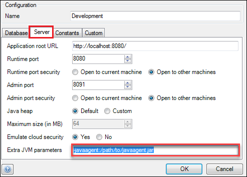

## 1 Introduction

To ensure your applications run smoothly, they need to be actively monitored so that the information is available in order to do the following:

* Avoid performance problems
* Diagnose performance problems when they occur

New Relic is a flexible application performance management tool that provides information to help you achieve the above goals.

**After using this how-to, you will know how to do the following:**

* How to set up application performance management for your Mendix application on New Relic

## 2 Prerequisite

Before starting with this how-to, make sure you have completed the following prerequisite:

* Create a New Relic account by signing up here: [https://newrelic.com/signup](https://newrelic.com/signup)

## 3 Setting Up

In this section, we will walk through all the steps to configure New Relic so that it can be used for application performance monitoring of your Mendix application.

## 3.1 Setting up New Relic (On-Premises Only)

The following steps are only relevant for on-premises deployments (skip to [2.2.1 Cloud Foundry](#CloudFoundry) if you are deploying your Mendix application to Cloud Foundry).

1. Log in to New Relic and create a new application:

    
2. Select Java:

    

3. Download the Java agent archive and save your license key:

     

4. Add your license key to the *newrelic.yml* file from the downloaded archive as described here: [https://docs.newrelic.com/docs/agents/java-agent/installation/java-agent-manual-installation#h2-download-files](https://docs.newrelic.com/docs/agents/java-agent/installation/java-agent-manual-installation#h2-download-files).

## 3.2 Setting Up Your Mendix Deployment

### <a name="CloudFoundry"></a>3.2.1 Cloud Foundry

Follow these build pack instructions to set up New Relic for Cloud Foundry deployments: [https://github.com/mendix/cf-mendix-buildpack#new-relic](https://github.com/mendix/cf-mendix-buildpack#new-relic).

### 3.2.2 On Premise Linux & Windows Service Console

To the `javaopts` list in your *m2ee.yaml* file, add "-javaagent:<path-to-javaagent>javaagent.jar". For example:

```java
 javaopts: [
   "-Dfile.encoding=UTF-8", "-XX:MaxPermSize=128M", "-Xmx512M", "-Xms512M",
   "-Djava.io.tmpdir=/srv/mendix/data/tmp",
   "-javaagent:/opt/newrelic/javaagent.jar"
 ]
```

### 3.2.3 Mendix Business Modeler (Development Mode Only)

1. Open your Mendix application, and click on **Settings** in the **Project Explorer**:

    

2. Open a configuration:

     

3. In the **Extra JVM parameters** field on the **Server** tab, add "-javaagent:<path-to-javaagent>javaagent.jar":

    

## 4 Transactions

After completing the steps described above, all the requests handled by your Mendix application should become visible together with various graphs and statistics:

 

## 5 Databases

Your database calls and queries will now be visible on the database page:
 

## 6 Further Documentation

For more information on New Relic, see the New Relic documentation here: [https://docs.newrelic.com/](https://docs.newrelic.com/).

## 7 Related Content

*   [Finding the Root Cause of Runtime Errors](Finding+the+Root+Cause+of+Runtime+Errors)
*   [Clearing Warning Messages in Mendix](Clear+Warning+Messages)
*   [Monitoring Mendix Using JMX](Monitoring+Mendix+using+JMX)
*   [Debugging Java Actions Remotely](Debug+Java+Actions+Remotely)
*   [Log Levels](Log+Levels)
*   [Debugging Microflows](Debug+Microflows)
*   [Debugging Java Actions](Debug+Java+Actions)
*   [Common Mendix SSO Errors](Handle+Common+Mendix+SSO+Errors)
*   [Solving Load and Import Errors](Solving+Load+and+Import+Errors)
*   [Debugging Microflows Remotely](Debug+Microflows+Remotely)
