## 1 Introduction

This how-to is based on the video "Build a Simple HRM App: Create, Manage, and Deploy the App," which is part of the [Getting Started videos](http://gettingstarted.mendixcloud.com/link/courses/gettingstarted).

This is the first how-to in a series of five on how to create a simple HRM application. In this how-to, you will learn how to create, deploy, and manage your Mendix application.

**After using this how-to, you will know how to do the following:**  

* Create an app
* Manage an app
* Deploy an app

## 2 Prerequisites

Before starting with this how-to, make sure you have completed the following prerequisite:

* Create a [Mendix account](https://www.mendix.com/try-now/?utm_source=documentation&utm_medium=community&utm_campaign=signup)

## 3 Creating Your App

To create your app, follow these steps:

1. Go to the **Mendix App Platform** launchpad ([home.mendix.com](http://home.mendix.com)) and log in if you are not already logged in.

    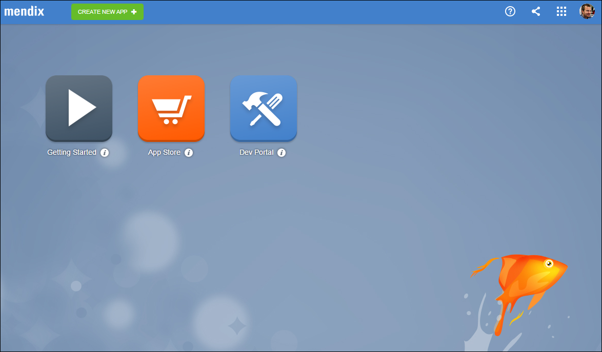

    The launchpad is the central starting point for using, sharing, and building apps.
2. Click the **Dev Portal** app.

    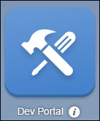

    The dev portal is your starting point for Mendix development. Here you can collaborate and manage the lifecycle of your app(s).
3. In the dev portal, click **CREATE NEW APP**.

     
4. On the **THEMES** tab, select a theme. We use **Blue Wave** theme in this how-to. To learn more about themes, see [The Eye-Catching Mendix UI Framework](https://www.mendix.com/blog/the-eye-catching-mendix-ui-framework/).
    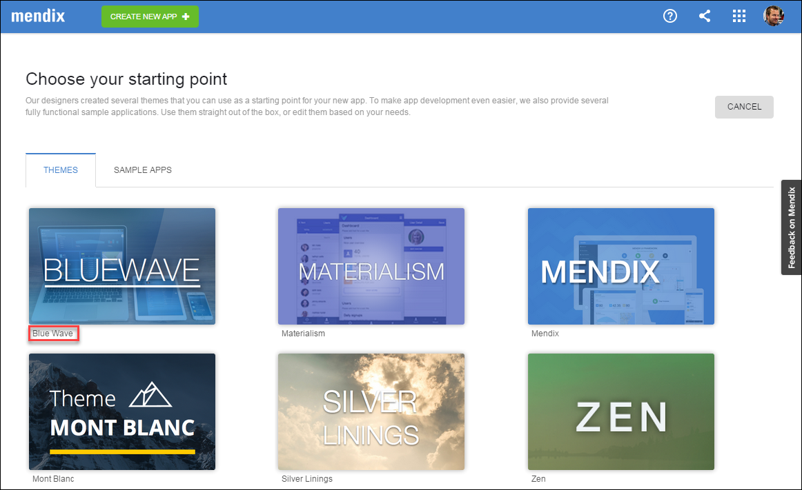 
5. Click **USE THIS THEME**.
     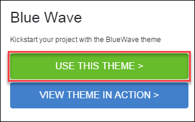
6. Enter the name of your application and click **CREATE APP**.
     
Your app is now created! You will see the overview page of your application. In the middle of the screen you can see and share ideas as well as collaborate with your team. On the right side of the screen, you can see your team and invite colleagues to join the project.
    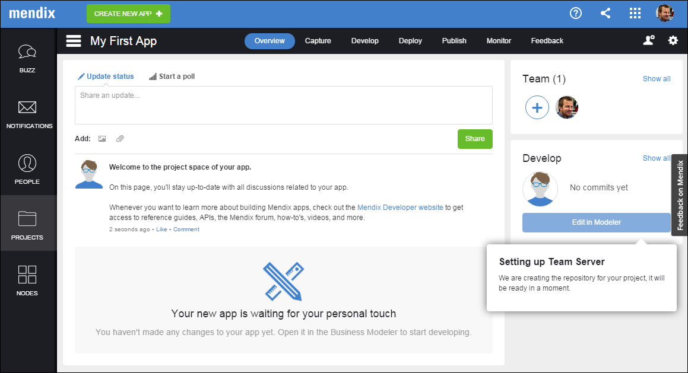

## 4 Managing Your App

To manage your app, follow these steps:

1. In the dev portal, click **Capture**:
    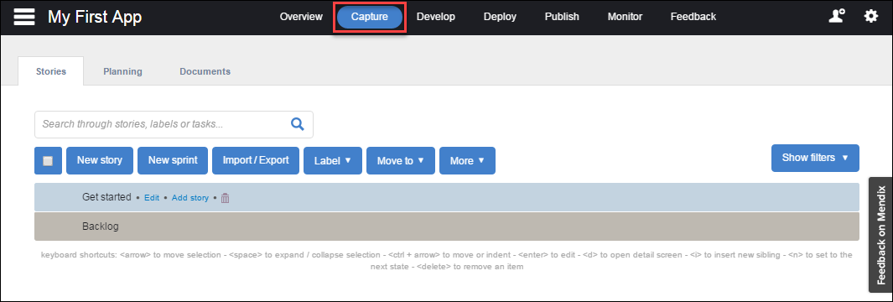
    On this tab you can plan the development of your app by adding sprints and stories. For details on how to manage your application requirements in Mendix by creating and configuring sprints and stories, see [How to Manage Sprints and Stories](managing-your-application-requirements-with-mendix).
2. Click **Develop**:
    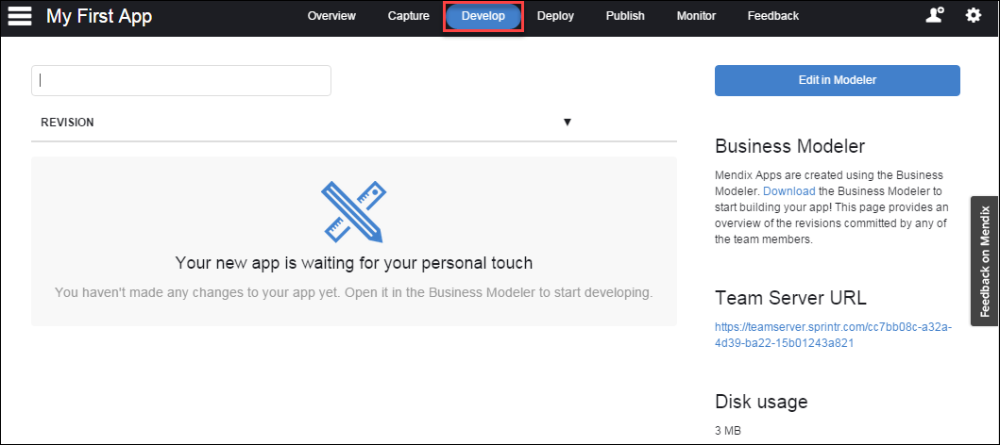
    On this tab you can see the latest revisions to your app made through the use of version control.
3. Click **Deploy**:
    
    On this tab you can see the status of your free sandbox or your licensed cloud node. By default every app gets a free sandbox. When you create an app in the dev portal, the development content is stored in the team server repository.
4. Click **Download Modeler**:
     
5. Click **Download** and install the Modeler (5.18 or higher):

     
6. Go back to the dev portal and click **Overview**:
    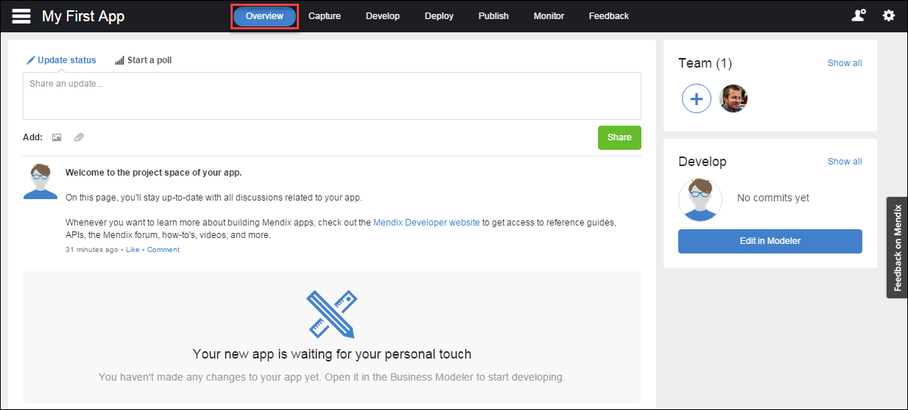 
7. Click **Edit in Modeler** to start working on your app:
    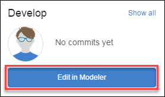

    Your app will be loaded into the Modeler. On the left side of the Modeler you can find the **Project Explorer**, which lists all of the developer content of your app. You can add pages, logic, and other content here.
    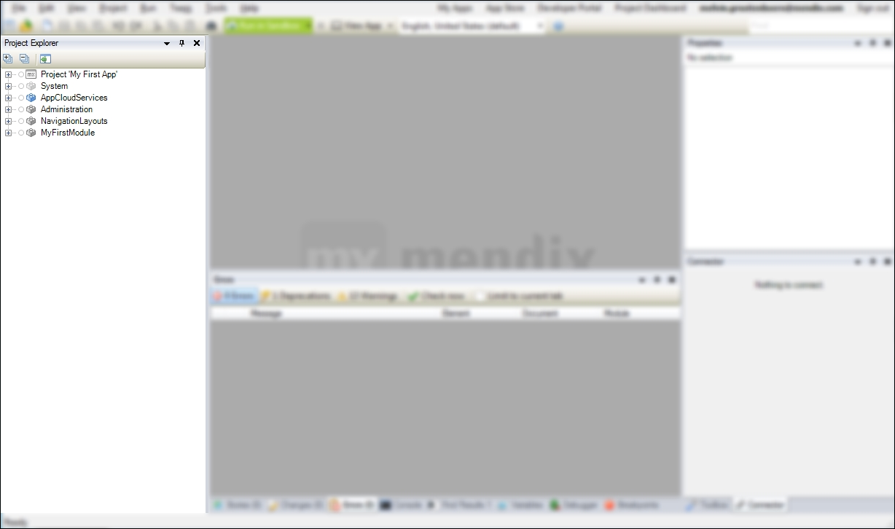

    The **Stories** pane in the Modeler displays the stories of the current sprint that you added on the **Capture** tab in the dev portal. Any changes you make will instantly be visible in the Modeler as well as on the Capture tab.
    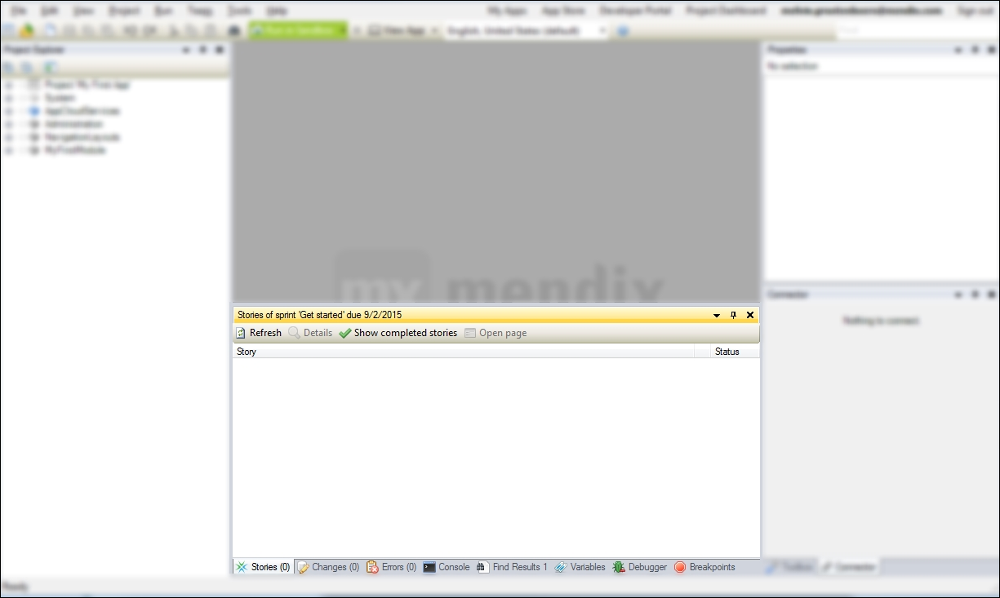

## 5 Deploying Your App

To deploy your app to a sandbox in the Mendix cloud so others can view and test the, follow these steps:

1. Click **Run in Sandbox**:
    
2. Click **View App**:
    

    Your default browser will open and your app will be shown:
    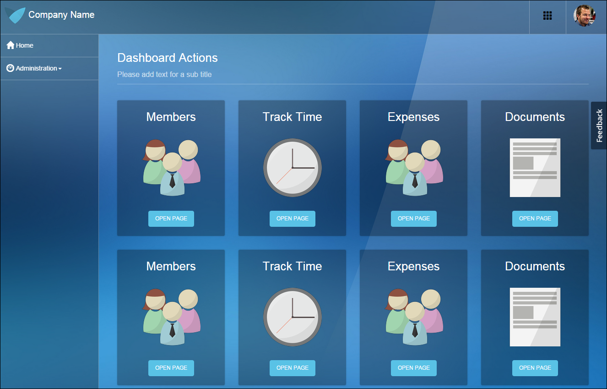

Wow, you deployed your first app!

To use the second how-to for creating a simple HRM application, see [Build a Simple HRM App 2: Perform the First Steps in Building a Rich GUI](build-a-simple-hrm-app-2-first-steps-in-building-a-rich-gui).

## 6 Related Content

* [Build a Simple HRM App 2: Perform the First Steps in Building a Rich GUI](build-a-simple-hrm-app-2-first-steps-in-building-a-rich-gui)
* [Build a Simple HRM App 3: Show Related Data in the GUI](build-a-simple-hrm-app-3-show-related-data-in-the-gui)
* [Build a Simple HRM App 4: Enrich the GUI with Filter Options](build-a-simple-hrm-app-4-enrich-the-gui-with-filter-options)
* [Build a Simple HRM App 5: Smarten Up Your App with Business Logic](build-a-simple-hrm-app-5-smarten-up-your-app-with-business-logic)
* [Create and Deploy Your First App](create-and-deploy-your-first-app)
* [Testing Microflows Using the UnitTesting Module](testing-microflows-using-the-unittesting-module)
