## 1 Introduction

Mendix apps encourage the application of a services-oriented architecture, with multiple smaller services providing APIs and user interfaces for a specific set of data and logic. Enterprises build up complete solutions by assembling these services.

One important aspect of services is that all access to data and logic is handled by the service operations. Direct access to databases used for storing the service data is discouraged, because this would bypass the business rules and security handled by the service. This creates a challenge for generic reporting, data warehousing, and ETL tooling.

A new standard called OData being adopted more and more, as this enables generic data access within a services-oriented architecture. OData is “an open protocol to allow the creation and consumption of queryable and interoperable Restful APIs in a simple and standard way” ([www.odata.org](http://www.odata.org)). In other words, it enables tools to use any REST/OData service by providing metadata that describes the data being provided and by standardizing the messages exchanged with the OData services.

A reporting tool like Tableau or Excel can discover what data and functionality is available in an OData service and provide a generic way for users to build new queries for the data.

**This how-to will teach you how to do the following:**

* Create a published OData service with resources
* Add the OData server to Tableau and Excel
* Combine resources in Tableau
* Create custom queries

## 2 Prerequisites

Before starting this how-to, make sure you have completed the following prerequisites:

* Open the [Company Expenses sample app](https://appstore.home.mendix.com/link/app/240/Mendix/Company-Expenses) from the Mendix App Store in the Modeler
    * Add some expense reports to the app so that you have data to work with in this how-to
* Install Excel 2013
* Download and install [Tableau](http://www.tableau.com/) (you can use the trial version for 14 days)

## 3 Creating a Published OData Service

A published OData service can be used by third-party applications to read data from a Mendix application. In this chapter, you will create and configure such a service.

1. Open the Modeler and add a new folder to the **Expenses** folder called **OData Services**.
2. Right-click the OData Service folder and select **Add** > **Published services** > **Published OData service**:

    

3. Enter the name **Expenses** and click **OK**.
    
4. Go to the Resources tab and click **Add published resource**:

    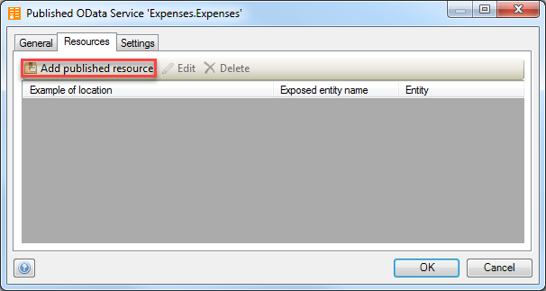

5. In the **Edit published resource** window, you can select an **Entity** as the data source for the OData service. Security in OData is managed by the project security settings and the entity level access rules; therefore, if you have already configured access rules in your app, you don't have to configure it separately for OData.

    Click **Select**:

    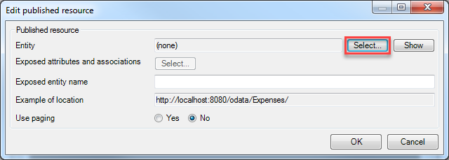

6. In the **Select Entity** window, select the **Expense** entity and click **Select**:

    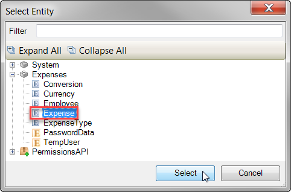

7. In the **Edit published resource** window, do the following:
    * Change the **Exposed entity name** to *Expenses*:
    * Click **Select** for **Exposed attributes and associations**

    

8. In the **Select members for entity** window, select what values are exposed in the OData service, then click **OK** to save the resource:

    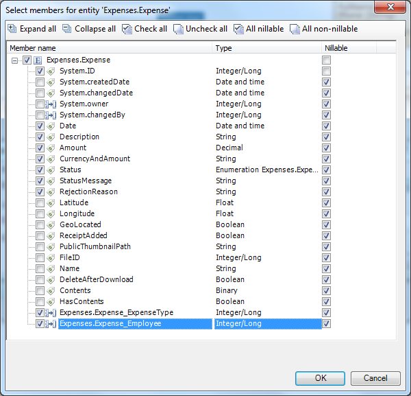

9. Repeat steps 4–8 for the **ExpenseType** and **Employee** entities:

    

10. Click **OK** to save the OData service.

Restart the application. The OData service is now ready to be consumed.

## 4 Working with Mendix Data in Excel 2013

1. Open Excel and create a new blank workbook:

    

2. Open the **DATA** tab and select **From Other Sources** > **From OData Data Feed**:

    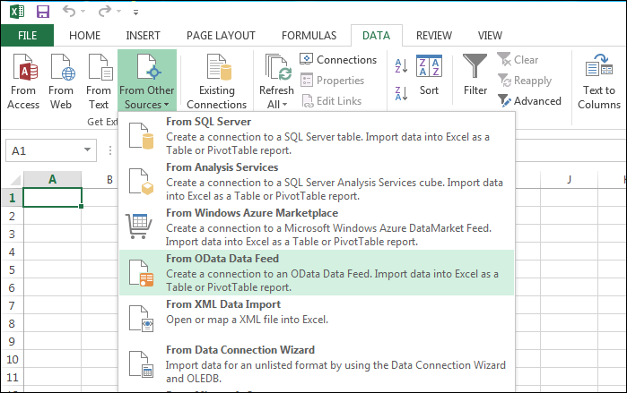

3. On the **Data Connection Wizard** dialog box, do the following:
    * Enter `http://localhost:8080/odata/Published_OData_service/Expenses` for the **Location of the data feed**
    * Select **Use this name and password** and enter the *MxAdmin* credentials
    * Click **Next**

    

4. Select **Expenses** in the tables selector and click **Finish**:

    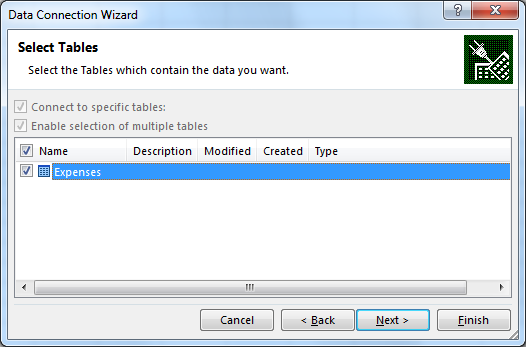

5. On the **Import Data** dialog box, select **Table** as the import method and then click **OK**:

    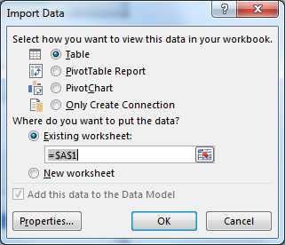

6. The data of the Mendix application should now be imported in Excel:

    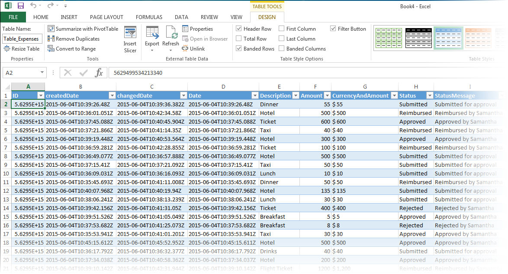

## 5 Working with Mendix Data in Tableau

To visualize data from the Company Expenses app in Tableau, follow these steps:

1. Open **Tableau** and select **More Servers...** > **OData**:

    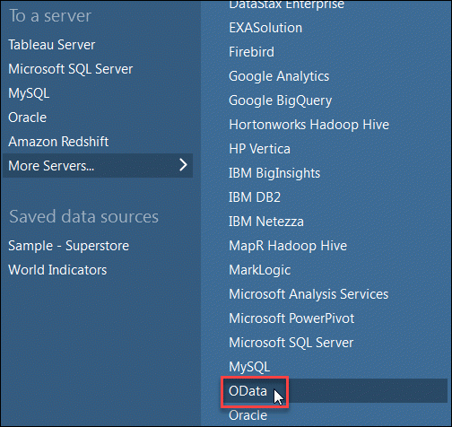

2. On the **Server Connection** dialog box, do the following:
    * Enter `http://localhost:8080/odata/Published_OData_service/Expenses` for the **Server** address
    * Select **Use a specific username and password** and enter the *MxAdmin* credentials
    * Click **OK** to save the server connection

    

3. Click **OK** to save the server connection. You should now see the data source details:

    

4. Click the name of the server connection and change it to *Expenses* for readability:

    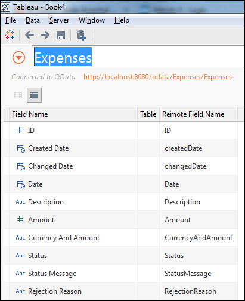

5. Repeat step 1–4 to add a server connection for `http://localhost:8080/odata/Published_OData_service/Expenses`.
6. Open Sheet1 and drag **Expense_Employee** and **Expense_ExpenseType** from **Measures** to **Dimensions**:

    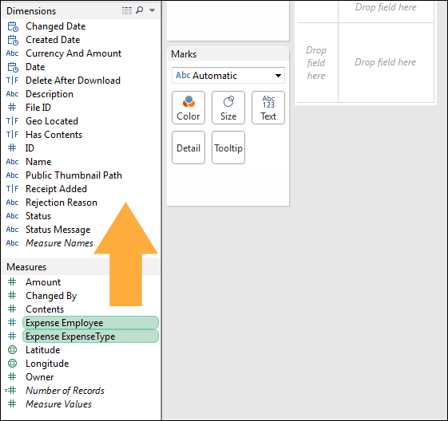

7. Select **Data** > **Edit Relationships...** in order to define the relation between the different data sources:

    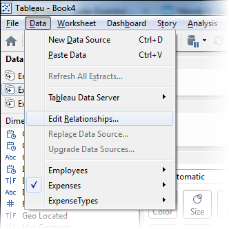

8. On the **Relationships** window, do the following:
    * Select **Expenses** for the **Primary data source** (1)
    * Select **Employees** for the **Secondary data source** (2)
    * Switch to **Custom** mapping (3)
    * Remove any default mappings (4)
    * Click **Add...** to configure a field mapping (5)

    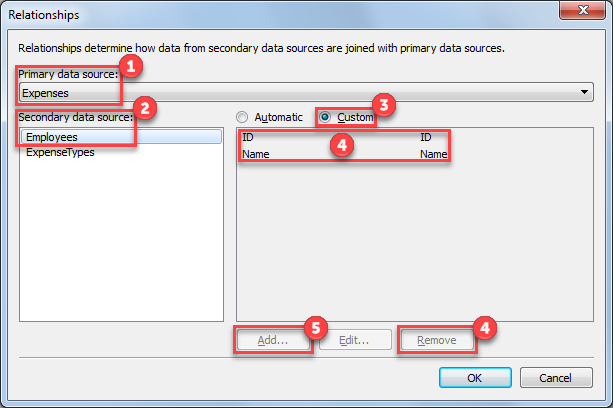

9. In the **Add/Edit Field Mapping** window, select **Expense_Employee** for the **Primary data source field** and **ID** for the **Secondary data source field**, then click **OK** to save the field mapping:

    

10. In the **Relationships** window, do the following:
    * Select **ExpenseTypes** for the **Secondary data source**
    * Switch to **Custom** mapping
    * Remove the default mappings
    * Click **Add...** to configure a field mapping

    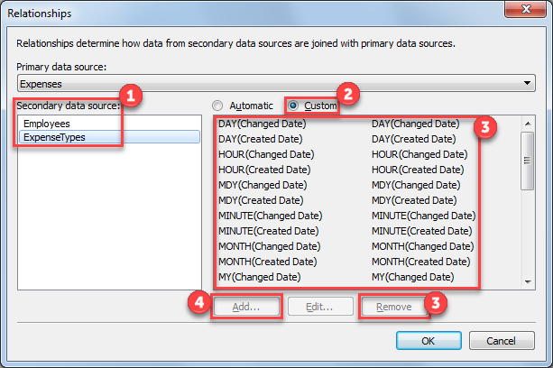

11. In the **Add/Edit Field Mapping** window, select **Expense_ExpenseType** for the **Primary data source field** and **ID** for the **Secondary data source field**, then click **OK** to save the field mapping:

    

12. In the **Relationships** window, click **OK** to save the relationships:

    

13. Select **Expenses** for the data source and drag the **Amount** attribute from the **Measures** section to **Rows**:

    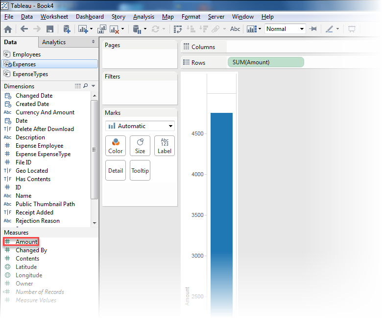

14. Select **Employees** for the data source, drag the **FullName** attribute from the **Dimensions** section to **Columns**, and click the icon next to the **ID** attribute to use ID as the linking field:

    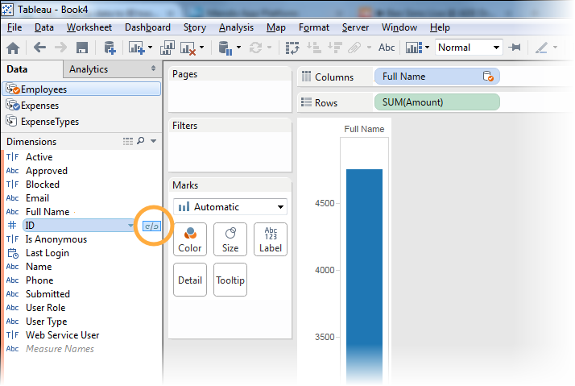

15. Select **ExpenseTypes** for the data source, drag the **Name** attribute from the **Dimensions** section to **Color**, and click the icon next to the **ID** attribute to use ID as the linking field:

    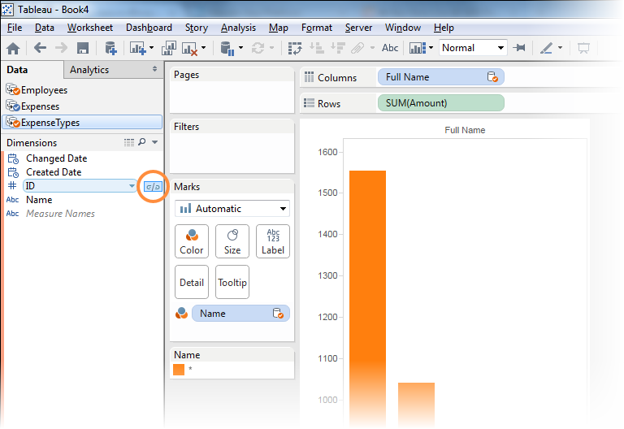

You should now see a stacked bar chart with data combined over multiple data sources:

## 6 Filtering Data With Query Parameters

By default all the expenses are retrieved by Tableau, but Mendix allows you to add filters to the query so only the desired data is being retrieved.

To filter data with query parameters, follow these steps:

1. Right-click the **Expenses** data source and select **Edit Data Source...**:

    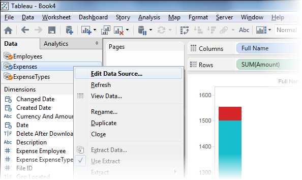

2. Click the OData URL to change the connection settings:

    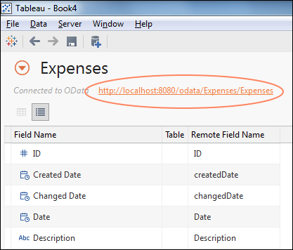

3. Add `?$top=3` to the server URL (in order to only retrieve the first three expenses) and click **OK**:

    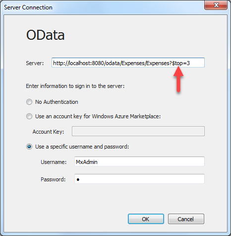

4. Open sheet1, where you should now see a stacked bar chart with only the data of the three expenses:

    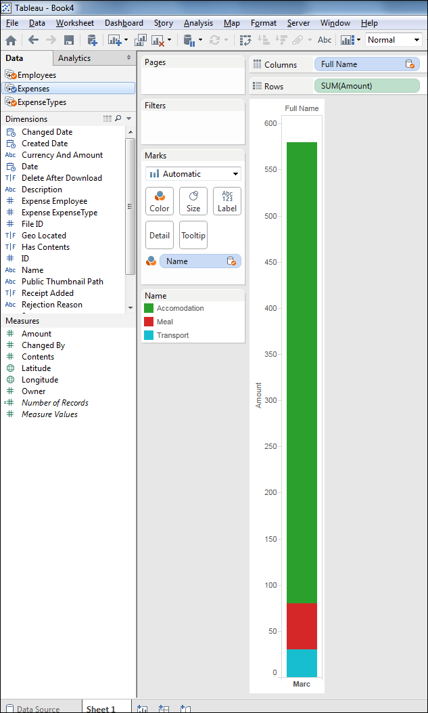

5. You can combine filters by using the `&` character. Repeat steps 1–4, but now use `http://localhost:8080/odata/Expenses/Expenses?$skip=3&$top=3` as the server URL. You should now see a stacked bar chart showing the data of expenses four to six.

These are some other query examples:

* `http:// localhost:8080/odata/Expenses/Expenses(1688849860265137)`
* `http ://localhost:8080/odata/Expenses/Expenses?$ top=100`
* `http://localhost:8080/odata/ Expenses/Expenses ?$skip=10&$ top=10`
* `http://localhost:8080/odata/ Expenses/Expenses /$ count`
* `http://localhost:8080/odata/ Expenses/Expenses ?$ filter=Firstname+eq+'Ivan'`
* `http://localhost:8080/odata/ Expenses/Expenses ?$ filter=Firstname+ne+'Ivan'`
* `http://localhost:8080/odata/ Expenses/Expenses ?$ filter=DateOfBirth+gt+datetime'1995-01-01T00:00:00'`
* `http ://localhost:8080/odata/ Expenses/Expenses ?$ filter=DateOfBirth+gt+datetime'2005-01-01T00:00:00 '&$ orderby=DateOfBirth`

## 7 Related Content

* [How to Consume a Complex Web Service](/howto6/consume-a-complex-web-service)
* [How to Consume a Simple Web Service](/howto6/consume-a-simple-web-service)
* [How to Export XML Documents](/howto6/export-xml-documents)
* [How to Import Excel Documents](/howto6/importing-excel-documents)
* [How to Expose a Web Service](/howto6/expose-a-web-service)
* [How to Enable Selenium Support](/howto6/selenium-support)
* [How to Synchronize User Accounts Using the LDAP Module](/howto6/synchronizing-user-accounts-using-the-ldap-module)
* [How to Import XML Documents](/howto6/importing-xml-documents)
* [How to Consume a REST Service](/howto6/consume-a-rest-service)
* [How to Expose Data to BI Tools Using OData](/howto6/exposing-data-to-bi-tools-using-odata)
* [Publishing OData Services](/refguide6/published-odata-services)
* [OData Representation](/refguide6/odata-representation)
* [OData Query Options](/refguide6/odata-query-options)