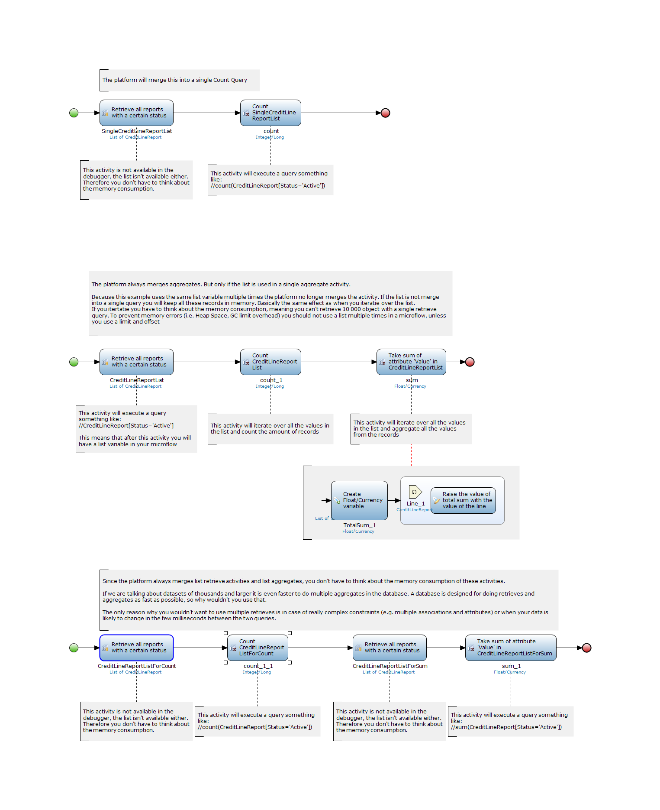

In some projects it is necessary to evaluate and large datasets in a microflow, for example for reporting purposes. If all those microflows do many retrieves and aggregates on large datasets it is easy to run into performance or memory problems. 

When a database retrieve activity is only used in a list aggregate activities the platform can automatically merged these two activities into a single action. This would execute a single aggregate query on the database. So if you would retrieve all 100k log lines from database and only do a count on the list you don’t receive a heap space because the microflow would never place all 100k records in the memory. However if you re-use the same list variable for multiple list aggregates this no longer applies.

Apparently the platform only merges the activities together as long as a list is only used for 1 single aggregate, as soon as you start reusing the list variable anywhere you could end up with memory issues.

So next time when you want to do multiple aggregates on the same list variable, please don’t. Just create to separate retrieve activities instead, you’ll prevent memory errors and in mycase the speed process improved drastically as well (from >60minutes to <10).

## Related content

*   [Defining access rules using XPath](/howto6/define-access-rules-using-xpath)
*   [Extending Your Application with Custom Java](/howto6/extending-your-application-with-custom-java)
*   [Working With Lists in a Microflow](/howto6/working-with-lists-in-a-microflow)
*   [Triggering Logic using Microflows](/howto6/triggering-logic-using-microflows)
*   [Creating a Custom Save Button](/howto6/create-a-custom-save-button)
*   [Optimizing Retrieve Activities](/howto6/optimizing-retrieve-activities)
*   [Error Handling](/howto6/set-up-error-handling)
*   [Optimizing Microflow Aggregates](/howto6/optimizing-microflow-aggregates)
*   [Extract and use sub microflows](/howto6/extract-and-use-sub-microflows)
