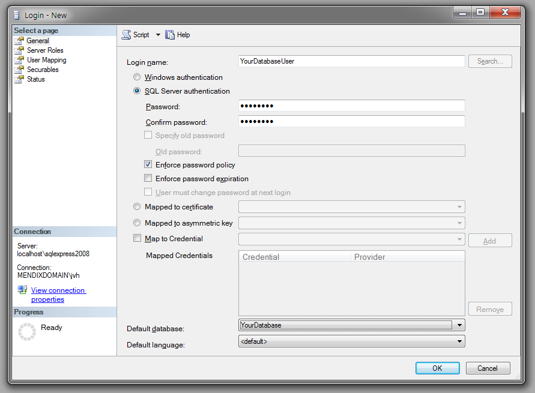
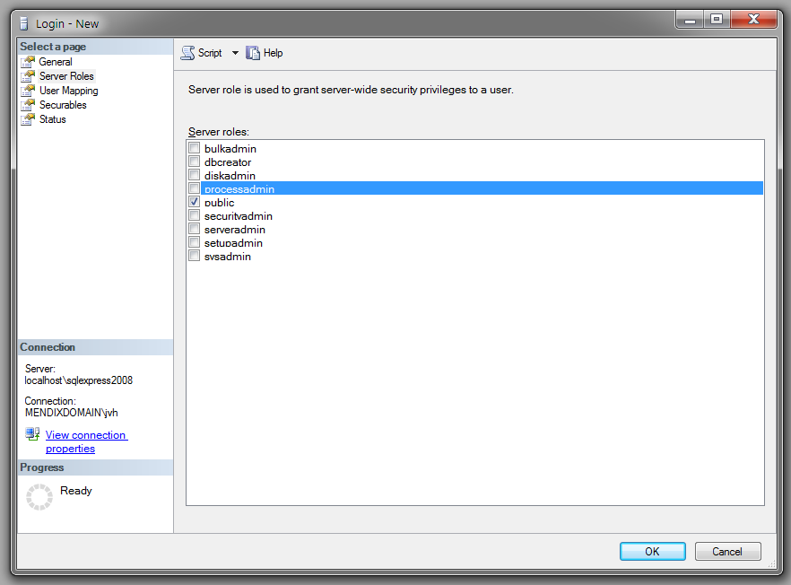
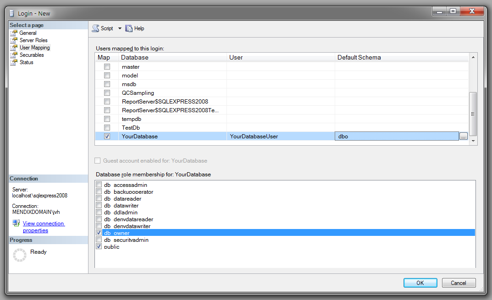
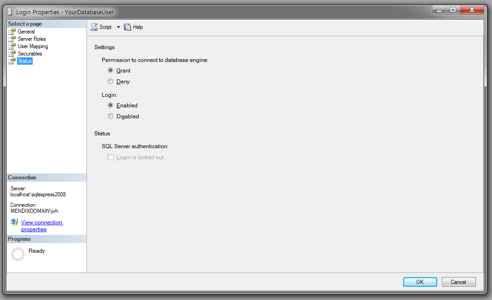

## 1\. General

Determine your login name. If the user you want to use is a local SQL server user select the option SQL Server Authentication. When you want to use an AD account for the database access you can select Windows Authentication. If you choose to use an AD account, the application should also run with this account and you’ll need to configure your database connection to use integrated authentication.

Since we are using an application to connect to the database we don’t want to use the options to expire the password nor the option to require the user to change the password at the next login.

Select the application database as the default database.

## 2\. Server Roles

The user does not require any special server roles. SQL server requires every user to be part of the public role, so it is sufficient to keep the ‘public’ server role as the only role for the user.

You can find more information about the authorization level of the server roles on this page: [http://msdn.microsoft.com/en-us/library/ms188659.aspx](http://msdn.microsoft.com/en-us/library/ms188659.aspx)

## 3\. User Mapping

With the User Mapping properties you can grant the user access to the different database. We suggest you use one account per Mendix application. So this means that the user you are creating should only have access to one single application database. 

The Mendix Platform keeps the database consistent. This means that the platform validates the database structure at the start-up and automatically generates the SQL scripts to update the table structure. The Mendix Service Console provides you with the option to execute these scripts directly on the database. The Mendix Platform requires the usage of the schema ‘dbo’

The recommended database role is db_owner. If you choose not to assign the db_owner role to the user the following roles should be assigned. The roles db_datareader and db_datawriter are the minimum permission the user should get so he can read and write in the contents of all the tables. For altering the tables and columns the user needs to get the db_dlladmin role. 

## 4\. Status

Allow the user to connect to the database. If the user is Denied the privilege to connect to the engine you won’t be able to connect with your application. The credentials used for your application should have the privilege to access the database through a normal login. Otherwise SQL Server considers your account disabled. 

## 5\. Related content

*   [Setting up the database user](/howto6/setting-up-the-database-user)
*   [Restoring a SQL Server database](/howto6/restoring-a-sql-server-database)
*   [Troubleshooting SQL Server](/howto6/troubleshooting-sql-server)
*   [Mendix SQL Maintenance Plans](/howto6/mendix-sql-maintenance-plans)
*   [Setting up a new SQL Server database](/howto6/setting-up-a-new-sql-server-database)
*   [Setting up a SQL Server user](/howto6/setting-up-a-sql-server-user)
*   [Security checklist for your on-premises installation](/howto6/security-checklist-for-your-on-premises-installation)
*   [Mendix on Windows - Microsoft SQL Server](/howto6/mendix-on-windows-_-microsoft-sql-server)
*   [Deploying Mendix on Microsoft Windows](/howto6/deploy-mendix-on-microsoft-windows)
*   [Installing Mendix on Debian GNU Linux](/howto6/installing-mendix-on-debian-gnu-linux)
