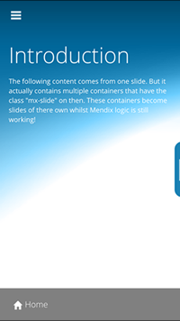
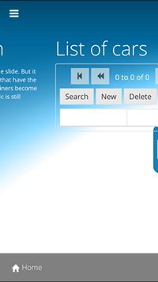
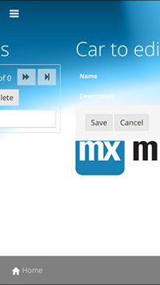
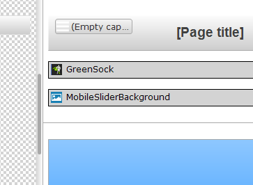
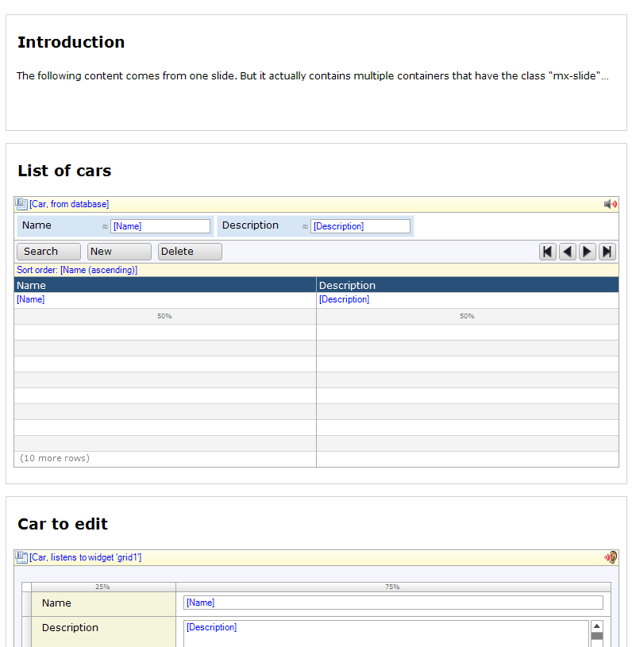
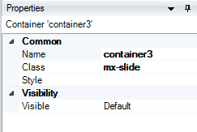
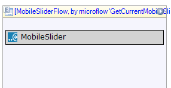
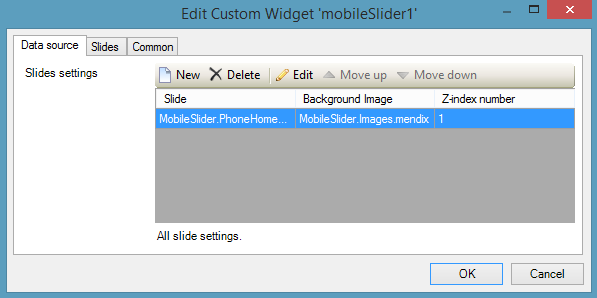
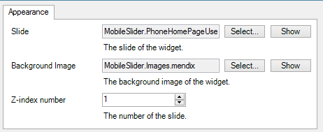
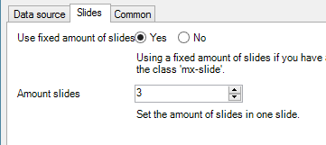

This how-to is about using the Mobile Slider widget in your Mendix hybrid mobile project, and creating the latest type of mobile interactivity. At the end of this tutorial you will have a basic understanding of the structure and setup of the custom widget and how to configure and prepare your Mendix app to use it. 

**After this how-to you will know:**

*   How to set up your Mendix project to use the mobile slider widget.
*   How the mobile slider custom widget works.
*   How to configure your Mendix project to use the mobile slider widget.

## 1. Preparation

Before you start building your Mendix hybrid mobile project with the Mobile Slider custom widget make sure you have the following programs installed:

*   [Mendix Modeler](https://appstore.home.mendix.com/link/modelers)
*   Adobe Brackets and the Widget Development Plugin for Adobe Brackets. [You can find a how-to about this software here](/howto6/getting-started-with-the-widget-development-plugin-for-adobe-brackets).
*   Also please read the "Hello World" how-to on creating a new widget based on the "AppStoreWidgetBoilerplate". [You can find a how-to about setting up a "Hello World" custom widget here](/howto6/create-a-basic-hello-world-custom-widget).


## 2\. Downloading the test project

We have prepared a Mendix hybrid mobile project on GitHub for you with all the settings and widgets you need. 

1.  Go to **[https://github.com/mendix/MobileSlider](https://github.com/mendix/MobileSlider).**
2.  Click on **Download ZIP** to download the latest version.
3.  You can find the test project in the **"test"** directory fully configured and ready to use.
4.  The app is available on [http://localhost:8109/](http://localhost:8109/) once you start running it in Mendix.


## 3\. What does the mobile slider do?

The mobile slider lets you define slides on a page that people can view when they swipe left or right to go to back and forth through the page(s). Take a look at the following screenshots to see the effect:

| Page 1 | Page 2 | Page 3 |
| --- | --- | --- |
|  |  |  |

Notice that the background also moves to the left. This is possible with the extra **MobileSliderBackground** widget that works together with the MobileSlider widget. All the animation is possible with the **GreenSock** widget that is also included in this project.

The source code for all these widgets is freely available on the GitHub repository for you to use and to examine. 


## 4\. What can you find inside the project?

We have created a MobileSlider module inside the MobileSlider project that has all the pages for "Phone", "Tablet" and "Desktop" configured. All the users are defined including their security settings.

Inside the module you will find a phone and tablet page that both have the layout **SidebarPhoneLayout** as their layout defined.
On this layout you will find the **GreenSock** and **MobileSliderBackground** widgets.



These widgets are required on the layout for the MobileSlider widget to function. So also include them in your own project.
Inside the MobileSlider module you will also find the images used to create the interface. We have also used the Yeti theme from the Mendix AppStore as a base for your project, and altered it a bit. The CSS changes can be found in the theme folder in the file "theme\ui\theme-yeti\css\mendix-custom.css".


## 5\. Adding Sliders to a Page

The MobileSlider widget needs at least one page that has containers with the CSS classname "mx-slide".
This allows the widget to cut the page up into viewports that display the content of the container.

**The phone page looks like this:**



Each container has a classname "mx-slide":



Notice that all logic in Mendix still works! So a listening dataview on a datagrids still works. It is advised though to use the listview instead in mobile designs. This is better from a UX perspective. Also don't use the standard "Cancel" button in your detail view. This will close the page and destroy the slide in your MobileSlider.


## 6\. Configuring the MobileSlider widget

The MobileSlider custom widget needs to be placed inside a dataview that creates or gets an entity.
This entity is passed to the page you select that has slides. 



Slides can be configured in the data source tab.



You can add as many pages as you want. Each page must at least have one container with the "mx-slide" classname configured to become a slide for the MobileSlider widget.



You can also use one page as your main slide.

1.  Turn on **Use fixed amount of slides** to manually determine the amount of slides you have configured in your page.
2.  There are 3 containers with the "mx-slide" classname configured, so you need to specify 3 for the amount of slides.




## 7\. Interesting feature

As promised in my previous how-to [Creating a Chainable Widget](/howto6/create-a-chainable-custom-widget) I would create a custom widget that is able to communicate to another custom widget with custom events. 

<div class="alert alert-warning">

Custom widgets in the Mendix project act as isolated features. This means that custom widgets cannot and do not know anything about platform widgets _(example: the datagrid, the listview)_. It is also not possible to hook into an event from a platform widget in a custom widget.

</div>

The MobileSlider custom widget actually communicates to the MobileSliderBackground custom widget to set the background image of the entire application. Take a look at the following source code that can be found in the MobileSlider that does just that:

**Custom JavaScript event / MobileSlider.js**

```
// Setting the background!

$('#mx-slider-background-layer').trigger('mx.slide.set.background', [{

         background: this.slides[0].backgroundImage,
         width: (this.slides.length * documentWidth),
         height: documentHeight

}]);
```
And the receiving bit of code in the MobileSliderBackground.js.

**Receiving JavaScript event / MobileBackgroundSlider.js**

```
$('#mx-slider-background-layer').on('mx.slide.set.background', lang.hitch(this, function(event, data) {

       $('#mx-slider-background-layer').css('background-image', 'url(\'' + mx.appUrl + data.background + '\')');
       ...

}));
```


## 8\. Conclusion

I encourage you to download all the source files from the GitHub repository and dive right into the goodies that these widgets provide. It will show you how powerful the Mendix platform can be, extended with new UX features.


## 9\. Related content

*   [Creating a chainable Custom Widget](/howto6/create-a-chainable-custom-widget)
*   [Getting started with the Widget Development Plugin for Adobe Brackets](/howto6/getting-started-with-the-widget-development-plugin-for-adobe-brackets)
*   [Creating a Basic Hello World Custom Widget](/howto6/create-a-basic-hello-world-custom-widget)
*   [The Mobile Slider Custom Widget](/howto6/the-mobile-slider-custom-widget)


Some interesting websites, books, and articles you might want to read next to dive into the source code of the AppStoreWidgetBoilerplate and the MobileSlider custom widget code base:

### 9.1 GreenSock

A great and powerful tool for creating stunning interfaces.
 [http://greensock.com/
 ](http://greensock.com/)

### 9.2 Writing your own DOJO Widget

Mendix Custom Widgets are based upon DOJO widgets. You will find the following BLOG post very useful.
[http://dojotoolkit.org/reference-guide/1.10/quickstart/writingWidgets.html
 ](http://dojotoolkit.org/reference-guide/1.10/quickstart/writingWidgets.html)

### 9.3 The Mendix Client API 6.0

To communicate with Mendix you need to use the Mendix JavaScript Client API. Read all about it at the following online documentation:

[https://apidocs.mendix.com/6/client/
 ](https://apidocs.mendix.com/6/client/)

### 9.4 Learning JavaScript Design Patterns

A very nice book that helps you understand what JavaScript is all about.

[http://addyosmani.com/resources/essentialjsdesignpatterns/book/](http://addyosmani.com/resources/essentialjsdesignpatterns/book/) 
