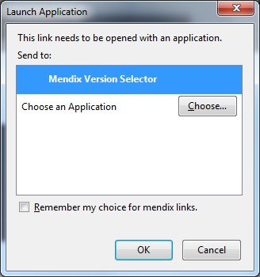
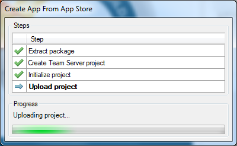
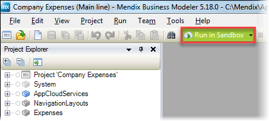
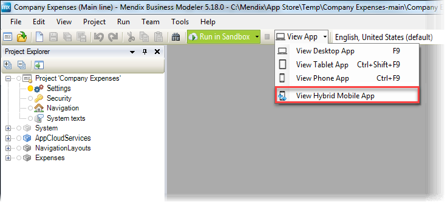
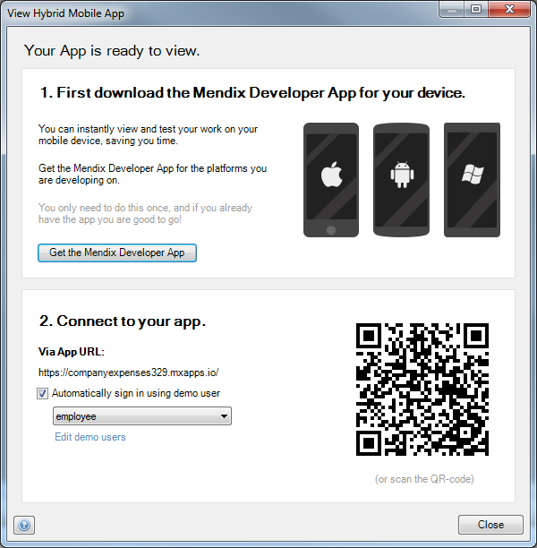
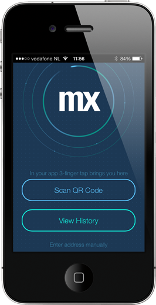
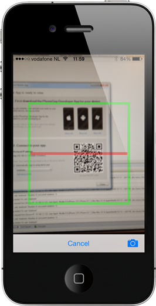
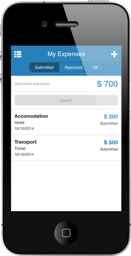

## 1 Introduction

Mendix supports mobile web development, and it is also possible to create and publish hybrid mobile apps. A hybrid app gives you the best of both worlds: it's a web application that can be deployed using the Mendix platform, but it runs inside a container that can be installed as a native app on your device. This container handles native capabilities like the camera and GPS, and it can even be published in the Apple App Store and Google Play. The big advantage of a hybrid mobile app is that you only need to go through the approval process once and every future update is just a new deployment of your app in the Mendix cloud.

**This how-to will teach you how to do the following:**

* Open a hybrid example app
* Install the app on your device

## 2 Prerequisites

Before starting this how-to, make sure you have completed the following prerequisites:

* Version 5.10 or higher of the Mendix Modeler (available from the [App Store](https://appstore.home.mendix.com/link/modelers)
* The Mendix Developer App, which makes it easy to see a hybrid application in action without the need to get it approved in the App Store (for details and download links, see [Getting the Mendix Developer App](/refguide7/getting-the-mendix-developer-app) in the Mendix Reference Guide)

## 3 Opening a Hybrid Example App

To open a hybrid example app, follow these steps:

1.  Go to the [Company Expenses](https://appstore.home.mendix.com/link/app/240/Mendix/Company-Expenses) app in the Mendix App Store and click **Open in Modeler**:

    

2. In the **Launch Selection** pop-up window, select **Mendix Version Selector** as the application to open this link:

    

    The modeler will open the example application and create a new project for you:

    

3. Click **Run in Sandbox** to deploy this application to the Mendix cloud:

     

    The Modeler will notify you as soon as the application is deployed.
4. Click the small arrow to open the **View App** menu and select **View Hybrid Mobile App**:

     

    This will open the **View Hybrid Mobile App** pop-up window:

    

5. Open the **Mendix Developer App** on your device and select **Scan QR Code**:

    

6. Scan the QR code on the screen with the Mendix Developer App:

    

    You should see the example application running on your device:

    

## 4 Installing the App on Your Device

If you want to install this application as a native app on your device, you can install it via iTunes or publish it to one of the mobile app stores. For details on how to achieve this, see [How to Publish a Mendix Hybrid Mobile App in Mobile App Stores](publishing-a-mendix-hybrid-mobile-app-in-mobile-app-stores).

## 5 Related Content

* [How to Build a Simple HRM App 1: Create, Manage, and Deploy the App](../getting-started/build-a-simple-hrm-app-1-create-manage-and-deploy-the-app)
* [How to Build a Simple HRM App 2: First Steps in Building a Rich GUI](../getting-started/build-a-simple-hrm-app-2-first-steps-in-building-a-rich-gui)
* [How to Build a Simple HRM App 3: Show Related Data in the GUI](../getting-started/build-a-simple-hrm-app-3-show-related-data-in-the-gui)
* [How to Build a Simple HRM App 4: Enrich the GUI with Filter Options](../getting-started/build-a-simple-hrm-app-4-enrich-the-gui-with-filter-options)
* [How to Build a Simple HRM App 5: Smarten Up Your App with Business Logic](../getting-started/build-a-simple-hrm-app-5-smarten-up-your-app-with-business-logic)
* [How to Create and Deploy Your First App](../getting-started/create-and-deploy-your-first-app)
* [How to Debug a Hybrid Mobile Application](..monitoring-troubleshooting/debug-a-hybrid-mobile-application)