You can publish your own webservices in a Mendix application. These webservices consist of operations. Other applications can then call operations of this webservice and you can return a result. This result is based on a microflow that will be executed when the webservice is called. With SoapUI you can create (automated) tests for these webservices.

**After completing this how-to you will know:**

*   How to create a SOAP project with SoapUI.
*   How to create assertions in SoapUI.
*   How to build an automated test using SoapUI.

## 1. Preparation

Before you can start with this how-to, make sure you have completed the following prerequisites.

*   Download and install [SoapUI](https://www.soapui.org/downloads/soapui.html)
*   Complete the how-to [Exposing a web service](expose-a-web-service)

| Software | Version used in this how-to |
| --- | --- |
| Mendix Business Modeler | 5.20.0 |
| SoapUI | 5.2.0 |

<div class="alert alert-warning">

All images, names and steps in this how-to are based on these versions. When using other versions the images and/or names on your screen may be different than the images or names used in this how-to.

</div>

## 2\. Publish more microflows as web service operation

In the how-to [Exposing a web service](expose-a-web-service) you already published the microflow _GetCustomers_ as web service operation. In this chapter you will create two more microflow and publish them as web service operation.

1.  Open the **Mendix Business Modeler**.
2.  Open the project you created in the how-to [Exposing a web service](expose-a-web-service).
3.  Create a **Microflow** that creates a customer and returns a boolean. 

    <iframe width="100%" height="491px" frameborder="0" src="https://modelshare.mendix.com/models/27dedcb6-38d2-48e4-a77d-68e1d5bde73a/createcustomer?embed=true"></iframe>
4.  Create a **Microflow** that deletes a customer and returns a boolean.

    <iframe width="100%" height="491px" frameborder="0" src="https://modelshare.mendix.com/models/33c17aed-c915-420b-b433-0c22614a0273/deletecustomer?embed=true"></iframe>
5.  Publish both microflows as web service operation of the **CustomerWebservice** as described in chapter 4 of the how-to [Exposing a web service](expose-a-web-service).

## 3\. Create a new SOAP project

In this chapter you will create a new SOAP project.

1.  Open **SoapUI**.
2.  Press **CTRL+N** to create a new SOAP project.
    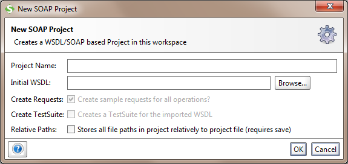
3.  Run the project locally in the **Mendix Business Modeler**.
4.  Go to _http://localhost:8080/ws-doc/_.
    
5.  Enter the URL of the WSDL schema in the **Initial WSDL** field in SoapUI.
    The Project Name field will automatically be filled with the name of the webservice following by _?wsdl_.
    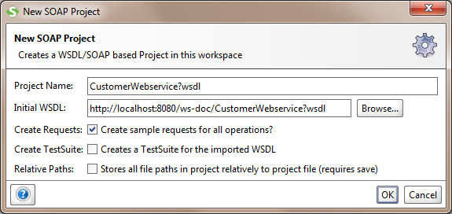
6.  Click** OK**. This will create a new SOAP project in SoapUI.
    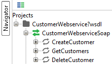

## 4\. Build a TestSuite, a TestCase and a TestStep

In this chapter you will build a testsuite. A testsuite contains one or more testcases. Every testcase contains one ore more teststeps. 

1. In SoapUI, press **CTRL+T** to create a new TestSuite.
   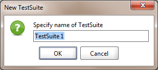
2. Click **OK**.
3. Select TestSuite 1 and press **CTRL+N** to create a new TestCase.
   
4. Click **OK**.
5. Expand Testuite 1 and TestCase 1.
6. Right-click **Test Steps(0)** and select **SOAP Request**.
   
7. Enter _Retrieve Customers_ in the name field.
   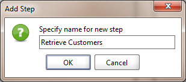
8. Click **OK**.
9. Select **CustomerWebserviceSoap -> GetCustomers**.
   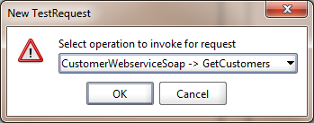
10. Click **OK**.
    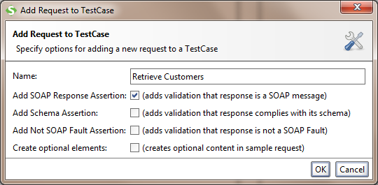
11. Click **OK**.
12. Open SOAP request **Retrieve Customers**.
    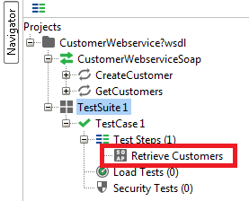 
13. Change the follow value:

    ```java
    <Offset>?</Offset>
    <PageSize>?</PageSize>
    ```

    into

    ```java
    <Offset>0</Offset>
    <PageSize>10</PageSize>
    ```

14. Press **ALT+Enter** to submit the request. The customers you created in the previous how-to will be shown in the response. The response will look like the code below:

    ```
    <soap:Envelope xmlns:xsd="http://www.w3.org/2001/XMLSchema" xmlns:xsi="http://www.w3.org/2001/XMLSchema-instance" xmlns:soap="http://schemas.xmlsoap.org/soap/envelope/" xmlns:tns="http://www.example.com/">
        <soap:Body>
            <tns:GetCustomersResponse>
                <Customer>
                    <Name>Jessica D. Rogers</Name>
                    <Address>2118 Collins Street</Address>
                    <ZipCode>PA 16646</ZipCode>
                    <City>Hastings</City>
                </Customer>
                <Customer>
                    <Name>Jamie S. Wentz</Name>
                    <Address>3269 Village View Drive</Address>
                    <ZipCode>MD 20872</ZipCode>
                    <City>Damascus</City>
                </Customer>
                <Customer>
                    <Name>Blake G. Race</Name>
                    <Address>4437 Sunny Glen Lane</Address>
                    <ZipCode>OH 44115</ZipCode>
                    <City>Cleveland</City>
                </Customer>
                <Customer>
                    <Name>Angela L. Dolly</Name>
                    <Address>3718 Alpha Avenue</Address>
                    <ZipCode>TX 75439</ZipCode>
                    <City>Ector</City>
                </Customer>
            </tns:GetCustomersResponse>
        </soap:Body>
    </soap:Envelope>
    ```

## 5\. Assertions

Assertions are used to validate the message received by a TestStep during execution, usually by comparing parts of the message (or the entire message) to some expected value. In this chapter you will create an assertion that validates the number of customers.

1.  Click **Assertions (1)**.
    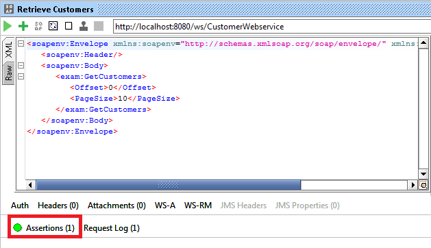
    In chapter 3 step 9 the _Add SOAP Response Assertion_ checkbox was checked. That is the first assertion you see in the list, _SOAP Response - VALID_.
2.  Click the add assertion icon.
    
3.  Click **Property Content**.
4.  Click **XPath Match**.
5.  Enter _count(//Customer)_ in the XPath Expression field.
6.  In step 1.4 of the previous how-to you have added some data. Enter the number of created customers in the **Expected Result** field. In this example four customers were created.
    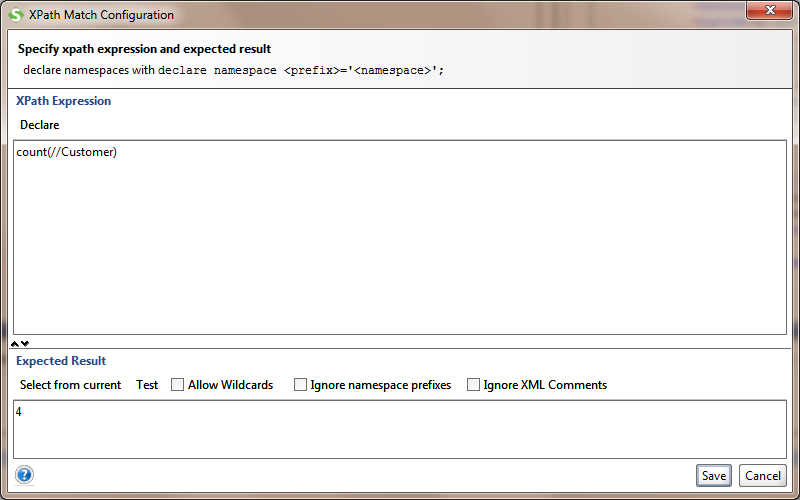
7.  Click **Save**.

## 6\. Extend your test case

In this chapter you will extend your test case with multiple test steps and assertions.

1.  Add a new SOAP request to the existing test case with the following details:

    | Field | Value |
    | --- | --- |
    | Specify name for step | Create Customer |
    | Select operation to invoke for request | CustomerWebServiceSoap -> CreateCustomer |

2.  Change the request into the following value:

    ```java
    <soapenv:Envelope xmlns:soapenv="http://schemas.xmlsoap.org/soap/envelope/" xmlns:exam="http://www.example.com/">
       <soapenv:Header/>
       <soapenv:Body>
          <exam:CreateCustomer>
             <Name>Donald A. Hylton</Name>
             <Address>784 Better Street</Address>
             <City>Kansas City</City>
             <ZipCode>KS 66102</ZipCode>
          </exam:CreateCustomer>
       </soapenv:Body>
    </soapenv:Envelope>
    ```

3.  Add a **Contains Assertion** and enter _true_ in the content field.
    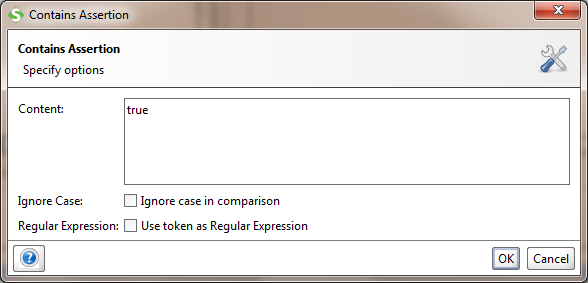 
4.  Right-click test step **Retrieve Customers**.

5.  Select **Clone TestStep**.

6.  Change **TestStep Name** to _Retrieve Customers 2_.
    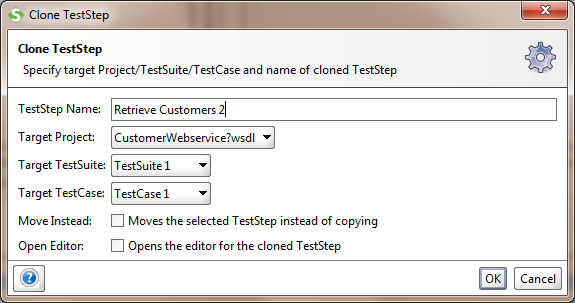
7.  Click **OK**.
8.  Open teststep **Retrieve Customers 2**.
9.  Click **Assertions (2)**.
10.  Open **XPath Match - Unknown**.
11.  Change **Expected result** to _1 + [the number you entered in step 5.6]_.
12.  Click **Save**.
13. Add a new SOAP request to the existing test case with the following details:
    * In the **Specify name for step**, enter *Delete Customer*.
    * In the **Select operation to invoke for request** field, enter *CustomerWebServiceSoap -> DeleteCustomer*.

14. Change the request into the following value:

    ```
    <soapenv:Envelope xmlns:soapenv="http://schemas.xmlsoap.org/soap/envelope/" xmlns:exam="http://www.example.com/">
       <soapenv:Header/>
       <soapenv:Body>
          <exam:DeleteCustomer>
             <Name>Donald A. Hylton</Name>
          </exam:DeleteCustomer>
       </soapenv:Body>
    </soapenv:Envelope>
    ```

## 7\. Run the test case

In this chapter you will learn how to run the testcase you created in previous chapters.

1.  Open testcase **TestCase 1**.
    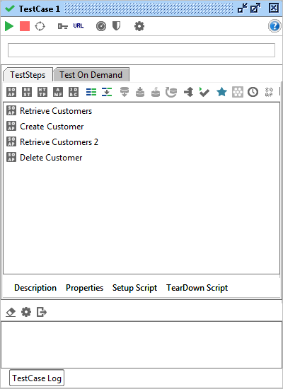
2.  Click the run this testcase icon.
    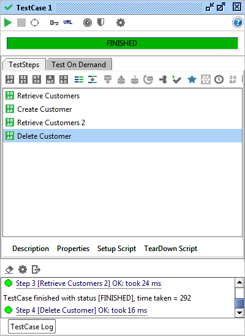

Congratulations! You have just created your first automated test with SoapUI.

## 8\. Related content

*   [Finding the Root Cause of Runtime Errors](../monitoring-troubleshooting/finding-the-root-cause-of-runtime-errors)
*   [Clearing Warning Messages in Mendix](../monitoring-troubleshooting/clear-warning-messages)
*   [Testing web services using SoapUI](testing-web-services-using-soapui)
*   [Monitoring Mendix using JMX](../monitoring-troubleshooting/monitoring-mendix-using-jmx)
*   [Debugging Java actions remotely](../monitoring-troubleshooting/debug-java-actions-remotely)
*   [Log Levels](../monitoring-troubleshooting/log-levels)
*   [Debugging Java Actions](../monitoring-troubleshooting/debug-java-actions)
*   [Common Mendix SSO Errors](../monitoring-troubleshooting/handle-common-mendix-sso-errors)
*   [Debugging Microflows](../monitoring-troubleshooting/debug-microflows)
*   [Debugging Microflows Remotely](../monitoring-troubleshooting/debug-microflows-remotely)


Learn more about this topic using the following helpful links:

*   [10 tips for the SoapUI beginner](http://www.soapui.org/getting-started/10-tips-for-the-soapui-beginner.html)
