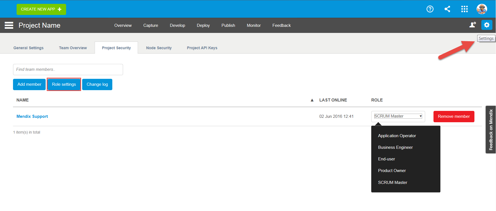
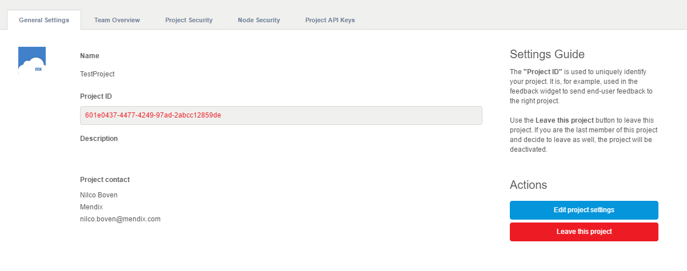

In June 2016 Mendix will release a new Customer Support portal. In this portal, the end user can select an affected app for a submitted ticket. The apps that can be selected will be based on the project authorization of that user (regardless of their organization). All users that have a role that has the authorization ‘Edit permissions on Deploy or Capture’ will be able to submit and view tickets for the app that is connected to that project.

The Customer Support portal needs to know the project identification for on-premises apps so it can show the correct apps. Therefore, we are asking all on-premises customers to provide us with the ProjectID of their project(s). Please invite all team members that you want to be able to submit tickets and provide them with the specified role and email the project information to Mendix Support?

**After completing this how-to you will know:**

*   How to configure project authorization to select affected application(s) in new Customer Support tool

## 1. Preparation

Before you can start with this how-to, please make sure you have completed the following prerequisites.

*   Create a project or use an existing project

## 2\. Instructions



NOTE: Keep in mind that this should be done for every new app that is created if you want to be able to submit ticket requests in our new Customer Support, so please add this as a default process step when setting up a new application.



1.  Go to the applicable project overview and invite all users that should be able to submit/view tickets concerning this project by adding the users as project team members.
    
2.  Enter the email addresses of all co-workers that should be able to submit tickets regarding the application that is connected to this project. It is possible to paste a list of email addresses as well. The parts of this project which can be accessed by the invitees will be based on the role you select for each invitee.
    
3.  A - All team members with the authorization ‘Edit permissions on Develop or Capture’ will be allowed to submit tickets for the app. We would advise to use the default ‘Business Engineer’ role (_see above_).

    B - If the user is already an existing team member you can verify and/or adjust the permission by going to the ‘Project Security’ tab in the ‘Project Settings’. If you click on the ‘Role settings’ button you can view all the specifications of the roles and, if desired, customize or create roles.
    
4.  To finalize the set up send an email to [support@mendix.com](http://support.mendix.com) with the Project Name, ProjectID and the name of the applicable app. The ProjectID can be found on the General Settings tab in the Project Settings.
     

For more information on how to create a collaboration project in the Mendix Cloud Portal please see: [How to Create and Deploy Your First App](/howto6/create-and-deploy-your-first-app).

## 3\. Related content

*   [How to connect a different project to a node](/mxsupport/how-to-connect-a-different-project-to-a-node)
