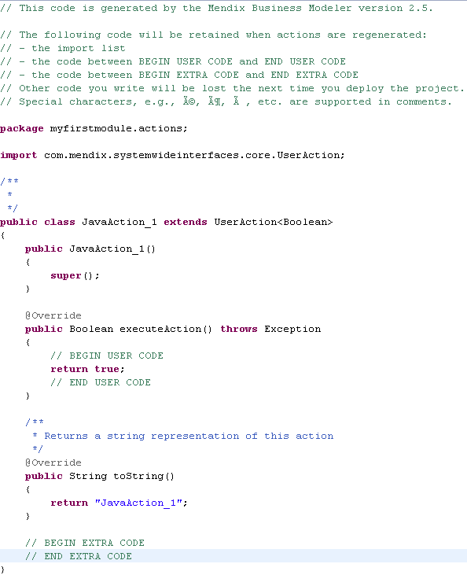

With Java actions you can extend the functionality of your application in situations where it would be hard to implement this functionality in microflows.

For information about Java actions in the modeler see [Java Actions](java-actions).

## Writing code in the .java files of your Java actions

In the .java files of your Java actions you can write your Java code between the markers:

*   // BEGIN USER CODE and // END USER CODE
*   // BEGIN EXTRA CODE and // END EXTRA CODE.

This is explained in more detail below.

The other code in these files is regenerated each time when you deploy your model, thus any modifications that you make in them will be overwritten. Your imports will be preserved however.



A Java action generated by the Mendix Business Modeler. This Java action has no input parameters and simply returns a boolean with value 'true'.



The method _executeAction_ is called by the runtime when the Java action is being executed. Between the lines _// BEGIN USER CODE_ and _// END USER CODE_ you can write your custom code that will always be called when executing the action. In this method you can call other methods in the section between _// BEGIN EXTRA CODE_ and _// END EXTRA CODE_.

The executeAction method throws all exceptions that occur. This means you can do error handling in the microflow calling this Java action. If you'd like to do your own error handling within the action, use try/catch statements.

## Using the Mendix Java library

In the Java code that you write for your Java actions you can use the Mendix Java library.



You can find the Javadoc at [apidocs.mendix.com](http://apidocs.mendix.com/7/runtime/) or in the directory you installed Mendix in, for example: `C:\Program Files\Mendix\7.0.0\runtime\javadoc`.



This library is automatically added to your libraries when you imported your project into Eclipse and it is called mxruntime.jar.

A tutorial with some examples can be found at the [Java API Tutorial](/howto7/logic-business-rules/java-api-tutorial) page.

## Using Eclipse as an environment to write your Mendix Java actions

See [Using Eclipse](using-eclipse).

## Java actions in the cloud

See [Java in the Cloud](/howtogeneral/mendixcloud/java-in-the-cloud).

## Documents in This Category

* [Troubleshooting](troubleshooting)
* [Using Eclipse](using-eclipse)
