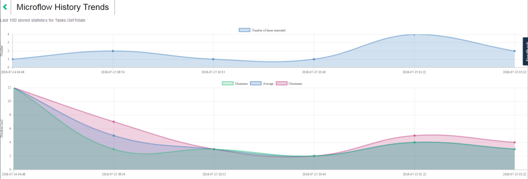

## 1.6.0

The theme for this version is Mendix 6 and a visual trend on microflow statistics to show at Mendix World.

### New feature: Graph on microflow statistics to show trend

To better visualize and show trends in the history of microflow statistics a graph has been added to show the last 100 statistics. A button called [History] in the statistics tool and called [Show History Graph] on the microflow history (under search menu) shows the graph (to visualize a trend) on microflow statistics.

With this feature during a performance analysis you can see if a microflow is taking more time to execute after a certain period of time. This can indicate a database table getting populated.

### New Beta feature: Trigger on microflow statistics

Customers have asked to get a notification when a microflow runs longer than a certain amount of time. A quick (hence BETA) implementation was to gather microflow statistics in the query tool and use those as measurements. Then you can build a trigger on a measurement of a microflow statistic to for example send an e-mail.
This feature will change in the future.

### New feature: Reporting support with OData

The APM Tool has now an OData source so users can use their own reporting against the data that is collected with the APM Tool. The OData source has separate rights, so it is configurable whether or not this is used.

### New feature: Load test recorder

Mansystems has a load test tool that can be used in projects by our consultants. The tool is likely to be productized in the future and is NOT INCLUDED in the APM Tool. This tool needs a recorder to record sessions. These sessions can then be scripted/parametrized for usage in the load test.
The APM Tool now includes the load test recorder, so APM Tool users are immediately ready for a load test and need not again add a module to their App.
Load test customers will need the APM Tool for measurements and hence also benefit from the addition.
This feature is visible in the addional tools menu.

### New feature: Cleanup of data after a certain period of time

The measurements tool would cause the database to grow after time. This tool had no protection against running out of space. For this reason, an automated data removal after a specified amount of time is built.
Per module it can be configured to remove data after a certain amount of days. Defaults:

*   Log/trap tool default 100 days
*   Statistics tool history 365 days
*   Performance tool data 30 days
*   Measurement tool 7 days, configurable per metric.
    *   Metrics that are no longer measured (and thus have no configuration) are deleted after 100 days from the database. This is not configurable.
*   Manual query audit, 365 days. Not configurable, because the audit is there not to be tampered with

### Compatibility, bug fixes and minor changes

This version supports Mendix 6.2.0 and above only. Also only on java 8.

*   Statistics Tool gave a parse error on logout in the logging. Not really visible for users, but would create a trap if trapping on warnings. Now fixed, so logout is also in the statistics.

*   During installation there were sometimes errors on startup, because Mendix generates different parameter names in java in different Mendix versions. Sometimes 'FileName' was allowed, sometimes not and then it becomes 'FileNameParameter1' in java. The parameter names with 'FileName' have changed to 'FileNameParameter' in 3 import java actions to prevent these installation errors. Also parameter 'MicroflowName' in java action ExecuteMicroflowAsync is changed into 'MicroflowNameParameter'.

*   A grid in the Mendix 6 version of the performance tool details was changed from to be able to sort on loop iterations.

*   When choosing sample data during install the explain plan sample data for MySQL is now also added.

### Known issues

The JDBC query and explain plan functionality against MySQL has not been tested.

The JDBC query and explain plan functionality for the built-in database does not work.

The performance tool can run out of memory when recording. The advised protection options for the performance tool still expect 1 GB of memory available, so for small implementations the protection options should be stricter.

When the before shutdown microflow is not configured and some tools are running the shutdown of the Mendix application can seem to hang for about a minute.

In Mendix 5 and above the microflow names are taken from the action caption. So if the action caption is changed in the modeler the call microflow action in the performance tool does not drill down. Also the caption only contains the microflow name, not the module name, so if multiple microflows exist with the same name, but in different modules the performance tool cannot pick the right one.

The CustomString widget on Mendix 6.2.0 does not render. A newer version from the AppStore solves this.

In a sandbox or on Cloud Foundry the instances will have a separate hostname/ip every time. The license will not work after a restart. This is fixed in 1.7.0.
